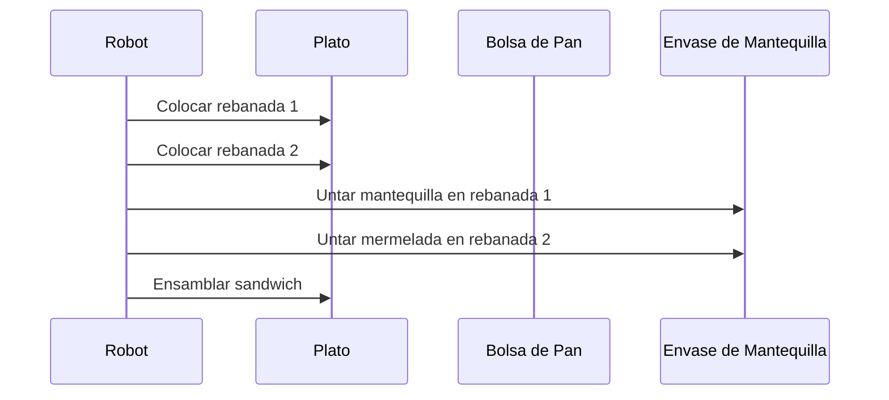
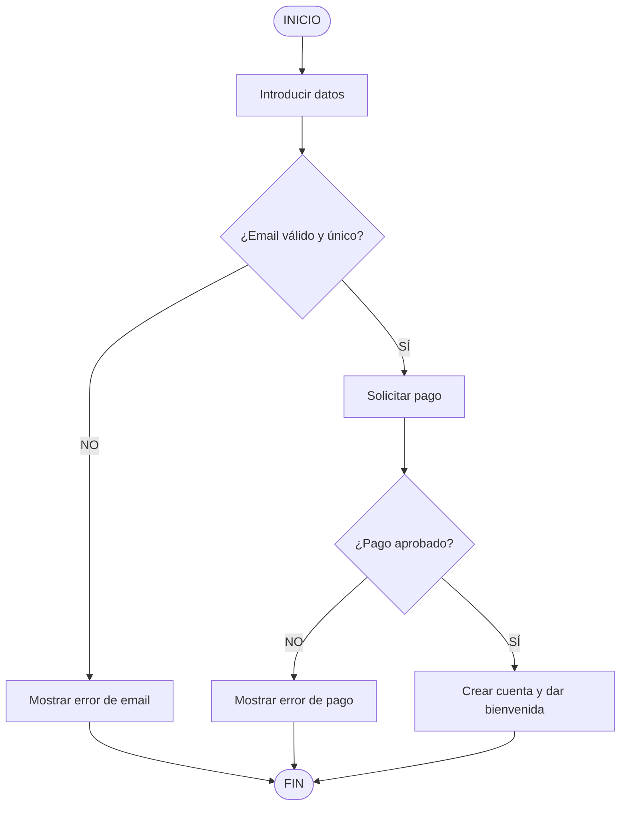

# Ejercicios Prácticos de Pensamiento Computacional

**Autor(es):** Brais Moure (@mouredev) / BIG School
**Fecha:** 2026
**Tipo:** Documento Técnico / Ejercicios Prácticos
**Fuente Original:** PDF / Módulo 0: Fundamentos del Desarrollo de Software

---

## Ejercicio 1: El Robot y el Sándwich (Descomposición Fina)

Diseño de un algoritmo atómico y secuencial para dar instrucciones a una entidad sin contexto implícito.





```text
INICIO Preparar_Sandwich
    1. Localizar la bolsa de pan.
    2. Abrir la bolsa de pan.
    3. Extraer UNA rebanada de pan.
    4. Colocar la rebanada en el plato.
    5. Extraer una SEGUNDA rebanada de pan.
    6. Colocar la segunda rebanada en el plato.
    7. Localizar el cuchillo de untar.
    8. Localizar el envase de mantequilla.
    9. Abrir el envase de mantequilla.
    10. Insertar el cuchillo en la mantequilla.
    11. Extraer 5 gramos de mantequilla con el cuchillo.
    12. Deslizar el cuchillo sobre la superficie de la Rebanada 1 hasta distribución uniforme.
    ... [Pasos análogos para mermelada y ensamblado final]
FIN
```


## Ejercicio 2: La Plataforma de Suscripción
### Parte A: Mapa Mental / Estructura Organizativa

```text
Plataforma de Suscripción
├── Producto
│   ├── Finalizar Desarrollo
│   └── Pruebas (QA)
├── Marketing
│   ├── Estrategia de Precios
│   ├── Material promocional
│   ├── Campaña RRSS
│   └── Lanzamiento
├── Operaciones
│   ├── Gestión de pagos
│   ├── Despliegue
│   └── Soporte al cliente
└── Legal
    ├── Política de Privacidad
    └── Términos de Servicio
```


### Parte B: Diagrama de Flujo de Registro




## Ejercicio 3: Restablecer Contraseña
### Parte A: Happy Path (Flujo Principal Ideal)

```text
1. El usuario hace clic en "Olvidé mi contraseña".
2. El sistema solicita el correo electrónico.
3. El usuario introduce su email y lo envía.
4. El sistema verifica que el email existe en la base de datos.
5. El sistema envía un correo electrónico al usuario con un enlace único y temporal.
6. El usuario hace clic en el enlace recibidor.
7. El usuario introduce la nueva contraseña (con confirmación).
8. El sistema actualiza la contraseña en la base de datos y confirma el éxito al usuario.
```

### Parte B: Edge Cases (Casos Límite y Excepciones)
Entrada de Email:

¿Y si el usuario introduce un texto que no cumple la sintaxis de email válido?

¿Y si el usuario intenta enviar el formulario demasiadas veces seguidas (Prevención de ataques de fuerza bruta / Rate Limiting)?

El Enlace:

¿Y si el enlace ya ha expirado (ej. ventana superior a 24 horas)?

¿Y si el enlace ya ha sido utilizado previamente una vez?

Nueva Contraseña:

¿Y si la nueva contraseña no cumple los requisitos de complejidad y seguridad mínimos?

¿Y si los campos de "Contraseña" y "Confirmar Contraseña" no coinciden?