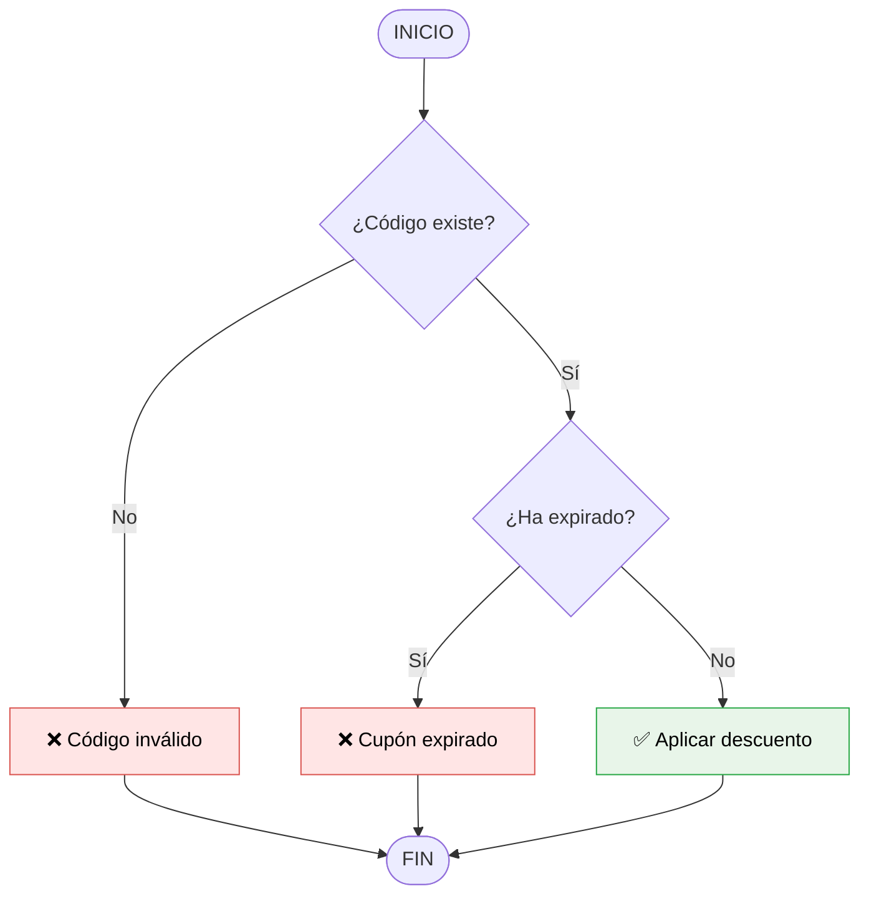

# Fundamentos del Pensamiento Computacional

**Autor(es):** Brais Moure (@mouredev) / BIG School
**Fecha:** 2026
**Tipo:** Documento Técnico / Material Académico (Máster Desarrollo con IA)
**Fuente Original:** PDF / Módulo 0: Fundamentos del Desarrollo de Software

---

## 1. Visión General y Contexto del Mercado

El mercado tecnológico actual atraviesa una mutación sin precedentes donde la capacidad de escribir sintaxis ha dejado de ser el principal activo del ingeniero para ceder su lugar a la soberanía técnica y al criterio arquitectónico. En un entorno saturado por la proliferación de herramientas de generación de código mediante inteligencia artificial, el profesional que sobrevive y destaca no es aquel que compite en velocidad con la máquina, sino el que posee la capacidad de orquestar soluciones complejas mediante un pensamiento computacional refinado. 

Este cambio de paradigma nos obliga a redefinir nuestra identidad: ya no somos meros colocadores de ladrillos digitales, sino los directores de obra que deben validar, auditar y dar sentido a la producción automatizada. La IA actúa como un músculo ejecutor de una eficiencia asombrosa, pero carece de la visión estratégica para entender el propósito de una estructura o la solidez de sus cimientos.

Por ello, dominar los pilares de la descomposición y la abstracción no es un ejercicio académico, sino una necesidad de supervivencia profesional. Quien no es capaz de desglosar un problema de negocio en unidades lógicas manejables está condenado a recibir resultados mediocres de la tecnología. La verdadera ventaja competitiva reside en la resolución de problemas desde una perspectiva de alto nivel, utilizando la IA como una palanca y no como un sustituto. Este enfoque prepara para liderar proyectos donde la complejidad técnica es delegada, pero la responsabilidad del diseño y la integridad del sistema recae exclusivamente en el juicio humano. 

Al final del día, la calidad del software resultante será un reflejo directo de la precisión de nuestros planos lógicos. Entender que el código es ahora una mercancía (*commodity*) permite al desarrollador elevarse hacia posiciones de mayor valor añadido, donde el reconocimiento de patrones y la creación de algoritmos eficientes dictan el éxito de los productos digitales en un mercado global extremadamente exigente.

Esta transición hacia un rol de arquitecto de software potenciado por IA exige una base conceptual de hierro; sin ella, el profesional corre el riesgo de convertirse en un espectador pasivo de una tecnología que no comprende, perdiendo el control sobre la escalabilidad y la mantenibilidad de sus propias soluciones. La soberanía técnica se alcanza cuando la herramienta obedece a una estrategia predefinida y no cuando la estrategia se adapta a las limitaciones o errores del automatismo. En última instancia, el desarrollo de software orientado al futuro demanda una integración simbiótica donde el humano aporta la visión estratégica y la máquina la capacidad de cómputo, transformando la manera en que concebimos la creación de valor en la economía digital.

---

## 2. Los Cuatro Pilares del Pensamiento Computacional

Los pilares del pensamiento computacional permiten abordar desafíos abrumadores mediante la lógica estructurada:

1. **Descomposición (*divide y vencerás*):** Consiste en dividir un problema complejo en subproblemas más pequeños y manejables para abordarlos por separado.
2. **Reconocimiento de Patrones:** Identificación de similitudes, tendencias o características comunes entre problemas para evitar la redundancia, estandarizar y reutilizar soluciones.
3. **Abstracción:** Filtrar el ruido visual y técnico para centrarse únicamente en la información esencial e ignorar los detalles irrelevantes.
4. **Diseño de Algoritmos:** Desarrollo de una secuencia de pasos finitos, precisos y ordenados para resolver el problema o ejecutar un proceso.

### Características del Diseño Algorítmico

* **Secuencia:** Flujo lógico ordenado paso a paso.
* **Precisión:** Instrucciones claras y sin ambigüedad.
* **Finalización:** Todo algoritmo debe tener un número finito de pasos e instrucciones de término.

---

## 3. Representación de Algoritmos

Los algoritmos pueden representarse mediante diagramas de flujo y pseudocódigo antes de escribir código ejecutable en cualquier lenguaje de programación.

### Elementos de un Diagrama de Flujo

| Elemento | Representación Visual | Función |
| :--- | :--- | :--- |
| **Óvalos** | Inicio y Fin | Delimitan el origen y la conclusión del flujo |
| **Rectángulos** | Acciones o Procesos | Indican ejecuciones o cálculos |
| **Rombos** | Decisiones | Evaluaciones de condiciones (Sí / No) |
| **Flechas** | Flujo de Ejecución | Indican la dirección del proceso |

### Ejemplo: Validación de Cupones de Descuento

#### Diagrama de Flujo (Mermaid)



#### Pseudocódigo

```
INICIO Algoritmo_Validar_Cupon
    LEER codigo_usuario
    LEER fecha_actual
    SI (el codigo_usuario EXISTE en la base de datos) ENTONCES
        OBTENER fecha_expiracion del cupón
        SI (fecha_actual > fecha_expiracion) ENTONCES
            MOSTRAR "Error: Cupón expirado"
        SINO
            APLICAR descuento
            MOSTRAR "Descuento aplicado con éxito"
        FIN SI
    SINO
        MOSTRAR "Error: Código inválido"
    FIN SI
FIN Algoritmo_Validar_Cupon
```


## 4 Observaciones Clave
La inteligencia artificial es un ejecutor, no un estratega; el diseño lógico siempre debe preceder a la generación de código.

El pensamiento computacional no busca que el humano piense como máquina, sino que aprenda a reformular problemas para que sean procesables para ellas.

El uso de pseudocódigo y diagramas de flujo es fundamental para auditar la lógica antes de comprometer recursos en el desarrollo técnico.

La eficiencia en la era de la IA depende de la claridad en las instrucciones (prompts), las cuales deben nacer de una descomposición previa del problema.

## 5 Conclusión Editorial
La integración de la inteligencia artificial en el flujo de trabajo del desarrollador no disminuye la importancia de los fundamentos; por el contrario, los vuelve críticos. Al delegar la escritura mecánica, el profesional asume la responsabilidad total sobre la lógica subyacente. El éxito en el desarrollo de software moderno no se mide por las líneas de código producidas, sino por la capacidad de diseñar sistemas coherentes, escalables y orientados a resolver necesidades reales mediante una dirección técnica impecable.
