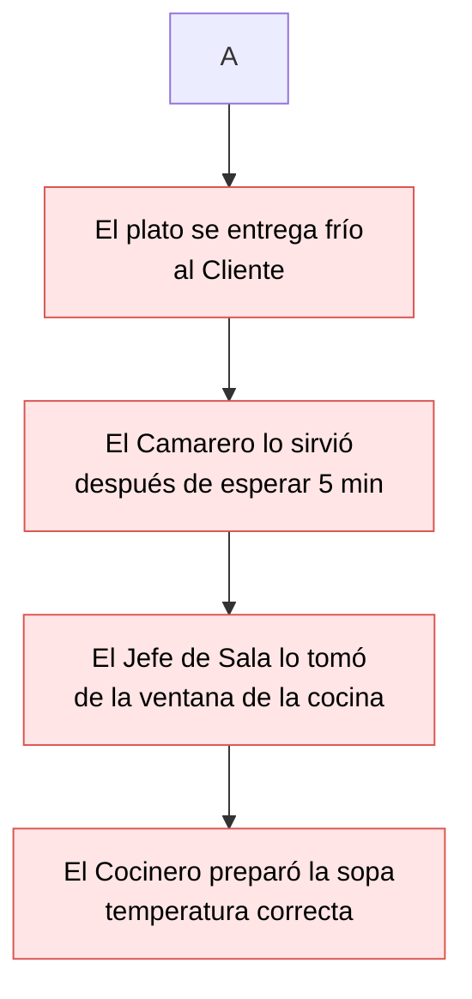

# Metodologías de Resolución de Problemas y Debugging

**Autor(es):** Brais Moure (@mouredev) / BIG School
**Fecha:** 2026
**Tipo:** Documento Técnico / Material Académico (Máster Desarrollo con IA)
**Fuente Original:** PDF / Módulo 0: Fundamentos del Desarrollo de Software

---

## 1. Contexto y Filosofía del Debugging

El mercado tecnológico actual atraviesa un cambio de paradigma donde la producción de código ha dejado de ser el principal cuello de botella gracias a la automatización. Sin embargo, esta abundancia de soluciones genera un nuevo desafío: la gestión de la fragilidad en sistemas cada vez más opacos y distribuidos. En este escenario, la verdadera ventaja competitiva no reside en la velocidad de escritura, sino en la capacidad crítica de diagnóstico. 

La realidad operativa dicta que las infraestructuras, por definición, tienden al caos; no importa la sofisticación de la Inteligencia Artificial empleada, los comportamientos inesperados son una constante universal. Por ello, el profesional de élite debe alejarse del instinto de "ensayo y error" —una práctica ineficiente que suele introducir deudas técnicas ocultas— para abrazar una metodología científica rigurosa. Dominar el arte del debugging permite transformar una crisis operativa en un proceso previsible y controlado.

Este enfoque prepara a los líderes técnicos para actuar como arquitectos forenses, capaces de diseccionar la causalidad en entornos de alta incertidumbre. A ello se suma la soberanía técnica que otorga el conocimiento de las herramientas de inspección profunda, las cuales actúan como el sistema nervioso del desarrollo moderno. Al final del día, en un mundo saturado de herramientas generativas, el valor diferencial se desplaza hacia la supervisión experta. Quien posee el método para reproducir, aislar y validar una hipótesis de fallo es quien realmente ostenta el control sobre el activo tecnológico.

---

## 2. Metodología Científica Aplicada al Debugging

La resolución de problemas técnicos debe ser tratada como un experimento de laboratorio estructurado mediante los siguientes pasos:

1. **Reproducir el Error (La regla de oro):** Sin un escenario controlado donde el fallo se manifieste de forma consistente, cualquier intento de arreglo es una mera conjetura.
2. **Observar y Entender:** Definir exactamente bajo qué parámetros ocurre el desvío de la expectativa original.
3. **Formular una Hipótesis:** Plantear una explicación informada reduciendo el ruido ambiental y centrando recursos en variables específicas.
4. **Probar la Hipótesis (Aislar la variable):** Modificar únicamente una variable a la vez. Este rigor metodológico asegura comprender por qué el sistema ha vuelto a su estado óptimo, evitando "soluciones fantasma".
5. **Resolver y Verificar:** Aplicar la corrección definitiva y realizar pruebas de regresión.

---

## 3. El Kit de Herramientas del Detective Digital

### Análisis de Logs
El análisis de logs constituye la arqueología del sistema, permitiendo reconstruir cronológicamente los eventos previos a un fallo o caída.

```text
02:30:00 INFO: Iniciando ciclo de producción.
02:31:15 INFO: Temperatura del horno alcanzando 200°C.
02:31:16 WARNING: Fluctuación de energía detectada en Sector 3.
02:31:18 ERROR: Sensor de temperatura del horno falló. Ciclo abortado.
```

### Stack Trace (Rastreo de Pila)
Ofrece una visión jerárquica y en cascada de la causalidad de un error, revelando la capa interna en la que se originó la falla.



**Nivel 1 (El Error):** El plato se entrega frío al Cliente.

**Nivel 2:** El Camarero lo sirvió (después de esperar 5 minutos).

**Nivel 3:** El Jefe de Sala lo tomó de la ventana de la cocina.

**Nivel 4 (Causa Raíz):** El Cocinero preparó la sopa (a la temperatura correcta, pero el retraso ocurrió en la entrega).

### Breakpoints (Puntos de Interrupción)
Permiten pausar la ejecución del software en tiempo real para inspeccionar el estado exacto de las variables y verificar si las reglas de negocio se ejecutan en el orden lógico correcto.

```text
INICIO Algoritmo_Validar_Cupon
    LEER codigo_usuario
    LEER fecha_actual
    [BREAKPOINT Aaquí -> Inspección de variables de sesión]
    SI (el codigo_usuario EXISTE en la base de datos) ENTONCES
``` 

### Técnicas de Claridad, Simplificación y Sinergia con IA

**Técnica del Patito de Goma (Rubber Duck Debugging):** Explicar el problema o línea por línea de código a un objeto inanimado o colega en lenguaje natural para forzar una simplificación cognitiva que revele fallos lógicos invisibles.

**Simplificación y Aislamiento:** Reducir el sistema a su mínima expresión reproducible descartando módulos no involucrados.

**Debugging en la era de la IA:** La IA actúa como un multiplicador de fuerza analizando masivamente volúmenes de logs y anomalías. Sin embargo, la responsabilidad final de validación es humana para contrarrestar posibles alucinaciones o errores lógicos generados automáticamente.

### Observaciones Clave

La reproducción del fallo es el único umbral válido para iniciar una intervención técnica seria.

El aislamiento de variables evita la creación de errores en cascada y garantiza la comprensión de la solución aplicada.

Deben ejecutarse siempre pruebas de regresión tras una solución para asegurar que el parche no compromete funcionalidades existentes.

La IA es un asistente de diagnóstico excepcional, pero su producción debe ser verificada mediante el método científico de debugging.