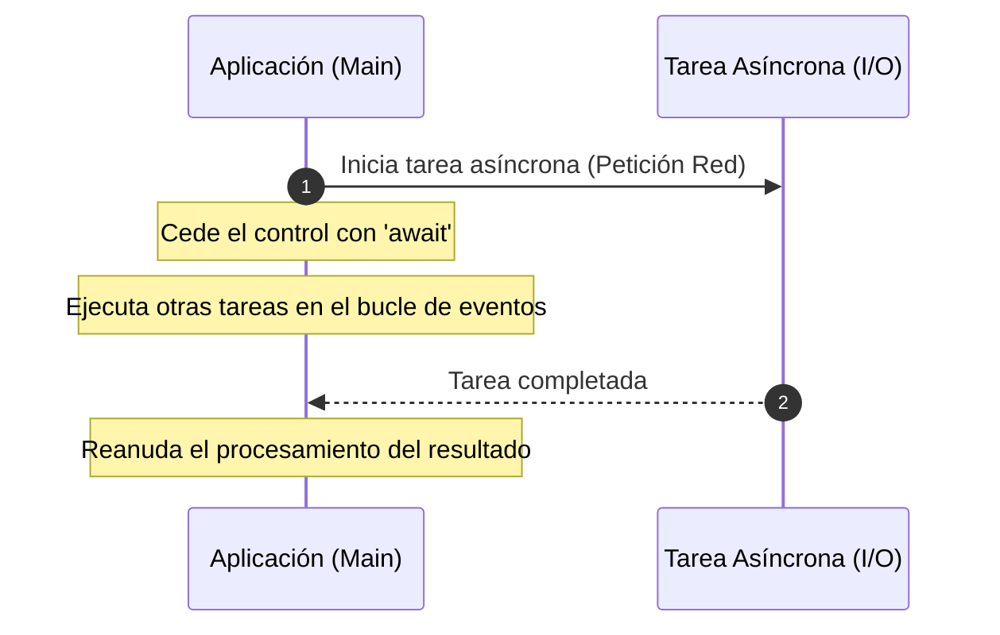
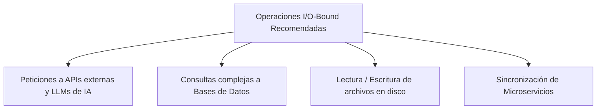

# Programación Asíncrona en Python

**Autor(es):** BIG School  
**Fecha:** 2026  
**Tipo:** Paper / Documento Técnico  
**Fuente Original:** PDF / Módulo 0: Fundamentos del Desarrollo de Software  

---

## 1. Visión General: El Paradigma de la Concurrencia

La eficiencia de un sistema moderno reside en su habilidad para gestionar los tiempos de espera. En el desarrollo síncrono convencional, cada instrucción bloquea el hilo principal esperando la respuesta de la anterior. 

La **programación asíncrona** permite que una aplicación inicie una tarea de larga duración (como peticiones de red o llamadas a APIs de IA) y continúe ejecutando otras tareas mientras espera a que la primera finalice.



> [!NOTE]
> **Analogía del Maestro de Ajedrez:** Un maestro de ajedrez jugando partidas simultáneas no espera a que cada oponente piense su jugada durante minutos; realiza su movimiento en una mesa e inmediatamente pasa a la siguiente. No piensa más rápido, simplemente elimina los tiempos muertos e inactivos.

---

## 2. Implementación Técnica con `asyncio`

Python proporciona la librería estándar `asyncio` junto con las palabras clave `async` y `await`:

* **`async def`:** Define una corrutina (función asíncrona).
* **`await`:** Pausa la ejecución de la corrutina y cede el control al bucle de eventos (*event loop*) mientras espera el resultado de una tarea de Entrada/Salida (*I/O*).

```python
import asyncio
import time

# Definición de una corrutina
async def order_coffee():
    print("Pidiendo un café...")
    # asyncio.sleep cede el control sin bloquear la aplicación
    await asyncio.sleep(3)
    print("¡Café listo!")
    return "Café"
```

---

## 3. Comparativa: Ejecución Síncrona vs. Asíncrona

### Caso de Estudio: Múltiples Peticiones Simultáneas (`asyncio.gather`)

```python
import asyncio
import time

async def order_pizza_async():
    print("Pidiendo una pizza...")
    await asyncio.sleep(5)  # No bloquea; cede el control al event loop
    print("¡Pizza lista!")

async def main():
    start_time = time.time()
    # Ejecución concurrente simultánea de múltiples corrutinas
    await asyncio.gather(
        order_pizza_async(),
        order_pizza_async()
    )
    end_time = time.time()
    print(f"Tiempo total asíncrono: {end_time - start_time:.2f} segundos")

# Ejecutador del bucle de eventos (Event Loop)
asyncio.run(main())
# Salida esperada: Tiempo total asíncrono: 5.00 segundos (frente a 10.00s en modelo síncrono)
```

---

## 4. ¿Cuándo Usar Asincronía? (I/O-Bound vs. CPU-Bound)

La asincronía no acelera los cálculos matemáticos pesados ni hace que la CPU procese más rápido. Su objetivo principal es optimizar la gestión de esperas externas en operaciones **I/O-Bound** (Entrada/Salida):



* **Peticiones de Red:** Llamadas a APIs web externas o modelos de IA (ej. OpenAI, Claude).
* **Bases de Datos:** Esperar respuestas a consultas complejas sin bloquear el servidor.
* **Operaciones de Disco:** Lectura y escritura asíncrona de archivos masivos.

---

## 5. Observaciones Clave

* **Evitar Bloqueos Síncronos:** No se deben usar funciones bloqueantes convencionales como `time.sleep()` en un contexto asíncrono; se deben sustituir siempre por `asyncio.sleep()`.
* **Obligatoriedad de `await`:** El uso de `await` es obligatorio para ejecutar y obtener el valor retornado por una corrutina dentro de otra función asíncrona.
* **Punto de Entrada (`asyncio.run`):** Para ejecutar una corrutina principal desde el punto de entrada síncrono del programa se debe utilizar `asyncio.run()`.
* **Reducción Drástica de Latencia:** La asincronía permite reducir drásticamente la latencia de las aplicaciones al paralelizar operaciones I/O simultáneas.

---

## 6. Conclusión

Dominar la asincronía permite transformar aplicaciones lineales ineficientes en sistemas de alta disponibilidad. En la era de la integración continua de microservicios y APIs de Inteligencia Artificial, identificar dónde el sistema pierde tiempo esperando y convertirlo en ejecución proactiva es fundamental para garantizar la escalabilidad y retención de usuarios.
