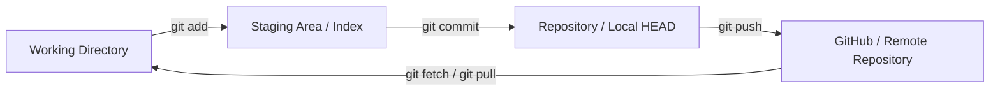
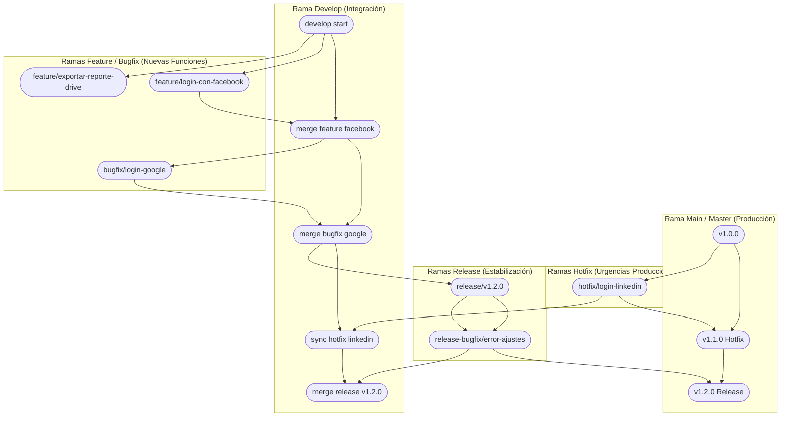

# Guía Maestra de Control de Versiones: Git, GitHub y Gitflow

**Autor(es):** Fernando Herrera (DevTalles) / Brais Moure (@mouredev) / BIG School  
**Revisión Técnica Senior:** Experto en Git & GitHub (20+ años de experiencia)  
**Fecha de Actualización:** 2026  
**Tipo:** Paper / Documento Técnico / Guía de Referencia Avanzada  
**Fuente Original:** PDF / Practic Gitflow.pdf & Fundamentos del Desarrollo de Software  

---

## 1. Visión General y Arquitectura del Estado Local

Git gestiona los cambios del código a través de tres áreas o estados locales principales antes de sincronizarse con la infraestructura remota en la nube (GitHub/GitLab):

1. **Working Directory (Directorio de trabajo):** Archivos físicos actuales en el sistema de archivos local.
2. **Staging Area (Área de preparación / Índice):** Zona intermedia donde se agrupan los cambios seleccionados (`git add`) antes de ser registrados de forma permanente.
3. **Repository (Repositorio / Commit History / HEAD):** Base de datos orientada a objetos (DAG - *Directed Acyclic Graph*) que almacena el historial inmutable de *commits*.



> [!TIP]
> **Comandos Modernos (Git 2.23+):** Se recomienda sustituir el comando ambiguo `git checkout` por:
> * `git switch <rama>` para cambiar entre ramas.
> * `git restore <archivo>` para descartar cambios en el espacio de trabajo.

---

## 2. Configuración Inicial e Incorporación a Proyectos

### A. Iniciar un Proyecto desde Cero

1. Crear el repositorio remoto en GitHub / GitLab.
2. Inicializar con archivo `README.md` y `.gitignore` adecuado al lenguaje.
3. Clonar en el entorno local:
   ```bash
   git clone <url_proyecto>
   cd <nombre_proyecto>
   ```

### B. Incorporarse a un Proyecto Existente

1. Clonar el repositorio remoto:
   ```bash
   git clone <url_proyecto>
   cd <nombre_proyecto>
   ```

2. Verificar los remotos configurados:
   ```bash
   git remote -v
   ```

3. Crear y vincular la rama `develop` local rastreando la remota:
   ```bash
   git switch -c develop origin/develop
   ```

4. Clonar o descargar una rama específica:
   ```bash
   # Clonar directamente una única rama
   git clone --branch <rama> --single-branch <url_proyecto>

   # Crear rama local que rastrea una remota existente
   git switch -c <nombre_rama> origin/<nombre_rama>
   ```

---

## 3. Buenas Prácticas y Convención de Commits (Conventional Commits)

Para mantener un historial auditable, limpio y compatible con herramientas de automatización de *Semantic Versioning* (SemVer), se debe aplicar el estándar **Conventional Commits**:

```text
<tipo>(<ámbito opcional>): <descripción corta en presente e imperativo>
```

| Tipo | Descripción / Propósito | Ejemplo |
| :---: | --- | --- |
| `feat` | Nueva funcionalidad para el usuario final. | `feat(auth): agregar inicio de sesión con Google` |
| `fix` | Corrección de un error o *bug* en producción o desarrollo. | `fix(login): corregir redirección tras autenticar` |
| `docs` | Cambios exclusivamente en documentación (`README.md`, comentarios). | `docs(readme): actualizar instrucciones de setup` |
| `refactor` | Cambio de código que no altera funcionalidad ni corrige *bugs*. | `refactor(user): simplificar lógica de validación` |
| `test` | Adición o corrección de pruebas unitarias o de integración. | `test(auth): añadir tests para flujo OAuth` |
| `chore` | Tareas de mantenimiento, dependencias o configuración del build. | `chore(deps): actualizar versión de axios` |
| `ci` | Cambios en archivos de configuración de CI/CD (GitHub Actions, Jenkins). | `ci(deploy): ajustar pipeline de staging` |
| `perf` | Cambios que mejoran el rendimiento del sistema. | `perf(db): optimizar consulta de usuarios activos` |

---

## 4. Estrategia de Ramificación: Diagrama General de Gitflow

Gitflow organiza la vida del proyecto mediante dos ramas de larga duración (`main` y `develop`) y tres tipos de ramas efímeras (`feature/`, `bugfix/`, `release/`, `hotfix/`).



---

## 5. Matriz de Cambios y Casos Prácticos

| ID | Descripción Corta | Rama de Trabajo | Rama Origen | Rama Destino |
| --- | --- | --- | --- | --- |
| **Cambio #1** | Implementar inicio de sesión con Facebook | `feature/login-con-facebook` | `develop` | `develop` |
| **Cambio #2** | Exportar reporte de usuarios a Google Drive | `feature/exportar-reporte-drive` | `develop` | `develop` |
| **Cambio #3** | Error al iniciar sesión con Google | `bugfix/login-google` | `develop` | `develop` |
| **Cambio #4** | Hotfix crítico en producción (LinkedIn v1.1.0) | `hotfix/login-linkedin` | `main` | `main` y `develop` |
| **Cambio #5** | Estabilización y liberación de versión v1.2.0 | `release/v1.2.0` | `develop` | `main` y `develop` |
| **Cambio #6** | Corrección de error sobre Release v1.2.0 | `release-bugfix/error-ajustes` | `release/v1.2.0` | `release/v1.2.0` (Tag `v1.2.1`) |

---

## 6. Desarrollo Paso a Paso de los Cambios (Práctica Guiada)

### Configuración Base de la Rama Develop

```bash
# Crear y cambiar a rama develop desde main
git switch -c develop
git push -u origin develop
git branch -a
```

### Cambio #1: `feature/login-con-facebook`

**Objetivo:** Desarrollar e integrar el inicio de sesión de Facebook.

```bash
# 1. Crear rama de trabajo desde develop
git switch -c feature/login-con-facebook

# 2. Implementación de cambios
touch login-con-facebook.txt
git add login-con-facebook.txt
git commit -m "feat(auth): implementar inicio de sesion con facebook"

# 3. Publicar rama en el remoto
git push -u origin feature/login-con-facebook
```

* **Pull Request en GitHub:**
  * **Base:** `develop` | **Compare:** `feature/login-con-facebook`
* **Sincronización posterior al Merge:**
  ```bash
  git switch develop
  git pull origin develop
  ```

### Cambio #2: `feature/exportar-reporte-drive`

**Objetivo:** Desarrollar exportador a Google Drive y realizar limpieza de ramas integradas.

```bash
# 1. Crear rama desde develop actualizado
git switch -c feature/exportar-reporte-drive

# 2. Implementar cambios
touch exportar-reporte-drive.txt
git add exportar-reporte-drive.txt
git commit -m "feat(reports): soporte para exportar reportes a google drive"
git push -u origin feature/exportar-reporte-drive
```

* **Pull Request en GitHub:**
  * **Base:** `develop` | **Compare:** `feature/exportar-reporte-drive`
* **Sincronización y Limpieza Local/Remota:**
  ```bash
  git switch develop
  git pull origin develop

  # Eliminar referencias remotas obsoletas
  git remote prune origin

  # Eliminar rama local ya integrada
  git branch -d feature/exportar-reporte-drive
  ```

### Cambio #3: `bugfix/login-google`

**Objetivo:** Renombrar/corregir archivo en la rama de desarrollo usando `git mv`.

```bash
git switch -c bugfix/login-google

# Uso correcto de git mv para mantener trazabilidad del archivo
git mv login-con-facebook.txt login-google.txt
git commit -m "fix(auth): corregir identificador de archivo de login para google"
git push -u origin bugfix/login-google
```

* **Pull Request en GitHub:**
  * **Base:** `develop` | **Compare:** `bugfix/login-google`
* **Limpieza:**
  ```bash
  git switch develop
  git pull origin develop
  git remote prune origin
  git branch -d bugfix/login-google
  ```

### Cambio #4: `hotfix/login-linkedin` (Parche Urgente en Producción)

**Objetivo:** Corregir un error crítico en `main` (versión en producción `v1.1.0`).

```bash
# 1. Partir siempre de main actualizado
git switch main
git pull origin main

# 2. Crear rama hotfix
git switch -c hotfix/login-linkedin
touch login-linkedin.txt
git add login-linkedin.txt
git commit -m "fix(prod): solucionar fallo critico de autenticacion con linkedin"
git push -u origin hotfix/login-linkedin
```

* **Pull Requests requeridos:**
  1. **Merge a `main`:** Base: `main` | Compare: `hotfix/login-linkedin`
  2. **Merge a `develop`:** Base: `develop` | Compare: `hotfix/login-linkedin` (Sincronización requerida para evitar regresiones).

* **Etiquetado de versión (Tagging) en `main`:**
  ```bash
  git switch main
  git pull origin main
  git tag -a v1.1.0 -m "Release v1.1.0: Hotfix de autenticación LinkedIn"
  git push origin v1.1.0

  # Sincronizar develop y limpiar rama hotfix
  git switch develop
  git pull origin develop
  git branch -d hotfix/login-linkedin
  ```

### Cambio #5: `release/v1.2.0` (Estabilización de Sprint)

**Objetivo:** Congelar desarrollo en `develop` para pruebas de QA y despliegue a producción.

```bash
git switch develop
git pull origin develop

# Crear rama de release congelada
git switch -c release/v1.2.0
touch ajustes-test-release-v1-2-0.txt
git add ajustes-test-release-v1-2-0.txt
git commit -m "chore(release): preparar empaquetado para release v1.2.0"
git push -u origin release/v1.2.0
```

* **Pull Requests requeridos:**
  1. **Merge a `main`:** Base: `main` | Compare: `release/v1.2.0`
  2. **Merge a `develop`:** Base: `develop` | Compare: `release/v1.2.0`

* **Tag de producción en `main`:**
  ```bash
  git switch main
  git pull origin main
  git tag -a v1.2.0 -m "Release v1.2.0 oficial"
  git push origin v1.2.0

  # Sincronizar develop y limpiar
  git switch develop
  git pull origin develop
  git branch -d release/v1.2.0
  ```

### Cambio #6: `release-bugfix/error-ajustes` (Corrección sobre Release Abierta)

**Objetivo:** Reparar un error detectado durante la fase de QA en la rama de release activa.

```bash
git switch release/v1.2.0
git pull origin release/v1.2.0

# Crear rama bugfix desde la release
git switch -c release-bugfix/error-ajustes
touch error-ajustes.txt
git add error-ajustes.txt
git commit -m "fix(release): corregir fallos detectados en pruebas de QA"
git push -u origin release-bugfix/error-ajustes
```

* **Pull Request:** Base: `release/v1.2.0` | Compare: `release-bugfix/error-ajustes`
* **Cierre y Tag parche `v1.2.1`:**
  ```bash
  git switch release/v1.2.0
  git pull origin release/v1.2.0
  git tag -a v1.2.1 -m "Release v1.2.1: Ajustes menores en QA"
  git push origin v1.2.1
  git branch -d release-bugfix/error-ajustes
  ```

---

## 7. Automatización con la CLI de `git-flow`

La extensión nativa `git-flow` automatiza la creación y cierre de estas ramas respetando las reglas del flujo:

```bash
# Inicializar Gitflow interactivo en el repositorio
git flow init

# --- Ciclo de Features ---
git flow feature start login-facebook    # Crea feature/login-facebook desde develop
git flow feature publish login-facebook  # Sube la rama al remoto
git flow feature finish login-facebook   # Fusiona en develop y elimina la rama local

# --- Ciclo de Release ---
git flow release start v1.2.0            # Crea release/v1.2.0 desde develop
git flow release publish v1.2.0          # Publica la release
git flow release finish v1.2.0           # Fusiona en main y develop, crea tag y elimina rama

# --- Ciclo de Hotfix ---
git flow hotfix start v1.2.1             # Crea hotfix/v1.2.1 desde main
git flow hotfix finish v1.2.1            # Fusiona en main y develop, crea tag v1.2.1

# Sincronizar todo con el servidor remoto
git push --all origin
git push --tags
```

---

## 8. Scripts y Alias Globales para Limpieza de Ramas (Clean Up)

Cuando las ramas remotas se eliminan tras hacer *Merge* en GitHub/GitLab, las ramas locales quedan desincronizadas (marcadas como `: gone` o `[desaparecido]`).

### Alias Global Multi-idioma (Inglés / Español)

Ejecuta este comando en tu terminal para configurar el alias unificado `git cleanup`:

```bash
git config --global alias.cleanup '!git remote prune origin && git branch -vv | grep -E "\[.*: (gone|desaparecido)\]" | awk '\''{print $1}'\'' | xargs -r git branch -D'
```

### Gestión de Alias en Git

```bash
# Probar el alias de limpieza
git cleanup

# Consultar la definición de un alias específico
git config --global --get alias.cleanup

# Listar todos los alias configurados
git config --global --get-regexp alias

# Eliminar un alias
git config --global --unset alias.cleanup
```

---

## 9. Gestión de Versiones por Microservicios / Módulos

En arquitecturas de monorepositorio o múltiples servicios, las etiquetas (*tags*) deben llevar el prefijo del componente o microservicio:

```bash
# Sincronizar etiquetas existentes del remoto
git pull --tags

# Creación de etiquetas semánticas independientes por servicio
git tag -a auth_service_v1.0.0 -m "Auth Service v1.0.0"
git tag -a payment_service_v1.2.0 -m "Payment Service v1.2.0"
git tag -a frontend_v2.0.0 -m "Frontend App v2.0.0"

# Publicar todas las etiquetas al repositorio remoto
git push origin --tags

# Listar etiquetas remotas
git ls-remote --tags origin
```

---

## 10. Cheat Sheet: Múltiples Cuentas de GitHub por SSH e `includeIf`

### A. Configuración SSH (`~/.ssh/config`)

```ini
# Cuenta Corporativa / Trabajo
Host github-trabajo
    HostName github.com
    User git
    IdentityFile ~/.ssh/id_github_work
    IdentitiesOnly yes

# Cuenta Personal
Host github-personal
    HostName github.com
    User git
    IdentityFile ~/.ssh/id_github_personal
    IdentitiesOnly yes
```

### B. Probar Conexión e Iniciar Agente SSH

```bash
# Iniciar agente SSH
eval "$(ssh-agent -s)"
ssh-add ~/.ssh/id_github_work
ssh-add ~/.ssh/id_github_personal

# Probar autenticación con los Host Aliases
ssh -T git@github-trabajo
ssh -T git@github-personal
```

### C. Clonación y Ajuste de Remotos

```bash
# Clonar repositorios utilizando los alias configurados
git clone git@github-trabajo:empresa/proyecto-backend.git
git clone git@github-personal:mi-usuario/proyecto-personal.git

# Cambiar la URL remota en un proyecto local existente
git remote set-url origin git@github-trabajo:empresa/proyecto-backend.git
```

### D. Automatización Profesional de Identidades (`includeIf` en `~/.gitconfig`)

En lugar de ejecutar `git config --local user.email` manualmente en cada repositorio, puedes automatizar la identidad según el directorio donde se encuentre el proyecto editando tu `~/.gitconfig` global:

```ini
# Configuración predeterminada (Personal)
[user]
    name = Tu Nombre Personal
    email = tu-personal@correo.com

# Cargar configuración de trabajo automáticamente si el repo está dentro de ~/Proyectos/trabajo/
[includeIf "gitdir:~/Proyectos/trabajo/"]
    path = ~/.gitconfig-trabajo
```

Contenido de `~/.gitconfig-trabajo`:

```ini
[user]
    name = Tu Nombre Profesional
    email = tu-nombre@empresa.com
```

> [!NOTE]
> Con `includeIf`, cualquier repositorio clonado o creado dentro de `~/Proyectos/trabajo/` usará automáticamente tu correo corporativo sin tener que configurarlo a mano.
