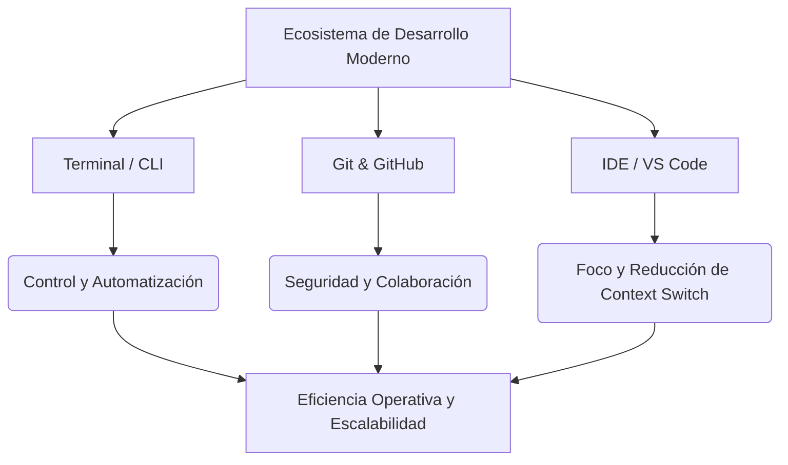

# Ecosistema del Desarrollo de Software Moderno - Conclusiones

**Autor(es):** Brais Moure (@mouredev) / BIG School  
**Fecha:** 2026  
**Tipo:** Paper / Resumen Ejecutivo  
**Fuente Original:** PDF / Módulo 0: Fundamentos del Desarrollo de Software  

---

## 1. Resumen Ejecutivo y La Tríada Estratégica

La competitividad en el mercado del desarrollo de software contemporáneo ya no se mide exclusivamente por el conocimiento de un lenguaje de programación específico, sino por la capacidad del profesional para orquestar un entorno de trabajo robusto, escalable y agnóstico. La integración de una infraestructura técnica personal basada en el dominio de la terminal, el control de versiones y los entornos de desarrollo integrados (IDE) constituye el ecosistema de desarrollo moderno.

### Componentes de la Tríada

| Componente | Rol en el Ecosistema | Propósito y Beneficio |
| --- | --- | --- |
| **Terminal / CLI** | Motor de Automatización | Permite ejecutar tareas repetitivas con precisión quirúrgica, eliminando la latencia de las interfaces gráficas y conectando directamente con servidores e infraestructura *cloud*. |
| **Git & GitHub** | Gestión de Riesgos | Permite experimentar en entornos aislados (ramas) sin afectar el activo principal de la empresa, asegurando la continuidad del negocio y documentando la evolución del producto. |
| **IDE / VS Code** | Centro de Mando | Unifica las herramientas, centraliza la operación y sirve como marco de auditoría para el código asistido por inteligencia artificial. |

---

## 2. La Inteligencia Artificial como Acelerador del Ecosistema

La irrupción de la inteligencia artificial generativa ha modificado las reglas del juego. Sin embargo, su efectividad está intrínsecamente ligada a la robustez del entorno donde se aplica. Un profesional que domine su IDE y su terminal puede integrar asistentes de IA para producir más en menos tiempo, pero solo si posee la capacidad de gestionar esa fluidez mediante procesos de revisión de código (*Pull Requests*) y pruebas rigurosas. La IA no sustituye al ecosistema; lo hace indispensable para no perder el control sobre un volumen de producción de software sin precedentes.

---

## 3. Observaciones Clave

* **Longevidad Profesional:** El dominio de herramientas agnósticas (CLI, Git, Markdown) garantiza la vigencia técnica frente a la rápida obsolescencia de lenguajes y *frameworks* específicos.
* **Protección del Estado de Flujo:** La integración de la terminal dentro del IDE reduce drásticamente el cambio de contexto (*context switch*), protegiendo la concentración y productividad del desarrollador.
* **Seguro de Continuidad:** El control de versiones debe ser entendido como una salvaguarda de continuidad de negocio y no solo como un repositorio de código.
* **Supervisión de IA:** La IA requiere una auditoría humana más técnica que nunca; el ecosistema estructurado es el marco donde se ejerce esa validación.
* **Estandarización del Entorno:** La consistencia en el entorno de trabajo facilita la incorporación (*onboarding*) de nuevos miembros y garantiza la calidad constante en las entregas.

---

## 4. Conclusión Final

En definitiva, la construcción de una "cocina profesional" en el desarrollo de software es lo que permite transitar de la artesanía a la industria. Quien domina estas herramientas adquiere la capacidad de liderar sistemas complejos, garantizando que la tecnología esté al servicio de los objetivos de negocio y no al revés. El futuro pertenece a quienes sepan combinar la potencia de la automatización, la seguridad de la colaboración y la velocidad de la IA bajo un criterio técnico unificado.