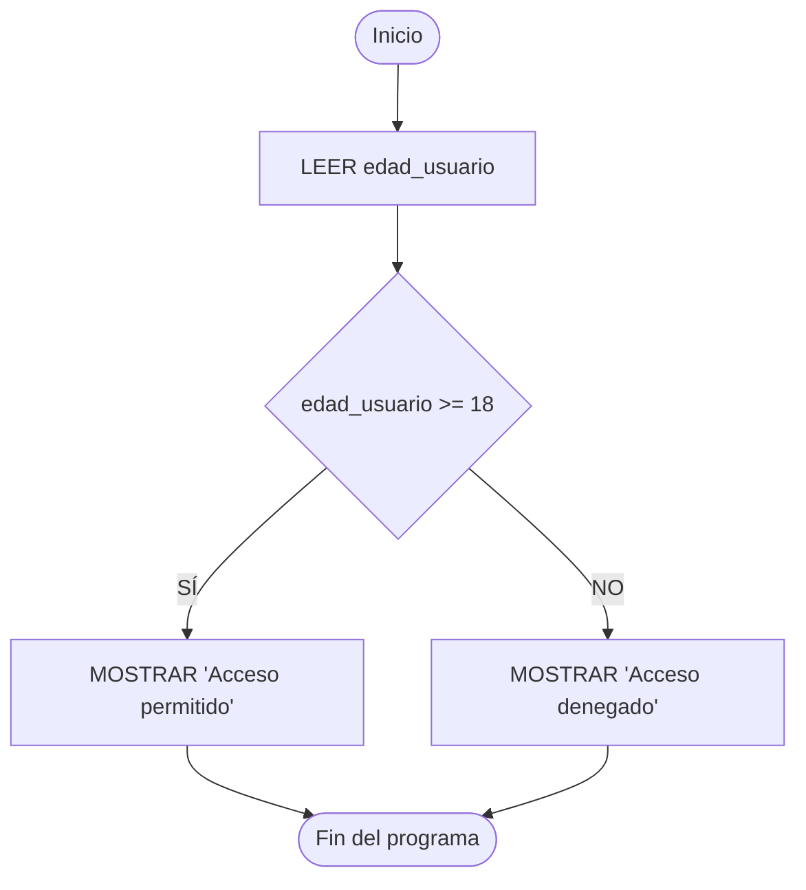
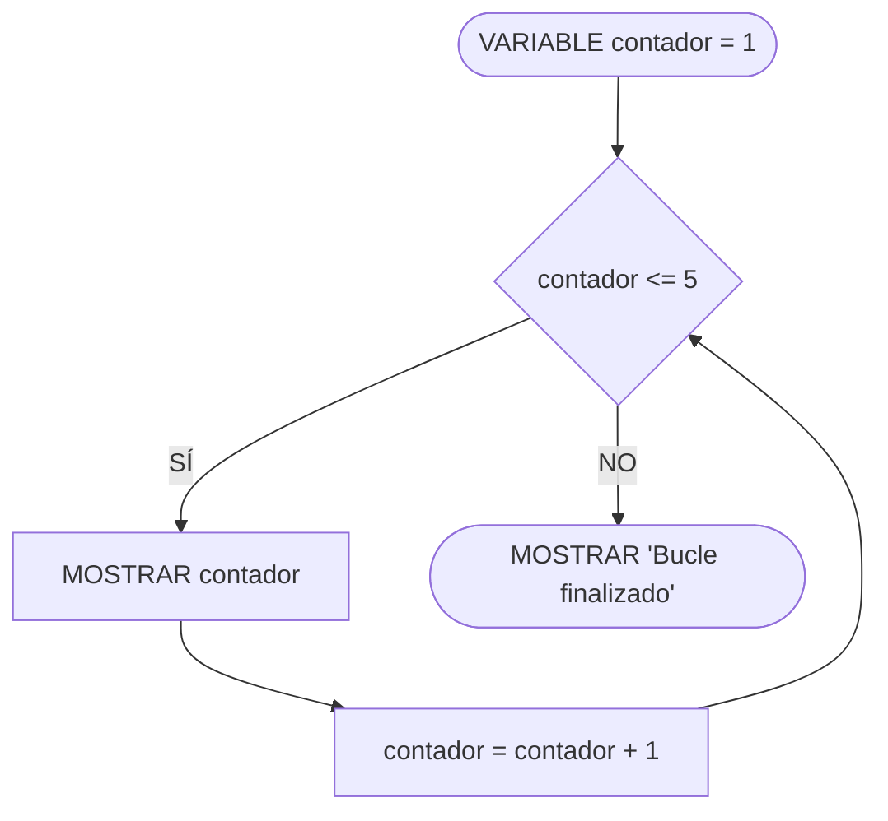

# Estructuras de Control

**Autor(es):** BIG School  
**Fecha:** 2026  
**Tipo:** Paper / Documento Técnico  
**Fuente Original:** PDF / Módulo 0: Fundamentos del Desarrollo de Software  

---

## 1. Visión General

La transición de programas que actúan como calculadoras lineales hacia sistemas dotados de inteligencia lógica se sustenta en el dominio de las estructuras de control. Estas actúan como el sistema nervioso central del software, permitiendo abandonar los flujos secuenciales rígidos para modelar procesos dinámicos que responden a condiciones del entorno en tiempo real.

---

## 2. Bifurcaciones y Condicionales

### Estructura IF / ELSE

Permite ejecutar ramificaciones de código basadas en la evaluación booleana de una condición.



```text
IF (edad_usuario >= 18) {
    MOSTRAR "Acceso permitido"
} ELSE {
    MOSTRAR "Acceso denegado. Eres menor de edad."
}
```

### Estructura ELSE IF (Evaluaciones Encadenadas)

```text
LEER puntuacion
IF (puntuacion >= 90) {
    MOSTRAR "Calificación: A (Excelente)"
} ELSE IF (puntuacion >= 75) {
    MOSTRAR "Calificación: B (Notable)"
} ELSE IF (puntuacion >= 60) {
    MOSTRAR "Calificación: C (Aprobado)"
} ELSE {
    MOSTRAR "Calificación: D (Suspendido)"
}
```

### Anidamiento (*Nesting*)

Consiste en posicionar estructuras condicionales dentro de otros bloques condicionales. Requiere precaución para evitar oscurecer la lectura y mantenibilidad del código.

```text
LEER usuario
LEER contraseña
IF (usuario == "Admin") {
    IF (contraseña == "Secreto123") {
        MOSTRAR "Login exitoso como Administrador"
    } ELSE {
        MOSTRAR "Contraseña incorrecta para Admin"
    }
} ELSE {
    MOSTRAR "Usuario no reconocido"
}
```

### Estructura SWITCH (Selección Múltiple)

Optimiza la legibilidad y rendimiento cuando se evalúa una única variable contra múltiples casos discretos.

```text
SWITCH (opcion_menu) {
    CASE 1:
        AbrirPerfil()
        BREAK
    CASE 2:
        AbrirConfiguracion()
        BREAK
    CASE 3:
        CerrarSesion()
        BREAK
    DEFAULT:
        MOSTRAR "Opción inválida"
}
```

---

## 3. Estructuras de Repetición (Bucles)

### Bucle WHILE (Pre-condición)

Evalúa la condición antes de cada iteración. Si la condición es falsa desde el inicio, el bloque no se ejecuta ninguna vez.



```text
VARIABLE contador = 1
WHILE (contador <= 5) {
    MOSTRAR "Iteración: " + contador
    contador = contador + 1
}
```

### Bucle DO-WHILE (Post-condición)

Garantiza al menos una ejecución del bloque de código antes de evaluar la condición por primera vez.

```text
VARIABLE contraseña_ingresada
DO {
    MOSTRAR "Por favor, introduce la contraseña:"
    LEER contraseña_ingresada
} WHILE (contraseña_ingresada != "Secreto123")
MOSTRAR "Contraseña correcta."
```

### Bucle FOR (Iteración Determinada)

Estructura compacta que agrupa la inicialización, la condición de parada y la actualización de la variable de control.

```text
FOR (VARIABLE i = 1; i <= 5; i = i + 1) {
    MOSTRAR "Esta es la iteración número: " + i
}
```

### Bucle FOREACH (Iteración sobre Colecciones)

Abstrae la gestión de contadores para recorrer secuencialmente elementos de una colección.

```text
LISTA frutas = ["Manzana", "Banana", "Naranja"]
FOREACH (fruta EN frutas) {
    MOSTRAR "Me gusta comer: " + fruta
}
```

---

## 4. Control Avanzado de Flujo

| Instrucción | Tipo | Comportamiento y Acción |
| :---: | --- | --- |
| `BREAK` | Salida Inmediata | Interrumpe de forma inmediata la ejecución del bucle o bloque `SWITCH` actual. |
| `CONTINUE` | Salto de Iteración | Omite el resto de instrucciones de la iteración actual y salta a la siguiente evaluación del bucle. |
| `RETURN` | Retorno de Función | Finaliza la ejecución de la función actual y devuelve opcionalmente un valor al punto de llamada. |

---

## 5. Observaciones Clave

* **Legibilidad y Anidamiento:** La indentación adecuada y la limitación en el anidamiento (*nesting*) son requisitos de seguridad para evitar fallos en la lógica de decisión.
* **Uso de BREAK:** La instrucción `BREAK` es crítica en estructuras `SWITCH` para evitar la ejecución accidental de casos posteriores en cascada (*fall-through*).
* **Bucles Infinitos:** En el diseño de bucles `WHILE`, olvidar la actualización de la variable de control provoca bucles infinitos que pueden colapsar los servicios.
* **Validación de Entradas:** La estructura `DO-WHILE` es ideal para protocolos de validación de entradas donde se requiere solicitar datos al menos una vez al usuario.
* **Optimización con CONTINUE:** `CONTINUE` optimiza los procesos de filtrado al ignorar elementos no relevantes sin romper la continuidad del ciclo.

---

## 6. Conclusión

La maestría en el flujo de control permite orquestar la toma de decisiones del software con rigor. Diseñar algoritmos robustos mediante bifurcaciones claras y bucles controlados garantiza la estabilidad de la arquitectura digital ante cualquier escenario operativo.
