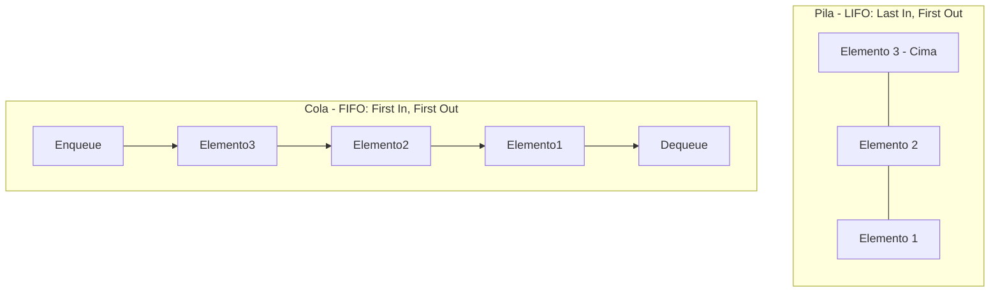

# Estructuras de Datos

**Autor(es):** BIG School  
**Fecha:** 2026  
**Tipo:** Paper / Documento Técnico  
**Fuente Original:** PDF / Módulo 0: Fundamentos del Desarrollo de Software  

---

## 1. Visión General

Si las estructuras de control actúan como el motor lógico de un sistema, las estructuras de datos representan la arquitectura sobre la que se organiza la información. La elección de la estructura adecuada determina la latencia, el consumo de memoria y la capacidad de escalabilidad de una aplicación.

---

## 2. Taxonomía de Estructuras de Datos

### Arrays y Listas

* **Array (Arreglo Estático):** Colección contigua de elementos con un tamaño fijo definido en su creación. Ofrece acceso indexado de alta velocidad.
* **Lista (Arreglo Dinámico):** Estructura lineal cuyo tamaño puede expandirse o contraerse dinámicamente durante la ejecución.

| Índice 0 | Índice 1 | Índice 2 | Índice 3 | Índice 4 |
| :---: | :---: | :---: | :---: | :---: |
| A | B | C | D | E |

---

### Estructuras de Acceso Restringido: Pilas y Colas



#### Pila (*Stack* - LIFO)

* **Mecanismo:** *Last In, First Out* (El último elemento en entrar es el primero en salir).
* **Operaciones Principales:** `PUSH` (insertar en la cima), `POP` (extraer de la cima).
* **Casos de Uso:** Historial de navegación, función de deshacer (*undo*), gestión de llamadas en compiladores (*call stack*).

#### Cola (*Queue* - FIFO)

* **Mecanismo:** *First In, First Out* (El primer elemento en entrar es el primero en salir).
* **Operaciones Principales:** `ENQUEUE` (insertar al final), `DEQUEUE` (extraer del frente).
* **Casos de Uso:** Colas de impresión, procesamiento de tareas asíncronas, atención de peticiones en servidores.

---

### Mapas / Diccionarios (*Hash Tables*)

Estructura asociativa que almacena datos en pares **Clave-Valor**. Las claves deben ser únicas.

```text
CLAVE (Única)    -->    VALOR
"Nombre"         -->    "Ana"
"Edad"           -->    30
"Ciudad"         -->    "Madrid"
```

* **Ventaja:** Permite búsquedas, inserciones y recuperaciones en tiempo casi instantáneo ($O(1)$) mediante técnicas de *hashing*, eliminando la necesidad de recorrer listas elemento por elemento.

---

### Conjuntos (*Sets*)

Colección no ordenada de elementos donde no se permiten valores duplicados.

```text
Set Inicial: { "Rojo", "Verde", "Azul" }

Añadir "Verde"    --> El Set permanece: { "Rojo", "Verde", "Azul" } (Omite el duplicado)
Añadir "Amarillo" --> El Set se actualiza: { "Rojo", "Verde", "Azul", "Amarillo" }

¿Existe "Rojo"?  --> Verdadero
```

---

## 3. Cuadro Comparativo de Aplicación Estratégica

| Estructura | Tamaño | Duplicados | Acceso / Búsqueda | Caso de Uso Principal |
| --- | --- | --- | --- | --- |
| **Array** | Fijo | Permitidos | Por Índice ($O(1)$) | Datos de dimensión conocida (ej. coordenadas). |
| **Lista** | Dinámico | Permitidos | Por Índice / Secuencial | Colecciones variables (ej. lista de compras). |
| **Pila** | Dinámico | Permitidos | Solo en la cima (LIFO) | Deshacer acciones, evaluación de expresiones. |
| **Cola** | Dinámico | Permitidos | Solo al frente (FIFO) | Procesamiento de tareas por turno. |
| **Mapa** | Dinámico | Claves Únicas | Por Clave ($O(1)$) | Búsqueda rápida por identificador (ej. usuarios). |
| **Set** | Dinámico | Prohibidos | Verificación de pertenencia | Filtrado automático y garantía de valores únicos. |

---

## 4. Observaciones Clave

* **Índices en Arrays:** El acceso indexado en arreglos comienza convencionalmente en el índice `0`; intentar acceder a un índice igual al tamaño provoca errores de límite (*Index Out of Bounds*).
* **Penalizaciones por Desplazamiento:** Modificar estructuras lineales mediante inserciones o borrados en posiciones intermedias conlleva penalizaciones de rendimiento debido al desplazamiento de elementos en memoria.
* **Optimización de Mapas:** Los mapas sacrifican el orden explícito de los elementos a favor de una velocidad de búsqueda óptima ($O(1)$) basada en claves únicas.
* **Detección de Duplicidad:** Los conjuntos (*sets*) filtran automáticamente la duplicidad de datos en la capa de almacenamiento.

---

## 5. Conclusión

Dominar las estructuras de datos permite diseñar el esqueleto sobre el cual los algoritmos procesan la información. Elegir la estructura adecuada para cada necesidad maximiza la eficiencia del sistema y minimiza el consumo de recursos computacionales.