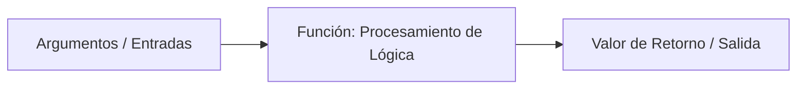

# Funciones y Parámetros

**Autor(es):** BIG School  
**Fecha:** 2026  
**Tipo:** Paper / Documento Técnico  
**Fuente Original:** PDF / Módulo 0: Fundamentos del Desarrollo de Software  

---

## 1. Visión General y Modularización

El desarrollo de software profesional trasciende la escritura lineal de código. A medida que un sistema crece en complejidad, mantener bloques extensos de instrucciones resulta ineficiente, propenso a errores y costoso de mantener. Las **funciones** (también conocidas como métodos, rutinas o subprogramas) constituyen la unidad fundamental de abstracción y modularización en la programación moderna.

Una función es un bloque de código reutilizable diseñado para realizar una tarea específica. Al empaquetar una secuencia de instrucciones bajo un nombre descriptivo, las funciones permiten aplicar el principio **DRY** (*Don't Repeat Yourself*), reduciendo la duplicidad de código y dividiendo problemas complejos en subproblemas más simples (enfoque *divide y vencerás*).

---

## 2. Anatomía de una Función

### Declaración e Invocación

* **Declaración:** Definición de la firma de la función, sus parámetros de entrada y su cuerpo de ejecución.
* **Invocación / Llamada:** Ejecución del bloque funcional desde otra parte del programa pasando argumentos específicos.



```text
// Firma y Declaración de Función en Pseudocódigo
FUNCION CalcularPrecioTotal(precioBase, impuesto) {
    VARIABLE total = precioBase + (precioBase * impuesto)
    RETORNAR total
FIN FUNCION

// Invocación de la Función
VARIABLE factura = CalcularPrecioTotal(100, 0.19)
```

---

## 3. Parámetros y Argumentos

Aunque frecuentemente se utilizan como sinónimos en el lenguaje cotidiano, existe una distinción conceptual clara entre parámetro y argumento:

* **Parámetro:** Variable definida en la firma de la función que actúa como un contenedor para recibir datos (`precioBase`, `impuesto`).
* **Argumento:** Valor real o expresado que se pasa a la función durante su invocación (`100`, `0.19`).

### Mecanismos de Paso de Parámetros

| Mecanismo | Comportamiento | Impacto en la Variable Original |
| --- | --- | --- |
| **Paso por Valor** | La función recibe una copia exacta del dato original. | Los cambios realizados dentro de la función **no afectan** a la variable externa. |
| **Paso por Referencia** | La función recibe la dirección de memoria de la variable original. | Cualquier modificación dentro de la función **altera directamente** la variable externa. |

#### Ejemplo de Paso por Valor vs. Referencia

```python
# Paso por Valor (Tipos Primitivos)
def duplicar_numero(n):
    n = n * 2
    return n

x = 5
duplicar_numero(x)  # x sigue valiendo 5

# Paso por Referencia (Estructuras Complejas / Objetos)
def agregar_item(lista):
    lista.append("Nuevo Elemento")

mis_items = ["Item 1"]
agregar_item(mis_items)  # mis_items ahora contiene ["Item 1", "Nuevo Elemento"]
```

---

## 4. Retorno de Valores y Efectos Secundarios

### Valores de Retorno (`RETURN`)

La instrucción `RETURN` finaliza de forma inmediata la ejecución de la función y devuelve el resultado computado al punto donde fue invocada.

* **Funciones Puramente Computacionales:** Reciben datos, calculan y devuelven un valor sin alterar el estado externo.
* **Funciones VOID (Sin retorno):** Ejecutan una serie de acciones (ej. imprimir en pantalla, escribir en un log o archivo) sin devolver un valor explícito.

### Funciones Puras vs. Efectos Secundarios (*Side Effects*)

| Tipo | Definición | Determinismo |
| --- | --- | --- |
| **Función Pura** | Produce siempre el mismo resultado para los mismos argumentos y no modifica el estado externo. | Totalmente determinista y fácil de probar en pruebas unitarias (*unit tests*). |
| **Efecto Secundario** | Modifica variables globales, realiza peticiones de red o altera archivos en disco. | Puede generar comportamientos imprevistos si no se gestiona adecuadamente. |

---

## 5. Scope (Ámbito) y Sombreado (*Shadowing*)

Las variables declaradas dentro de una función poseen **Scope Local**, existiendo únicamente durante la ejecución de dicha función.

```python
variable_global = "Acceso Global"

def mi_funcion():
    variable_local = "Solo dentro de la función"
    print(variable_global) # Válido

mi_funcion()
# print(variable_local) # ERROR: variable_local no existe en el scope global
```

* **Shadowing (Sombreado):** Ocurre cuando una variable local se declara con el mismo nombre que una variable global, ocultando temporalmente el acceso a la global dentro del bloque funcional.

---

## 6. Observaciones Clave

* **Principio de Responsabilidad Única (SRP):** Cada función debe realizar una sola tarea bien definida. Si una función es demasiado extensa o realiza múltiples acciones no relacionadas, debe refactorizarse en funciones más pequeñas.
* **Firma Clara y Nombres Descriptivos:** El nombre de una función debe ser un verbo o frase verbal que describa su acción (`CalcularDescuento()`, `ValidarUsuario()`).
* **Evitar Efectos Secundarios Imprevistos:** Preferir funciones puras siempre que sea posible para facilitar las pruebas unitarias y el mantenimiento del sistema.
* **Valores por Defecto:** Muchos lenguajes permiten definir valores predeterminados para parámetros opcionales no provistos en la invocación.

---

## 7. Conclusión

El uso adecuado de funciones y parámetros es el pilar de la arquitectura limpia de software. Al dominar el encapsulamiento, el aislamiento de ámbitos y la correcta transferencia de datos por valor o referencia, el desarrollador adquiere la capacidad de construir sistemas modulares, testeables y altamente escalables.
