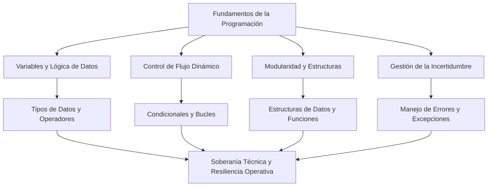

# Fundamentos de la Programación - Conclusiones Generales

**Autor(es):** BIG School  
**Fecha:** 2026  
**Tipo:** Paper / Resumen Ejecutivo  
**Fuente Original:** PDF / Módulo 0: Fundamentos del Desarrollo de Software  

---

## 1. El Marco Mental del Pensamiento Computacional

La capacidad de resolver problemas mediante tecnología no reside en el dominio de una sintaxis específica, sino en la adquisición de un kit de herramientas mentales que permite descomponer la realidad en procesos ejecutables. 

En un entorno empresarial donde la digitalización es la norma, entender los pilares de la programación es equivalente a comprender los engranajes de la economía moderna. No se trata simplemente de escribir líneas de código, sino de diseñar comportamientos escalables y sistemas resilientes que transformen datos brutos en decisiones estratégicas.

---

## 2. La Materia Prima: Variables y Lógica de Datos

Todo desarrollo de software se fundamenta en la capacidad de procesar información. El primer paso para construir una solución robusta es identificar la naturaleza de los datos con los que operamos.

* **Variables:** Actúan como contenedores etiquetados que permiten almacenar valores esenciales para el negocio.
* **Tipología de Datos:** Reglas que rigen el comportamiento de números (cálculos financieros), cadenas de texto (comunicación con clientes) o booleanos (validación de estados).
* **Operadores:** Mecanismos para transformar la materia prima mediante cálculos aritméticos o comparaciones lógicas.

Sin una correcta definición de variables y una manipulación precisa, cualquier estructura superior carece de integridad.

---

## 3. Control de Flujo y Comportamientos Dinámicos

La verdadera potencia de la programación se manifiesta cuando el código deja de ser una lista estática de instrucciones y comienza a tomar decisiones autónomas.

### Condicionales: La Toma de Decisiones

Las estructuras condicionales permiten que un programa bifurque su ejecución dependiendo de las circunstancias. Implementar lógicas de tipo *"si ocurre esto, haz aquello"* es lo que permite personalizar experiencias de usuario en tiempo real o gestionar niveles de riesgo en transacciones financieras.

### Bucles: Eficiencia y Escalabilidad

La capacidad de repetición otorga a la tecnología su ventaja competitiva sobre el trabajo manual. Mediante el uso de bucles, podemos procesar miles de registros o realizar tareas recurrentes sin desgaste y con total precisión, convirtiendo procesos que antes tomaban días en ejecuciones de milisegundos.

---

## 4. Organización y Reutilización: Funciones y Estructuras de Datos

A medida que la complejidad de un proyecto crece, la necesidad de orden se vuelve crítica.

* **Estructuras de Datos (Arrays, Mapas, Sets):** Funcionan como archivadores lógicos que organizan la información de manera limpia y accesible para construir modelos de datos escalables.
* **Funciones:** Representan la transición hacia la artesanía técnica. Al empaquetar lógica específica en bloques reutilizables, pasamos de escribir código lineal a construir sistemas modulares. Una función bien diseñada recibe parámetros, procesa información y devuelve un resultado, minimizando efectos secundarios.

---

## 5. Gestión de la Incertidumbre y Resiliencia Operativa

Un rasgo distintivo del desarrollo profesional frente al amateur es la anticipación del fallo. El mundo real es imperfecto: las conexiones fallan, los usuarios introducen datos erróneos y los sistemas externos caen.

El manejo de errores y excepciones es una red de seguridad esencial. Crear software que no se desmorone ante el imprevisto, sino que responda con elegancia y control (*graceful degradation*), es lo que garantiza la continuidad del servicio y la confianza del cliente final.

---

## 6. Observaciones Clave

* **Soberanía Lógica:** Dominar los fundamentos trasciende el ámbito técnico para convertirse en una ventaja estratégica en el mercado.
* **Base para la IA:** La Inteligencia Artificial, en su esencia, es una combinación sofisticada de estas mismas herramientas mentales (variables, funciones, control de flujo y estructuras de datos).
* **Arquitectura de Resistencia:** La integración de estos conceptos capacita al profesional para supervisar, diseñar y liderar proyectos tecnológicos capaces de resistir y evolucionar en la complejidad del mundo real.

---

## 7. Conclusión Final

Dominar los fundamentos de la programación trasciende el ámbito técnico para convertirse en una ventaja estratégica en el mercado actual. Al comprender cómo se integran las variables, las funciones y las estructuras de datos, estamos capacitados para supervisar, diseñar y liderar proyectos tecnológicos que no solo funcionen en teoría, sino que sean capaces de resistir y evolucionar en la complejidad del mundo real. El paso final es trasladar este marco lógico a lenguajes de ejecución para materializar la visión estratégica en soluciones tangibles.