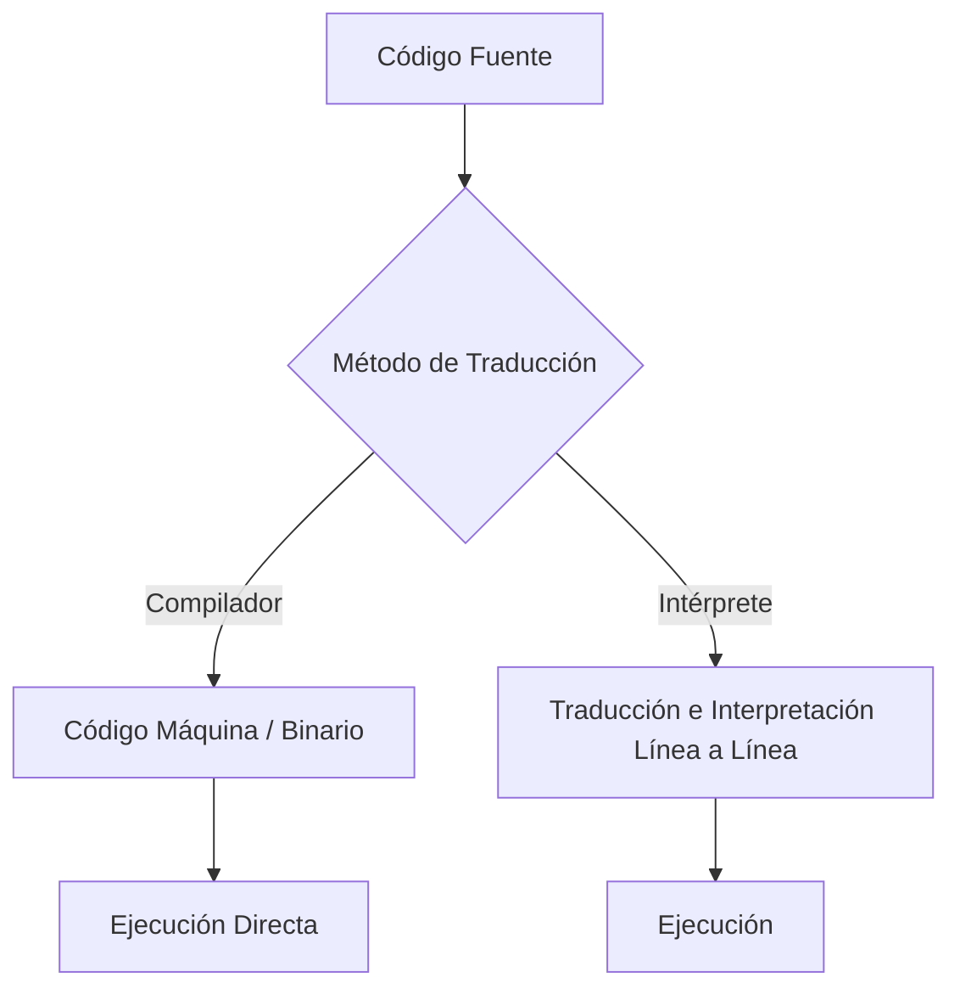

# Fundamentos de la Programación - Introducción y Sintaxis

**Autor(es):** BIG School  
**Fecha:** 2026  
**Tipo:** Paper / Documento Técnico  
**Fuente Original:** PDF / Módulo 0: Fundamentos del Desarrollo de Software  

---

## 1. Visión General y Contexto del Mercado

El mercado tecnológico actual ha desplazado el foco del programador como mero transcriptor de código hacia un perfil de arquitecto de soluciones con alta capacidad crítica. Dominar la programación hoy no implica memorizar manualmente cada carácter de un lenguaje específico, sino comprender la infraestructura lógica que permite que una idea abstracta se transforme en un activo ejecutable. Esta transición entre el pensamiento computacional y la implementación técnica constituye el verdadero diferencial competitivo en entornos de alta incertidumbre. La realidad operativa dicta que los ordenadores, a pesar de su potencia de procesamiento masiva, operan bajo una rigidez absoluta; son entidades extremadamente literales que carecen de contexto intrínseco.

Por ello, la labor del líder tecnológico no reside en la lucha contra la sintaxis —una tarea que la inteligencia artificial está asumiendo con una precisión quirúrgica—, sino en el control de la semántica lógica, que es donde realmente se gana o se pierde la eficiencia de un proyecto. Este enfoque prepara para una era de agnosticismo de lenguaje, donde la capacidad de saltar entre Python, JavaScript o Java depende de la solidez de los fundamentos universales y no de la familiaridad con una puntuación concreta. A ello se suma la soberanía técnica de entender los procesos de traducción: saber cuándo la inmediatez de un intérprete es preferible a la robustez y velocidad de un compilador define la viabilidad de una arquitectura escalable.

En última instancia, el profesional de élite es aquel que reconoce que un programa puede ser gramaticalmente perfecto pero estratégicamente fallido. La validación de la lógica de negocio es el último bastión del criterio humano, y es ahí donde la programación se convierte en una herramienta de decisión empresarial más que en un simple ejercicio de escritura técnica. Este cambio de paradigma nos obliga a ver el código fuente no como un destino, sino como un vehículo de comunicación entre la visión de negocio y la capacidad de cómputo, exigiendo una claridad que minimice la ambigüedad y maximice la mantenibilidad a largo plazo.

---

## 2. La Dualidad del Código: Traducción y Ejecución

El código que escribimos se denomina **Código Fuente** (*Source Code*). Sin embargo, el procesador no puede ejecutarlo directamente; necesita ser traducido a **Código Máquina**. Por ejemplo, el texto `"Hola"` en representación binaria de código máquina se observa como:

```text
01001000 01101111 01101100 01100001
```

### Arquitecturas de Compilación vs. Interpretación

Existen dos modalidades principales para realizar esta traducción:

| Aspecto | Compilación (*Compiler*) | Interpretación (*Interpreter*) |
| --- | --- | --- |
| **Mecanismo** | Genera un archivo binario ejecutable optimizado de una sola vez. | Lee y traduce el código línea por línea en tiempo de ejecución. |
| **Analogía** | Traducción editorial previa: la obra se consume directamente sin intermediarios. | Traducción simultánea: interpretación en vivo en tiempo real. |
| **Ventaja** | Alta velocidad de ejecución y rendimiento optimizado. | Alta flexibilidad en desarrollo, depuración e iteración rápida. |
| **Desventaja** | Requiere proceso previo de compilación antes de probar cambios. | Mayor consumo computacional y menor velocidad en ejecución. |



---

## 3. Fundamentos Universales, Sintaxis y Semántica

La sintaxis representa la gramática y ortografía rígida del diálogo hombre-máquina. A diferencia del lenguaje natural, donde el contexto puede salvar una comunicación defectuosa, la programación no admite margen de error.

*Ejemplo de ambigüedad en lenguaje natural:*
> `"Vamos a comer, niños."` **vs.** `"Vamos a comer niños."`

Un signo de puntuación cambia drásticamente el significado. En código, un único carácter omitido provoca un fallo sistémico (error de compilación o de ejecución).

### Elementos Comunes de la Sintaxis

| Elemento Sintáctico | Descripción | Ejemplos |
| --- | --- | --- |
| **Keywords (Palabras reservadas)** | Instrucciones propias del lenguaje con significado específico reservado. | `if`, `while`, `function`, `class`, `return` |
| **Identificadores** | Nombres asignados a variables, funciones, parámetros o clases. | `userName`, `calcularImpuesto`, `ClienteService` |
| **Puntuaciones y delimitadores** | Símbolos de control gramatical que estructuran el código. | `()`, `{}`, `[]`, `;`, `,` |
| **Sensibilidad a mayúsculas (*Case sensitive*)** | Distinción estricta entre mayúsculas y minúsculas en nombres. | `variable` y `Variable` representan entidades distintas. |
| **Espacios e indentación** | Reglas de espaciado y tabulación para delimitar bloques de ejecución. | Identación por bloques (ej. Python). |

### Estilos de Delimitación de Bloques

#### Estilo por Llaves (C++, Java, JavaScript)

```javascript
if (condicion) {
    hacer_esto();
}
```

#### Estilo por Indentación (Python)

```python
if condicion:
    hacer_esto()
```

---

## 4. Estilo, Convenciones y Comentarios

La semántica rige la intención y lógica de negocio detrás de la sintaxis. Para garantizar la mantenibilidad y legibilidad del código a largo plazo, se aplican comentarios descriptivos enfocados en la arquitectura y convenciones de nombres.

```python
# Comentario descriptivo: Explica la lógica estratégica o la razón de la decisión técnica
calcular_impuesto()
```

---

## 5. Observaciones Clave

* **Sintaxis vs. Semántica:** La sintaxis es el mandato de la máquina; la semántica es el mandato del negocio.
* **Impacto de Errores:** Un error sintáctico detiene el programa; un error semántico destruye la rentabilidad del proceso sin emitir un aviso de error explícito.
* **Legibilidad como Activo Financiero:** La legibilidad del código es un activo financiero que reduce los costes de mantenimiento y facilita la colaboración en equipos multidisciplinares.
* **Propósito de los Comentarios:** Los comentarios en el código no deben explicar *qué* hace una instrucción, sino *por qué* se tomó esa decisión técnica específica.
* **Rol de la Inteligencia Artificial:** La IA es una aliada en la generación de sintaxis rutinaria, pero el control de calidad semántico es una competencia humana intransferible.

---

## 6. Conclusión

El dominio de los fundamentos de programación es, en esencia, el desarrollo de una mentalidad de precisión extrema. Mientras el mercado se satura de técnicos que conocen la superficie de las herramientas, la ventaja competitiva reside en aquellos que comprenden la lógica subyacente que rige el comportamiento del hardware. Al separar la sintaxis (la forma) de la semántica (el fondo), el profesional se libera de la dependencia de un *stack* tecnológico concreto, garantizando que el software no solo funcione, sino que resuelva el problema correcto de la forma más eficiente posible.