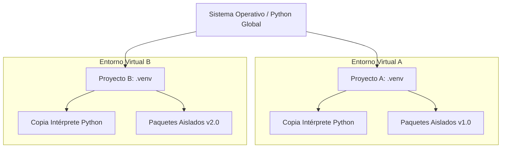

# Gestión de Entornos y Dependencias en Python

**Autor(es):** BIG School  
**Fecha:** 2026  
**Tipo:** Paper / Documento Técnico  
**Fuente Original:** PDF / Módulo 0: Fundamentos del Desarrollo de Software  

---

## 1. Visión General y Contexto

La estabilidad de una solución tecnológica no reside únicamente en la lógica del código, sino en la capacidad de asegurar que dicho software se comporte de manera idéntica en cualquier infraestructura. En el desarrollo profesional, confiar en la configuración global de una máquina es un riesgo operativo que conduce al colapso de la escalabilidad. 

La gestión de entornos virtuales y dependencias emerge como la infraestructura invisible que permite transformar un script local en un producto industrializable. Al aislar cada proyecto, se garantiza la integridad sistémica y se permite que equipos multidisciplinares colaboren sin fricciones técnicas.

---

## 2. El Entorno Virtual (`venv`)

### Concepto y Definición

Un entorno virtual es una copia autocontenida y aislada de una instalación de Python. Al crearlo, se obtiene:
* Una copia del intérprete de Python.
* Un espacio propio completamente vacío para instalar librerías (paquetes).

La herramienta estándar en la librería nativa de Python para la gestión de estos entornos es el módulo `venv`.



### Comandos de Creación y Activación

```bash
# 1. Crear una carpeta para el proyecto y acceder a ella
mkdir mi_proyecto_genial
cd mi_proyecto_genial

# 2. Ejecutar el módulo venv para crear el entorno en una carpeta llamada 'venv'
python -m venv venv

# 3. Activar el entorno virtual según el sistema operativo
# En Windows (CMD/PowerShell):
venv\Scripts\activate

# En macOS y Linux (Bash/ZSH):
source venv/bin/activate

# 4. Desactivar el entorno virtual al finalizar la sesión
deactivate
```

---

## 3. Gestión de Paquetes con PIP

Un paquete es una colección de código desarrollada por terceros para resolver problemas específicos (peticiones HTTP, análisis de datos, Machine Learning, etc.). `pip` es el gestor de paquetes oficial para instalar, actualizar y eliminar librerías dentro del entorno virtual activo.

```bash
# Instalación de un paquete específico
pip install requests

# Consultar todos los paquetes instalados en el entorno activo
pip list
```

---

## 4. Archivo de Requisitos (`requirements.txt`)

El archivo `requirements.txt` actúa como un contrato de dependencias e inventario que detalla las librerías exactas y sus versiones.

```bash
# Congelar (freeze) y exportar el listado de paquetes instalados al archivo de requisitos
pip freeze > requirements.txt

# Instalar todas las dependencias listadas en el archivo de requisitos
pip install -r requirements.txt
```

---

## 5. Observaciones Clave

* **Activación Obligatoria:** La activación del entorno es obligatoria en cada sesión de trabajo para evitar la instalación accidental de paquetes en el ámbito global del sistema.
* **Fijación de Versiones (*Version Pinning*):** En proyectos de Inteligencia Artificial y producción, fijar las versiones explícitamente en el archivo de requisitos previene fallos por actualizaciones incompatibles de librerías de terceros.
* **Exclusión en Control de Versiones:** La carpeta del entorno virtual (`venv/` o `.venv/`) **nunca debe subirse al repositorio de código** (debe incluirse en `.gitignore`); en su lugar, solo se comparte el archivo `requirements.txt`.

---

## 6. Conclusión

Adoptar un flujo de trabajo basado en el aislamiento de entornos asegura que las soluciones de software y modelos de IA sean transferibles, reproducibles y escalables. Este hábito previene incompatibilidades en despliegues a producción y ahorra costes operativos.
