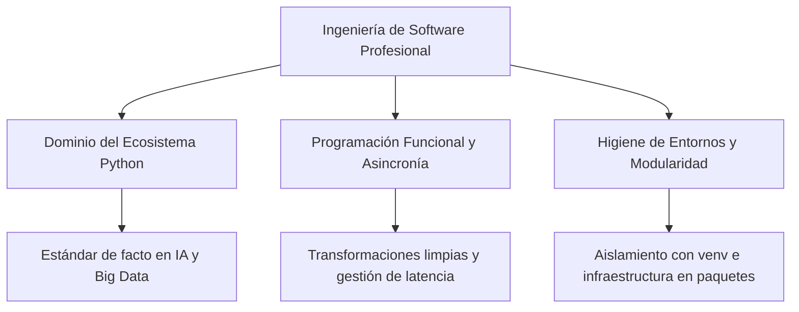

# Introducción a los Lenguajes de Programación - Conclusiones Generales

**Autor(es):** BIG School  
**Fecha:** 2026  
**Tipo:** Paper / Resumen Ejecutivo  
**Fuente Original:** PDF / Módulo 0: Fundamentos del Desarrollo de Software  

---

## 1. Resumen Ejecutivo

La viabilidad de cualquier iniciativa tecnológica en el mercado actual no reside únicamente en la capacidad de ejecutar una idea, sino en la robustez técnica que permite que dicha idea sea escalable y mantenible a largo plazo. 

Superar la barrera de la lógica de programación convencional para adentrarse en la ingeniería de software profesional marca la diferencia entre un prototipo frágil y una solución de negocio sólida.

---

## 2. Los Pilares del Desarrollo de Software de Alto Nivel

### Dominio del Ecosistema y Gramática Funcional

Python se ha consolidado como el estándar de facto en inteligencia artificial y ciencia de datos. Al dominar sus fundamentos (variables, tipos de datos, estructuras de control) y evolucionar hacia paradigmas como la programación funcional, el desarrollador se enfoca en transformaciones de datos limpias, predecibles y sin efectos secundarios, facilitando la auditoría técnica.

### Agilidad y Rendimiento mediante Asincronía

En un entorno conectado, la gestión eficiente del tiempo de espera es vital. La asincronía es la técnica clave para interactuar con APIs externas, bases de datos y microservicios sin bloquear el flujo del programa. Esto optimiza los costes de infraestructura y ofrece respuestas fluidas al usuario final.

### Disciplina e Higiene en la Organización de Proyectos

El software profesional exige orden y estándares rigurosos de empaquetado:

* **Entornos Virtuales:** Garantizan que el proyecto sea ejecutable e idéntico en cualquier servidor o máquina corporativa.
* **Modularidad:** Dividir el código en módulos y paquetes permite construir infraestructuras de gran escala que resultan fáciles de mantener, auditar y escalar.

---

## 3. Observaciones Clave

* **Elección Estratégica:** La selección de lenguajes y herramientas debe basarse en la madurez del ecosistema y su capacidad de integración nativa con arquitecturas de Inteligencia Artificial.
* **Previsibilidad Operativa:** La programación funcional minimiza errores en producción en comparación con la programación imperativa al evitar estados mutables globales.
* **Portabilidad Sistémica:** Prescindir de entornos virtuales compromete la estabilidad operativa y la reproducibilidad durante el despliegue.
* **Gestión Eficiente de I/O:** La asincronía es indispensable al consumir servicios externos, bases de datos distribuidas y APIs de forma masiva.
* **Sostenibilidad Arquitectónica:** La arquitectura modular frena el incremento exponencial de la deuda técnica a medida que la empresa crece.

---

## 4. Conclusión Final

La transición de seguir instrucciones secuenciales a diseñar arquitecturas modulares, asíncronas y aisladas capacita al profesional para abordar problemas de negocio complejos con rigor técnico. Al combinar Python, pensamiento funcional, asincronía y modularidad, se establece una plataforma estable para la innovación continua y el crecimiento sostenible en el mercado digital.
