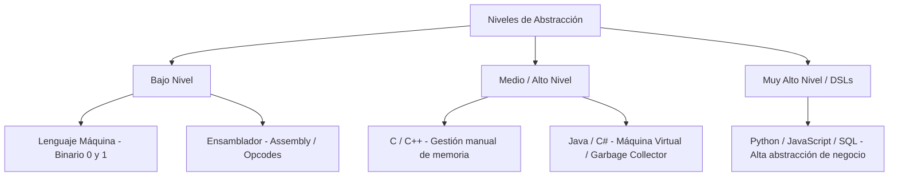
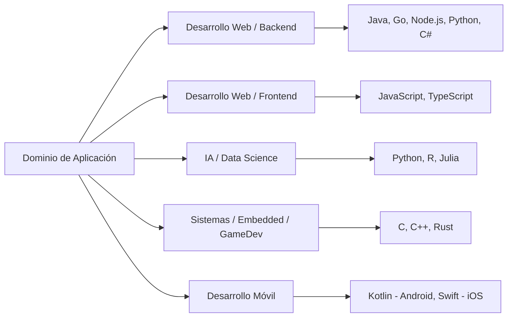

# Introducción a los Lenguajes de Programación

**Autor(es):** BIG School  
**Fecha:** 2026  
**Tipo:** Paper / Documento Técnico  
**Fuente Original:** PDF / Módulo 0: Fundamentos del Desarrollo de Software  

---

## 1. Visión General y Evolución Tecnológica

Un **lenguaje de programación** es un sistema formal estructurado por reglas sintácticas y semánticas que permite a los seres humanos instruir a un sistema de cómputo para realizar tareas específicas. En la historia de la informática, los lenguajes han evolucionado continuamente con un objetivo claro: elevar el **nivel de abstracción**, permitiendo expresar conceptos de negocio complejos sin tener que gestionar manualmente cada transistor o celda de memoria.

La elección de un lenguaje de programación no es una decisión dogmática o estética, sino una decisión estratégica de arquitectura de software que impacta en el rendimiento, la mantenibilidad, los costes operativos y la velocidad de desarrollo (*time-to-market*).

---

## 2. Niveles de Abstracción de los Lenguajes

Los lenguajes de programación se clasifican principalmente según su nivel de proximidad al hardware físico o a la lógica del pensamiento humano:

### Tabla Comparativa por Nivel de Abstracción

| Nivel | Ejemplos | Ventajas | Desventajas |
| --- | --- | --- | --- |
| **Bajo Nivel** | Binario, Assembly | Control absoluto del hardware, máxima velocidad de ejecución y latencia mínima. | Dificultad extrema de escritura, nula portabilidad y alta probabilidad de errores. |
| **Nivel Medio / Alto** | C, C++, Rust | Alto rendimiento y eficiencia de recursos con sintaxis estructurada. | Gestión compleja de memoria (en C/C++) y curva de aprendizaje elevada. |
| **Alto Nivel** | Java, C#, Go | Seguridad de memoria, recolección de basura (*Garbage Collection*) e independencia de plataforma. | Menor control directo sobre el hardware y ligero consumo adicional de recursos. |
| **Muy Alto Nivel / DSL** | Python, SQL, HTML/CSS | Expresividad extrema, prototipado ultra rápido y cercanía al lenguaje natural. | Menor velocidad bruta de ejecución y mayor abstracción de la memoria. |

---

## 3. Principales Paradigmas de Programación

Un **paradigma de programación** es un enfoque o filosofía fundamental que gobierna la estructura y organización del código. La mayoría de lenguajes modernos son **multiparadigma**, permitiendo combinar diferentes enfoques según el problema.

| Paradigma | Enfoque Principal | Conceptos Clave | Lenguajes Representativos |
| --- | --- | --- | --- |
| **Imperativo / Procedural** | Describe *cómo* se debe calcular mediante una secuencia paso a paso de instrucciones y cambios de estado. | Algoritmos secuenciales, procedimientos, variables mutables. | C, Pascal, Bash |
| **Orientado a Objetos (POO / OOP)** | Modela el software organizando datos y comportamientos en entidades llamadas *Objetos* e *Instancias*. | Clases, Encapsulamiento, Herencia, Polimorfismo. | Java, C++, C#, Python |
| **Funcional (FP)** | Modela el cómputo como la evaluación de funciones matemáticas puras evitando estados mutables. | Funciones puras, inmutabilidad, funciones de primer orden (*higher-order*). | Haskell, Elixir, Scala, Clojure |
| **Declarativo** | Describe *qué* resultado se desea obtener sin especificar la secuencia detallada de pasos. | Consultas, reglas lógicas, transformaciones de datos. | SQL, Prolog, HTML |

---

## 4. Clasificación según el Modelo de Ejecución

Los lenguajes difieren en el mecanismo utilizado para transformar el código fuente en instrucciones ejecutables por la CPU:

1. **Lenguajes Compilados (C, C++, Go, Rust):** El código fuente se traduce por completo a código máquina específico de la plataforma antes de su ejecución. Generan binarios de alto rendimiento.
2. **Lenguajes Interpretados (Python, Ruby, PHP):** Un intérprete lee y ejecuta el código línea por línea en tiempo real, facilitando la depuración y portabilidad entre sistemas operativos.
3. **Lenguajes Híbridos / JIT (Java, C# / .NET):** El código fuente se compila a un código intermedio agnóstico (*Bytecode* o CIL) y una Máquina Virtual (JVM o CLR) lo traduce en tiempo de ejecución a código máquina mediante un compilador *Just-In-Time* (JIT).

---

## 5. Criterios de Selección de Lenguaje por Dominio de Industria

Ningún lenguaje de programación es superior en todos los contextos. La elección debe alinearse con los requerimientos no funcionales del proyecto:

---

## 6. Observaciones Clave

* **Agnosticismo Tecnológico:** Los desarrolladores profesionales dominan los fundamentos universales (lógica, estructuras de datos, patrones), permitiéndoles aprender la sintaxis de un nuevo lenguaje en cuestión de días.
* **Seguridad de Memoria (*Memory Safety*):** Lenguajes modernos como Rust previenen errores críticos de gestión de memoria (*null pointer*, *buffer overflow*) en tiempo de compilación sin requerir un *Garbage Collector*.
* **Ecosistema y Comunidad:** Más allá de la sintaxis, el valor real de un lenguaje reside en la madurez de su ecosistema de librerías, marcos de trabajo (*frameworks*), herramientas de pruebas y comunidad de soporte.

---

## 7. Conclusión

Los lenguajes de programación son herramientas al servicio de la resolución de problemas empresariales e ingenieriles. Comprender la taxonomía, niveles de abstracción, modelos de ejecución y paradigmas permite al tecnólogo tomar decisiones informadas de arquitectura, garantizando la escalabilidad, mantenibilidad y rendimiento a largo plazo de las aplicaciones.
