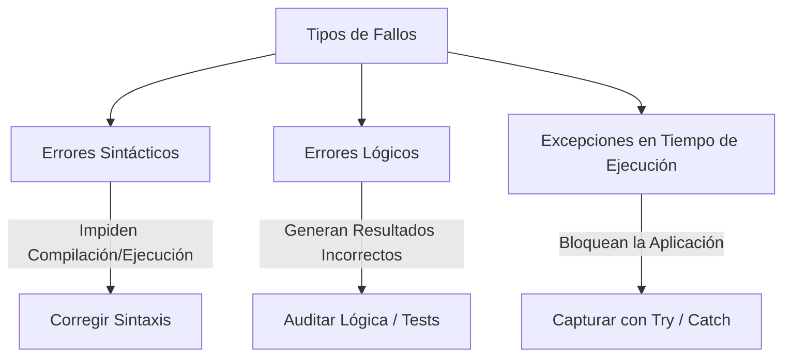
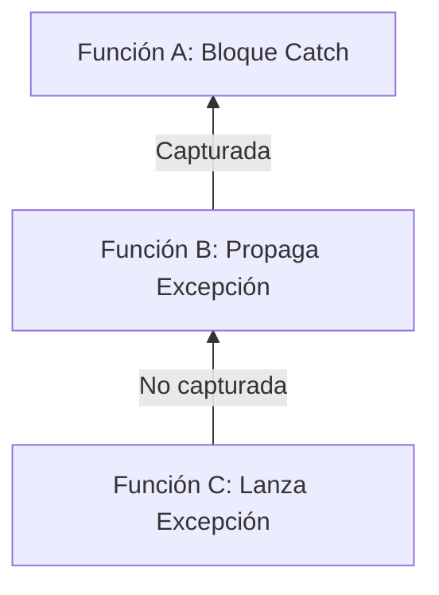

# Manejo de Errores y Excepciones

**Autor(es):** BIG School  
**Fecha:** 2026  
**Tipo:** Paper / Documento Técnico  
**Fuente Original:** PDF / Módulo 0: Fundamentos del Desarrollo de Software  

---

## 1. Visión General y Resiliencia del Software

En la construcción de software para producción, la ocurrencia de eventos imprevistos no es una posibilidad remota, sino una certeza inevitable. Fallos en las conexiones de red, archivos no encontrados, datos con formato inválido provistos por usuarios o agotamiento de recursos del sistema son situaciones operativas reales. El **manejo de errores y excepciones** constituye la disciplina que permite diseñar sistemas resilientes capaces de responder ante fallos de forma controlada y elegante sin colapsar (*graceful degradation*).

Ignorar la gestión de errores conduce a la inestabilidad de la aplicación, corrupción de datos y una deficiente experiencia de usuario. La resiliencia no consiste en impedir que los errores ocurran, sino en preverlos, aislarlos y recuperarse adecuadamente.

---

## 2. Taxonomía de Errores en Software

Existen tres categorías fundamentales de fallos en el ciclo de desarrollo:

| Tipo de Error | Momento de Detección | Causa Principal | Ejemplo |
| --- | --- | --- | --- |
| **Error Sintáctico** (*Syntax Error*) | Tiempo de Compilación / Interpretación | Violación de las reglas gramaticales del lenguaje. | Olvidar un paréntesis, punto y coma o palabra clave mal escrita. |
| **Error Lógico** (*Logic Error*) | Tiempo de Ejecución (Silencioso) | Defecto en el diseño del algoritmo o cálculo. | Calcular el total sumando el impuesto en lugar de multiplicarlo. |
| **Excepción en Tiempo de Ejecución** (*Runtime Exception*) | Tiempo de Ejecución | Evento anómalo e imprevisto durante la ejecución del programa. | División por cero, archivo no encontrado, timeout de red. |



---

## 3. El Mecanismo Estándar: Bloque `TRY / CATCH / FINALLY`

Los lenguajes modernos implementan la gestión de excepciones mediante la estructura estructurada `TRY - CATCH - FINALLY` (o `TRY - EXCEPT - FINALLY` en Python).

```text
TRY {
    // Código propenso a generar excepciones
    AbrirArchivo("datos.csv")
    LeerContenido()
} CATCH (ExcepcionArchivoNoEncontrado e) {
    // Manejo específico del error de archivo
    MOSTRAR "El archivo solicitado no existe en el sistema."
} CATCH (ExcepcionGeneral e) {
    // Captura de cualquier otra excepción no prevista
    MOSTRAR "Ocurrió un error inesperado: " + e.mensaje
} FINALLY {
    // Bloque de limpieza obligatoria (se ejecuta SIEMPRE)
    CerrarArchivo()
}
```

### Componentes del Bloque

* **`TRY` (Intentar):** Envuelve el bloque de código sospechoso donde puede surgir un error. Si ocurre una excepción, la ejecución del bloque se interrumpe de inmediato.
* **`CATCH / EXCEPT` (Capturar):** Intercepta la excepción emitida. Es posible encadenar múltiples bloques `CATCH` para gestionar distintos tipos de excepciones de forma específica.
* **`FINALLY` (Finalmente):** Bloque opcional pero crítico que se ejecuta **siempre**, independientemente de si ocurrió un error o si fue capturado con éxito. Se utiliza para liberar recursos (cerrar archivos, desconectar bases de datos, liberar sockets).

---

## 4. Lanzamiento y Propagación de Excepciones

### Lanzamiento Explícito (`THROW` / `RAISE`)

Cuando una función detecta que las condiciones para su correcta ejecución no se cumplen, puede emitir intencionadamente una excepción.

```python
def calcular_descuento(precio, porcentaje):
    if porcentaje < 0 or porcentaje > 100:
        raise ValueError("El porcentaje de descuento debe estar entre 0 y 100.")
    return precio - (precio * (porcentaje / 100))
```

### Propagación de Excepciones (*Call Stack Bubbling*)

Cuando se lanza una excepción dentro de una función y no es capturada localmente, la excepción se propaga hacia arriba en la pila de llamadas (*Call Stack*) buscando un bloque `CATCH` en las funciones superiores. Si alcanza la raíz sin ser capturada, el programa finaliza abruptamente.



---

## 5. Excepciones Personalizadas (*Custom Exceptions*)

Para mejorar la claridad y trazabilidad del negocio, los desarrolladores pueden definir sus propios tipos de excepciones heredando de las clases base del lenguaje.

```python
class SaldoInsuficienteException(Exception):
    """Excepción lanzada cuando una cuenta no tiene fondos suficientes."""
    pass

def realizar_retiro(cuenta, monto):
    if monto > cuenta.saldo:
        raise SaldoInsuficienteException("No posee saldo suficiente para retirar este monto.")
    cuenta.saldo -= monto
```

---

## 6. Observaciones Clave

* **No Silenciar Excepciones (Evitar *Catch-All* Vacíos):** Capturar excepciones y no hacer nada con ellas (`catch {}` vacío) oculta errores críticos y dificulta el diagnóstico.
* **Uso Adecuado de `FINALLY`:** Utilizar siempre el bloque `FINALLY` o administradores de contexto (`with` en Python, `using` en C#) para garantizar la liberación de recursos del sistema.
* **Mensajes de Error Claros y Seguros:** Los mensajes de error mostrados al usuario final deben ser comprensibles y no exponer detalles sensibles de la infraestructura (ej. cadenas de conexión, trazas de SQL).
* **Logging Centralizado:** Registrar las trazas completas de error (*Stack Traces*) en herramientas de *logging* centralizadas para facilitar la auditoría y corrección.

---

## 7. Conclusión

El manejo riguroso de errores y excepciones diferencia al código experimental del software de grado de producción. Al integrar la anticipación de fallos en la arquitectura mediante bloques de captura, limpieza de recursos y propagación controlada, se garantiza la estabilidad operativa y la confiabilidad del sistema ante cualquier contingencia.
