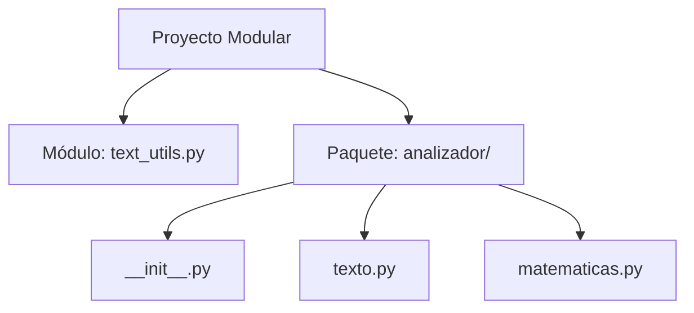

# Modularidad en Python: Módulos y Paquetes

**Autor(es):** BIG School  
**Fecha:** 2026  
**Tipo:** Paper / Documento Técnico  
**Fuente Original:** PDF / Módulo 0: Fundamentos del Desarrollo de Software  

---

## 1. Visión General y Beneficios

La modularidad es la estrategia de ingeniería que permite fragmentar la complejidad de una aplicación en componentes independientes. El código monolítico en un único archivo se vuelve inasimilable, ineficiente y propenso a fallos sistémicos.



### Beneficios Principales

* **Organización:** Segmentación del código según su responsabilidad lógica.
* **Reusabilidad:** Invocar librerías y utilidades desde cualquier punto de la aplicación sin duplicar lógica.
* **Mantenibilidad:** La corrección de errores (*bug fixing*) en un módulo se propaga inmediatamente a todo el sistema.
* **Colaboración:** Permite que múltiples desarrolladores trabajen en paralelo sobre módulos independientes sin generar conflictos en Git.

---

## 2. Módulos en Python

Cualquier archivo de Python con extensión `.py` es técnicamente un módulo. El nombre del archivo se convierte en el identificador del módulo.

### Ejemplo de Módulo

```python
# Archivo: text_utils.py

def contar_palabras(texto):
    """Cuenta el número de palabras en un string."""
    return len(texto.split())

def a_mayusculas(texto):
    """Convierte un string a mayúsculas."""
    return texto.upper()
```

### Consumo del Módulo

```python
# Archivo: main.py
import text_utils

mi_frase = "La modularidad es la clave del software profesional."

# Uso mediante sintaxis: nombre_modulo.nombre_funcion
total_palabras = text_utils.contar_palabras(mi_frase)
frase_mayusculas = text_utils.a_mayusculas(mi_frase)

print(f"El texto tiene {total_palabras} palabras.")
print(f"En mayúsculas: {frase_mayusculas}")
```

---

## 3. Paquetes en Python

Un paquete es una estructura jerárquica de carpetas que contiene módulos y un archivo especial denominado `__init__.py`.

### Estructura de Directorios

```text
mi_analizador/
│
├── main.py
└── analizador/
    ├── __init__.py
    ├── texto.py
    └── matematicas.py
```

### Código de los Módulos del Paquete

```python
# Archivo: analizador/texto.py
def a_mayusculas(texto):
    return texto.upper()
```

```python
# Archivo: analizador/matematicas.py
def contar_palabras(texto):
    return len(texto.split())
```

### Importación desde el Programa Principal

```python
# Archivo: main.py
from analizador import texto, matematicas

mi_frase = "Organizar el código en paquetes es una buena práctica."

palabras = matematicas.contar_palabras(mi_frase)
mayusculas = texto.a_mayusculas(mi_frase)

print(f"Número de palabras: {palabras}")
print(f"Texto transformado: {mayusculas}")
```

---

## 4. Sintaxis de Importación

| Sintaxis | Descripción | Ejemplo de Uso |
| --- | --- | --- |
| `import paquete.modulo` | Importación explícita. Requiere el espacio de nombres completo. | `paquete.modulo.funcion()` |
| `from paquete import modulo` | Importa el módulo acortando el prefijo de llamada. | `modulo.funcion()` |
| `from paquete.modulo import funcion` | Importa una función o clase específica al espacio de nombres local. | `funcion()` |
| `import paquete.modulo as alias` | Asigna un pseudónimo o alias para simplificar la llamada. | `alias.funcion()` |

---

## 5. Observaciones Clave

* **El archivo `__init__.py`:** Notifica al intérprete de Python que la carpeta debe ser tratada como un paquete ejecutable.
* **Prevención de Colisiones de Nombres:** Se deben evitar nombres de módulos locales que coincidan con librerías estándar o de terceros (`math.py`, `json.py`).
* **Escalabilidad y Time-to-Market:** Separar responsabilidades en módulos independientes reduce la deuda técnica y optimiza la velocidad de entrega (*time-to-market*).

---

## 6. Conclusión

La modularidad transforma scripts aislados en arquitecturas de ingeniería industrializables. Organizar el código en módulos y paquetes es el estándar para construir software escalable, mantenible y preparado para entornos corporativos complejos.
