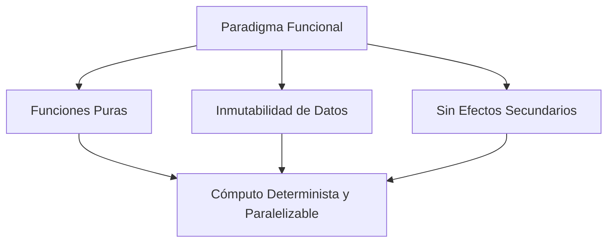

# Programación Funcional en Python

**Autor(es):** BIG School  
**Fecha:** 2026  
**Tipo:** Paper / Documento Técnico  
**Fuente Original:** PDF / Módulo 0: Fundamentos del Desarrollo de Software  

---

## 1. Visión General: Paradigma Funcional vs. Imperativo

La **Programación Funcional (PF)** es un paradigma declarativo que trata el cómputo como la evaluación de funciones matemáticas puras, evitando la modificación de estados mutables y los datos compartidos. Mientras que el enfoque imperativo describe *cómo* ejecutar tareas cambiando estados paso a paso, la programación funcional se centra en *qué* transformaciones aplicar a los datos de entrada para producir salidas predecibles.



Python es un lenguaje **multiparadigma** que incorpora poderosas herramientas funcionales sin imponer una orientación funcional pura.

---

## 2. Conceptos Fundamentales de la Programación Funcional

### Funciones Puras (*Pure Functions*)

Una función se considera **pura** cuando cumple dos condiciones estrictas:
1. **Determinismo:** Para los mismos argumentos de entrada, devuelve **siempre** exactamente el mismo resultado.
2. **Sin Efectos Secundarios (*No Side Effects*):** No altera variables globales, no modifica sus argumentos de entrada y no realiza operaciones de I/O externas (archivos, red, consola).

| Tipo | Determinista | Efectos Secundarios | Facilidad de Pruebas Unitarias |
| --- | :---: | :---: | --- |
| **Función Pura** | Sí | No | Alta (Testeo aislado e inmediato) |
| **Función Impura** | No | Sí | Compleja (Requiere Mocks / Stubs) |

```python
# Ejemplo de Función Pura (Recomendado)
def calcular_impuesto(precio, tasa):
    return precio * tasa  # Transparente y sin estado

# Ejemplo de Función Impura (Evitar en PF)
total_impuestos = 0
def acumular_impuesto(precio, tasa):
    global total_impuestos
    total_impuestos += precio * tasa  # Modifica estado global (Efecto Secundario)
```

### Inmutabilidad (*Immutability*)

En la programación funcional, los datos son inmutables: una vez creados, no se pueden modificar. Si se requiere un cambio, se genera una **nueva copia** con el valor transformado.

* **Tipos Inmutables en Python:** Tuplas (`tuple`), Cadenas (`str`), Enteros (`int`), `frozenset`.
* **Beneficio:** Elimina errores de concurrencia y condiciones de carrera (*race conditions*) en entornos multihilo.

---

## 3. Funciones de Primera Clase y de Orden Superior

### Funciones como Ciudadanos de Primera Clase (*First-Class Functions*)

En Python, las funciones son objetos de primera clase, lo que significa que pueden:
* Asignarse a variables.
* Pasarse como argumentos a otras funciones.
* Devolverse como resultado desde dentro de otra función.

### Funciones de Orden Superior (*Higher-Order Functions*)

Una función de orden superior es aquella que recibe una o más funciones como parámetros o devuelve una función como resultado.

```python
# Pasar una función como argumento
def aplicar_operacion(func, x, y):
    return func(x, y)

def sumar(a, b):
    return a + b

resultado = aplicar_operacion(sumar, 10, 20)  # Output: 30
```

---

## 4. Funciones Anónimas: `lambda`

Las funciones `lambda` son funciones pequeñas y anónimas definidas en una sola línea sin utilizar la palabra clave `def`.

```text
lambda parametros: expresion
```

```python
# Función tradicional
def cuadrado(n):
    return n ** 2

# Equivalente en expresión Lambda
cuadrado_lambda = lambda n: n ** 2

print(cuadrado_lambda(5))  # Output: 25
```

---

## 5. Herramientas de Transformación: `map`, `filter` y Comprensiones

### 1. `map(función, iterable)`
Aplica una función a cada elemento de una colección y devuelve un iterador con los resultados transformados.

```python
numeros = [1, 2, 3, 4]
duplicados = list(map(lambda x: x * 2, numeros))  # [2, 4, 6, 8]
```

### 2. `filter(función_booleana, iterable)`
Filtra elementos de una colección conservando únicamente aquellos para los cuales la función devuelve `True`.

```python
numeros = [1, 2, 3, 4, 5, 6]
pares = list(filter(lambda x: x % 2 == 0, numeros))  # [2, 4, 6]
```

### 3. List Comprehensions (Estilo Python de PF)
Python favorece el uso de **comprensiones de listas y diccionarios** sobre `map` y `filter` por su legibilidad superior:

```python
# Equivalente a map + filter con List Comprehension
numeros = [1, 2, 3, 4, 5, 6]
cuadrados_de_pares = [x ** 2 for x in numeros if x % 2 == 0]  # [4, 16, 36]
```

---

## 6. Observaciones Clave

* **Transparencia Referencial:** Las funciones puras facilitan la memoización y optimización del rendimiento al poder sustituir una llamada a función por su resultado precalculado.
* **Legibilidad Pythonica:** Se recomienda usar *List Comprehensions* en lugar de encadenar múltiples `map()` y `filter()` para mantener un código claro y pythónico.
* **Concurrencia Segura:** La inmutabilidad de los datos previene bloqueos (*deadlocks*) y simplifica el desarrollo de sistemas paralelos y distribuidos.

---

## 7. Conclusión

El paradigma funcional aporta rigor y mantenibilidad a la ingeniería de software. Al integrar funciones puras, inmutabilidad y transformaciones declarativas en Python, los desarrolladores pueden construir tuberías de procesamiento de datos (*data pipelines*) robustas, testeables y preparadas para escalar en sistemas de Inteligencia Artificial y Big Data.
