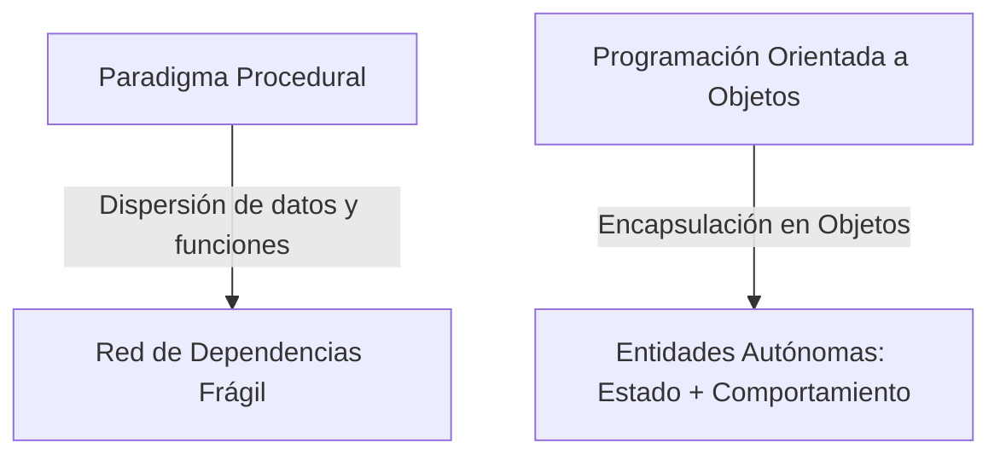
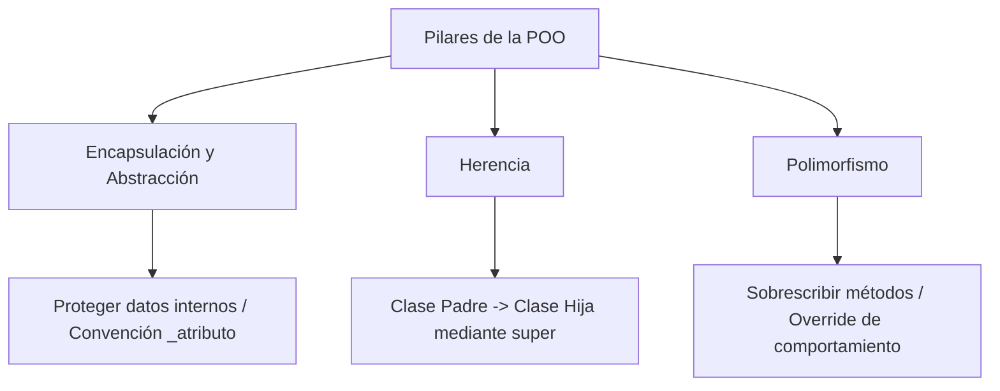

# Programación Orientada a Objetos (POO) en Python

**Autor(es):** BIG School  
**Fecha:** 2026  
**Tipo:** Paper / Documento Técnico  
**Fuente Original:** PDF / Módulo 0: Fundamentos del Desarrollo de Software  

---

## 1. Visión General: Del Paradigma Procedural a POO

La transición de escribir instrucciones secuenciales (*procedural*) a diseñar sistemas basados en entidades (*POO*) representa el salto cualitativo más importante en el desarrollo de software.



Mientras que el enfoque *procedural* separa los datos de las funciones, la POO combina ambos en unidades autónomas denominadas **Objetos**:

* **Estado (Atributos):** Datos o información que el objeto conoce o almacena.
* **Comportamiento (Métodos):** Acciones o funciones que el objeto puede realizar.

---

## 2. Anatomía del Objeto: Clases, Constructor y `self`

| Término | Definición y Función |
| --- | --- |
| **Clase** | Modelo o plano maestro abstracto que define la estructura general de los objetos. Se nombran en `PascalCase`. |
| **Objeto / Instancia** | Materialización real de una clase con datos específicos almacenados en memoria. |
| **Constructor (`__init__`)** | Método especial encargado de inicializar el estado del objeto al momento de instanciarlo. |
| **`self`** | Referencia autorreferencial del objeto que permite acceder a sus propios atributos y métodos. |

```python
class Book:
    # Constructor
    def __init__(self, title, author):
        self.title = title
        self.author = author
        self.is_borrowed = False  # Estado inicial por defecto

    # Método de instancia
    def borrow(self):
        if self.is_borrowed:
            print(f"Error: '{self.title}' ya está prestado.")
        else:
            self.is_borrowed = True
            print(f"'{self.title}' ha sido prestado.")

# Instanciación
book_1 = Book("Cien Años de Soledad", "Gabriel García Márquez")
book_1.borrow()
```

---

## 3. Los Cuatro Pilares de la POO



### 1. Encapsulación y Abstracción

La encapsulación protege la integridad de los datos impidiendo que sean alterados arbitrariamente desde fuera. En Python, se utiliza la convención de un guion bajo (`_balance`) para señalar atributos protegidos. La abstracción expone solo una interfaz pública simplificada (métodos) al usuario.

```python
class BankAccount:
    def __init__(self, owner):
        self.owner = owner
        self._balance = 0.0  # Atributo protegido por convención

    def deposit(self, amount):
        if amount > 0:
            self._balance += amount

    def get_balance(self):  # Getter público
        return self._balance
```

### 2. Herencia (*Inheritance*)

Permite crear clases hijas que heredan atributos y métodos de una clase base (padre) utilizando la función `super()` para invocar al constructor del padre.

```python
# Clase Padre
class LibraryItem:
    def __init__(self, title):
        self.title = title
        self.is_borrowed = False

    def borrow(self):
        self.is_borrowed = True

# Clase Hija
class Book(LibraryItem):
    def __init__(self, title, author):
        super().__init__(title)
        self.author = author  # Atributo específico
```

### 3. Polimorfismo y Sobrescritura (*Overriding*)

Permite que diferentes clases hijas respondan al mismo comando o método de forma personalizada.

```python
class DVD(LibraryItem):
    def __init__(self, title, director):
        super().__init__(title)
        self.director = director

    # Sobrescritura (Override) del método del padre
    def borrow(self):
        print(f"Verificando si el DVD '{self.title}' tiene rayones...")
        super().borrow()  # Llama al método original del padre

# Uso polimórfico
items = [Book("Dune", "Frank Herbert"), DVD("Inception", "Nolan")]
for item in items:
    item.borrow()  # Cada objeto ejecuta su propia versión de borrow()
```

---

## 4. Observaciones Clave

* **Nomenclatura PascalCase:** La nomenclatura `PascalCase` (`NombreDeClase`) es el estándar esencial para definir clases en Python.
* **Manejo Implícito de `self`:** El argumento `self` es gestionado internamente por Python y no debe pasarse manualmente al llamar a un método.
* **Encapsulación por Convención:** En Python, la encapsulación con `_` es una convención de diseño y protección visual que exige disciplina arquitectónica.
* **Extensibilidad:** El polimorfismo facilita la extensión de sistemas añadiendo nuevos tipos de datos sin alterar la lógica de procesamiento existente.

---

## 5. Conclusión

En la era de la IA, el valor diferencial del profesional no reside en saber escribir un bucle, sino en diseñar la arquitectura orientada a objetos que conecta las piezas del negocio. Entender cómo se relacionan las clases, dónde aplicar la herencia y cómo proteger los datos mediante encapsulación permite dirigir modelos de lenguaje para construir sistemas fiables, escalables y mantenibles.
