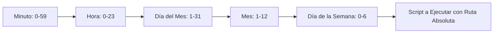

# Guía Rápida de Bash/Shell: Terminal y Línea de Comandos

**Autor(es):** Brais Moure (@mouredev) / MoureDev Pro  
**Fecha:** 2026  
**Tipo:** Paper / Documento Técnico / Guía Rápida  
**Fuente Original:** PDF / Módulo 0: Fundamentos del Desarrollo de Software  

---

## 1. Introducción

Como desarrolladores, trabajamos en un entorno radicalmente transformado por la Inteligencia Artificial. Los asistentes de IA generan bloques de código complejos, optimizan algoritmos e incluso proponen arquitecturas completas a partir de lenguaje natural. Con herramientas tan potentes a nuestra disposición, es tentador pensar en desplazar tecnologías fundamentales como la línea de comandos o la shell de Bash a las categorías de "legacy".

Sin embargo, la realidad de la infraestructura moderna nos cuenta otra historia. Paradójicamente, el auge de la IA hace que el dominio de Bash sea más importante que nunca.

La razón reside en una distinción fundamental: La IA sobresale en la creación de código, pero Bash sigue siendo el rey indiscutible en la ejecución, orquestación y control de ese código en el mundo real.

Vivimos en la era de la generación de código, pero el código no tiene valor hasta que se despliega y opera de manera fiable. La IA es muy buena definiendo el "qué" (la lógica de la aplicación), pero la infraestructura exige un control absoluto sobre el "dónde" y el "cómo" (el entorno de ejecución).

En la actualidad, piensa en la IA como un copiloto, pero tú sigues siendo el piloto, y Bash es tu panel de control. Dominar la shell no es mirar al pasado, es asegurar tu control sobre la infraestructura que potencia el futuro. Es el superpoder que convierte el potencial estático generado por la IA en sistemas vivos, resilientes y eficientes en producción.

---

## 2. Configuración y Conceptos Fundamentales

### Shell, Terminal y Bash

| Concepto | Definición | Ejemplos |
| --- | --- | --- |
| **Shell** | Programa intérprete de órdenes (comandos) escritas por el usuario. | `bash`, `sh`, `zsh`, `csh`, `powershell` |
| **Terminal** | Interfaz gráfica o de texto para comunicarse con la shell. | Warp, Xterm, Terminal del sistema |
| **Bash** | *Bourne-again shell*: La shell estándar más popular en entornos Unix. | Estándar Linux / macOS |

### Historia y Relevancia de Bash

* **Estándar en Unix/Linux/macOS:** Es la shell por defecto en la gran mayoría de distribuciones (macOS utiliza Zsh, una evolución compatible).
* **Infraestructura y Servidores:** La inmensa mayoría de scripts de administración, despliegue y CI/CD están escritos en Bash.
* **Portabilidad:** Alta compatibilidad entre sistemas locales, servidores cloud y contenedores Docker.

### Entornos en Windows

#### Git for Windows
Proporciona soporte parcial para emular un entorno Bash en Windows.  
*Enlace:* [gitforwindows.org](https://gitforwindows.org)

#### WSL (Windows Subsystem for Linux)
Proporciona soporte completo nativo de Linux en Windows.

```bash
# Instalación desde terminal de Administrador
wsl --install
```
*Nota:* Tras reiniciar, finaliza la configuración de Linux. El directorio raíz de Windows en WSL se encuentra en `/mnt/c`.

#### Warp Terminal
Terminal moderna asistida por IA.  
*Enlace de descarga:* [mouredev.link/warp](https://mouredev.link/warp)

---

## 3. Primeros Pasos en la Terminal

### Hola Mundo y Verificación de Shell

```bash
# Primer comando: imprime texto en pantalla
echo "Hola, BASH"

# Mostrar la Shell que se está utilizando
echo $SHELL
echo $0
```

### Comandos de Orientación

| Comando | Descripción |
| --- | --- |
| `pwd` | Imprime la ruta del directorio actual (*Print Working Directory*). |
| `ls` | Lista los archivos y carpetas del directorio actual. |
| `ls -l` | Muestra el listado en formato largo (detalles, permisos, tamaño, fecha). |
| `ls -a` | Muestra todos los archivos, incluidos los ocultos (inician por `.`). |
| `ls -lh` | Muestra el tamaño de archivos en formato legible para humanos (*human-readable*). |

### Comandos de Navegación

Para cambiar de directorio se utiliza el comando `cd` (*Change Directory*):

| Comando | Descripción |
| --- | --- |
| `cd dir` | Se desplaza al directorio especificado (nivel inferior). |
| `cd dir1/dir2/dir3` | Desplazamiento por múltiples niveles inferiores a la vez. |
| `cd ..` | Sube un nivel hacia el directorio padre (superior). |
| `cd ../../../` | Sube múltiples niveles superiores a la vez. |
| `cd .` | Hace referencia al directorio actual. |
| `cd ~` o `cd` | Se desplaza directamente al directorio personal (*home*). |

> [!TIP]
> Presiona la tecla **Tabulador (`TAB`)** para autocompletar comandos, rutas o ver sugerencias de archivos.

### Ruta Absoluta vs. Ruta Relativa

* **Ruta Relativa:** Se calcula partiendo de la posición actual (`pwd`). No empieza por `/`.
* **Ruta Absoluta:** Indica la ubicación completa dentro del árbol de archivos. Siempre inicia con la raíz `/`.

```bash
# Ejemplo de cambio a ruta absoluta
cd /home/user/Docs
```

### Comandos Básicos del Sistema

| Comando | Descripción |
| --- | --- |
| `whoami` | Muestra el nombre de usuario activo. |
| `cal` | Muestra el calendario del mes actual. |
| `date` | Muestra la fecha y hora actuales. |
| `uptime` | Muestra el tiempo transcurrido desde el encendido del sistema. |
| `hostname` | Muestra el nombre de la máquina / equipo. |
| `uname -a` | Muestra la información completa del kernel y sistema operativo. |
| `clear` | Limpia la pantalla de la terminal (mantiene el historial). |

### Anatomía de un Comando

```bash
comando [opciones] [argumentos]
```
* **comando:** Acción a ejecutar (ej. `ls`).
* **opciones:** Modifican el comportamiento (`-l`, `-a`).
* **argumentos:** Objetos o datos sobre los que actúa (`archivo.txt`, `directorio/`).

### Ayuda y Documentación

```bash
# Consultar resumen rápido de ayuda
python --help
python -h

# Consultar el manual interactivo completo
man ls
```
*Nota:* Para salir de la interfaz de `man`, presiona la tecla `q`.

### Ejercicios: Primeros Pasos
1. Muestra el directorio en el que estás ubicado actualmente.
2. Cambia al directorio `Documentos` (o `Documents`) de tu sistema.
3. Regresa al directorio `Documentos` utilizando una ruta absoluta completa.
4. Sube un nivel en la jerarquía de directorios.
5. Lista el contenido en formato simple, en formato largo y luego incluyendo archivos ocultos.
6. Consulta el manual de un comando con `man`.
7. Consulta la ayuda corta de un comando con `--help`.
8. Muestra tu usuario, la fecha/hora actual y el calendario del mes.
9. Regresa al directorio donde comenzaste.
10. Limpia la pantalla.

---

## 4. Gestión de Archivos y Directorios

### Sistema de Archivos Unix

Los sistemas Unix se organizan en una jerarquía de árbol único que parte de la raíz `/`.

| Directorio | Descripción |
| --- | --- |
| `/` | Raíz del sistema (*root*). |
| `/home` | Directorios personales de los usuarios. |
| `/etc` | Archivos de configuración del sistema. |
| `/bin` | Programas ejecutables binarios esenciales del sistema. |
| `/usr` | Aplicaciones e información general de los usuarios. |
| `/var` | Archivos variables del sistema (*logs*, datos de servicios, colas). |
| `/tmp` | Archivos temporales (se borran periódicamente). |

```bash
# Explorar rutas sin estar físicamente en ellas
ls /etc
```

### Operaciones de Manipulación

| Operación | Comando | Descripción |
| --- | --- | --- |
| **Crear Archivo** | `touch archivo.txt` | Crea un archivo vacío en la ruta actual. |
| **Crear Directorio** | `mkdir carpeta` | Crea una nueva carpeta en el directorio actual. |
| **Crear Ruta** | `mkdir -p dir1/dir2` | Crea carpetas anidadas de forma recursiva. |
| **Eliminar Dir Vacío**| `rmdir carpeta` | Elimina la carpeta solo si está vacía. |
| **Copiar Archivo** | `cp orig.txt dest.txt` | Duplica un archivo en la ruta especificada. |
| **Copiar Directorio**| `cp -r dir1 dir2` | Copia recursiva de directorios y contenidos. |
| **Copia Exacta** | `cp -a dir1 dir2` | Copia recursiva preservando atributos y permisos. |
| **Mover / Renombrar**| `mv archivo.txt dir/` | Mueve o renombra un archivo/directorio. |
| **Eliminar Archivo** | `rm archivo.txt` | Borra un archivo permanentemente. |
| **Eliminar Rec.** | `rm -r carpeta` | Elimina una carpeta y todo su contenido. |
| **Eliminar Interac.** | `rm -ri carpeta` | Pide confirmación antes de eliminar cada elemento. |

> [!CAUTION]
> El comando `rm` **no** envía los archivos a la papelera. La combinación `rm -rf` borra datos de forma irreversible sin pedir confirmación.

### Wildcards (Comodines)

| Comodín | Coincidencia | Ejemplo |
| :---: | --- | --- |
| `*` | Cero o más caracteres | `ls *.md` |
| `?` | Exactamente un carácter | `rm ?.txt` |

```bash
# Ejemplos prácticos de uso de comodines
ls *.md         # Archivos con extensión .md
ls 03*.txt      # Comienzan por 03 y terminan en .txt
ls ?????*       # Nombres de 5 o más caracteres
rm a????        # Archivos que empiezan por 'a' y tienen 5 caracteres en total
```

### Listados Avanzados y Búsqueda

```bash
# Estructura en árbol de directorios
tree
tree -a

# Búsqueda de archivos por nombre en la jerarquía
find . -name "archivo.txt"
find /var/log -name "*.log"
```

### Ejercicios: Gestión de Archivos
1. Crea un directorio llamado `practica`.
2. Elimina el directorio `practica`.
3. Copia un archivo dentro del directorio actual y haz otra copia fuera de él.
4. Mueve un archivo a otro directorio.
5. Renombra el archivo movido.
6. Lista todos los archivos `.txt` usando el comodín `*`.
7. Elimina un directorio de forma recursiva con precaución.
8. Elimina archivos usando comodines.
9. Inspecciona una carpeta usando `tree`.
10. Localiza un archivo por nombre utilizando `find`.

---

## 5. Comandos Avanzados y Tuberías

### Lectura de Archivos

| Comando | Descripción |
| --- | --- |
| `cat archivo` | Muestra todo el contenido del archivo en la terminal. |
| `less archivo` | Visualizador interactivo paginado (navegar con flechas/espacio, salir con `q`). |
| `more archivo` | Pagina contenido largo (solo desplazamiento hacia adelante). |
| `head archivo` | Muestra las primeras 10 líneas. |
| `head -n 20 archivo` | Muestra las primeras 20 líneas. |
| `tail archivo` | Muestra las últimas 10 líneas. |
| `tail -n 20 archivo` | Muestra las últimas 20 líneas. |
| `tail -f app.log` | Transmite cambios en tiempo real a medida que se añaden líneas al archivo. |

### Búsqueda y Recuento

#### Búsqueda con `grep`
```bash
grep "patrón" archivo.txt          # Busca el texto en el archivo
grep -i "patrón" archivo.txt       # Insensible a mayúsculas/minúsculas
grep -r "patrón" ./src             # Búsqueda recursiva en todo un directorio
```

#### Recuento con `wc` (*Word Count*)
```bash
wc archivo.txt       # Muestra líneas, palabras y bytes
wc -l archivo.txt    # Muestra número de líneas
wc -w archivo.txt    # Muestra número de palabras
wc -c archivo.txt    # Muestra número de bytes/caracteres
wc -lw archivo.txt   # Combina banderas (líneas y palabras)
```

### Redirecciones y Pipes (Tuberías)

| Operador | Tipo | Descripción |
| :---: | --- | --- |
| `>` | Redirección de Salida | Escribe la salida en un archivo (sobrescribe contenido). |
| `>>` | Redirección de Salida | Añade la salida al final de un archivo (modo *append*). |
| `<` | Redirección de Entrada | Pasa el contenido de un archivo como entrada estándar a un comando. |
| `\|` | *Pipe* (Tubería) | Conecta la salida de un comando con la entrada del siguiente. |

```bash
# Ejemplos de Redirecciones
echo "Primera línea" > notas.txt
echo "Segunda línea" >> notas.txt
sort < lista.txt

# Ejemplo de Pipe encadenado
cat accesos.log | grep "404" | wc -l
```

### Variables de Entorno

#### Variables Locales
Válidas únicamente dentro de la sesión o proceso activo de la shell:
```bash
mi_var="Hola Mundo"
echo $mi_var
```

#### Variables Globales (Exportadas)
Disponibles para la shell y todos los procesos/scripts hijos:
```bash
# Variables del sistema predefinidas
echo $HOME
echo $PATH

# Declarar variable global
export API_KEY="secret_token_123"
```
*Persistencia:* Para hacer permanente una variable global, agrégala a tu archivo de perfil (`~/.bashrc`, `~/.zshrc` o `~/.bash_profile`).

### Ejercicios: Comandos Avanzados
1. Muestra todo el contenido de un archivo con `cat`.
2. Lee un archivo largo de forma paginada con `less`.
3. Muestra las primeras 15 líneas de un archivo de log.
4. Muestra las últimas 15 líneas de un archivo.
5. Filtra las líneas que contengan una palabra específica con `grep`.
6. Cuenta la cantidad total de líneas de un archivo con `wc -l`.
7. Redirige el resultado de un comando a un nuevo archivo usando `>`.
8. Concatena nueva información al archivo anterior usando `>>`.
9. Encadena 3 comandos distintos utilizando dos tuberías (`|`).
10. Crea una variable local y muestra su valor en pantalla.

---

## 6. Editores de Texto en Terminal

### Nano Editor

Invocación: `nano archivo.txt`

| Atajo | Acción |
| --- | --- |
| `Ctrl + O` + `Enter` | Guardar cambios (*WriteOut*). |
| `Ctrl + X` | Salir de Nano. |
| `Ctrl + G` | Ver menú de ayuda. |
| `Ctrl + W` | Buscar texto. |
| `Ctrl + K` | Cortar la línea actual. |
| `Ctrl + U` | Pegar la línea cortada. |

### Vim Editor

Invocación: `vim archivo.txt`

#### Modos de Operación
* **Modo Normal:** Navegación y comandos (modo por defecto, presiona `Esc`).
* **Modo Inserción:** Edición de texto (se activa pulsando `i` desde Modo Normal).
* **Modo Comando:** Guardar/salir/ajustes (se activa pulsando `:` desde Modo Normal).

| Atajo / Comando | Acción |
| --- | --- |
| `i` | Entrar a Modo Inserción. |
| `Esc` | Regresar a Modo Normal. |
| `h`, `j`, `k`, `l` | Mover cursor (Izquierda, Abajo, Arriba, Derecha). |
| `:q` | Salir sin guardar. |
| `:wq` | Guardar cambios y salir. |
| `:q!` | Salir forzado descartando cambios. |
| `/texto` | Buscar término en el archivo. |
| `dd` | Borrar (cortar) la línea actual. |
| `yy` | Copiar (*yank*) la línea actual. |
| `p` | Pegar después de la posición actual del cursor. |
| `u` | Deshacer la última acción. |

### Ejercicios: Editores Básicos
1. **Nano:** Crea `nota.txt`, escribe 3 líneas, guarda y sal.
2. **Nano:** Abre `nota.txt`, agrega una cuarta línea y guarda.
3. **Nano:** Crea `borrador.txt`, escribe texto y sal **sin** guardar.
4. **Vim:** Crea `apuntes.txt`, entra a modo inserción (`i`) y escribe una frase.
5. **Vim:** Mueve el cursor usando las teclas `h`, `j`, `k`, `l`.
6. **Vim:** Copia una línea (`yy`) y pégala (`p`) debajo.
7. **Vim:** Elimina una línea (`dd`) y deshabilita el cambio (`u`).
8. **Vim:** Guarda los cambios y sal (`:wq`).

---

## 7. Administración del Sistema y Permisos

En sistemas Unix/Linux, el acceso a archivos y directorios está controlado por esquemas de permisos de lectura (`r`), escritura (`w`) y ejecución (`x`).

### Permisos y Notación

| Modo Simbólico | Valor Octal | Permiso | Descripción |
| :---: | :---: | --- | --- |
| `r` | `4` | Lectura (*Read*) | Ver contenido del archivo o listar directorio. |
| `w` | `2` | Escritura (*Write*) | Modificar archivo o agregar/eliminar en directorio. |
| `x` | `1` | Ejecución (*Execute*) | Correr script/programa o acceder al directorio. |

### Clases de Usuario

* `u` (*User*): Propietario del archivo.
* `g` (*Group*): Grupo de usuarios asociado.
* `o` (*Others*): Cualquier otro usuario del sistema.
* `a` (*All*): Todos los anteriores (`u` + `g` + `o`).

### Estructura de Permisos (Modo Simbólico y Octal)

```text
[-] [rwx] [rwx] [rwx]
 |    |     |     |
 |    |     |     └── Permisos para Otros (Others)
 |    |     └─────── Permisos de Grupo (Group)
 |    └───────────── Permisos del Propietario (User)
 └────────────────── Tipo de Archivo (- regular, d directorio, l enlace)
```

#### Notación Octal
Cada grupo se calcula sumando los valores numéricos (`r=4`, `w=2`, `x=1`):

* `7` = `4 + 2 + 1` (`rwx`)
* `6` = `4 + 2` (`rw-`)
* `5` = `4 + 1` (`r-x`)
* `4` = `4` (`r--`)

*Ejemplo `764`:* Propietario (`7` / `rwx`), Grupo (`6` / `rw-`), Otros (`4` / `r--`).

### Modificación de Permisos (`chmod`)

```bash
# Modo Simbólico
chmod u+x script.sh       # Otorga permisos de ejecución al dueño
chmod g-w documento.txt    # Quita permisos de escritura al grupo

# Modo Octal
chmod 755 script.sh       # rwxr-xr-x
chmod 644 documento.txt   # rw-r--r--
```

### Propietario (`chown`) y Máscara (`umask`)

```bash
# Cambiar propietario y grupo
chown usuario script.sh
chown usuario:grupo script.sh

# Consultar / modificar máscara de permisos base
umask
umask 022
```
*Cálculo de umask 022:*
* Directorios base `777` - `022` = `755` (`rwxr-xr-x`)
* Archivos base `666` - `022` = `644` (`rw-r--r--`)

### El Superusuario (`sudo`)

```bash
# Ejecutar comando con privilegios de administrador (root)
sudo apt update
sudo rm -rf /tmp/protegido
```

### Ejercicios: Administración del Sistema
1. Crea un archivo y consulta sus permisos con `ls -l`.
2. Otorga permiso de ejecución solo al propietario usando modo simbólico (`chmod u+x`).
3. Cambia los permisos del archivo a `644` en notación octal.
4. Elimina todos los permisos para el grupo (`chmod g-rwx`).
5. Crea un directorio y restringe los permisos para que solo el propietario tenga acceso (`chmod 700`).
6. Consulta la máscara `umask` del sistema.
7. Cambia la `umask` a `027`, crea un archivo nuevo y comprueba sus permisos resultantes.
8. Ejecuta un comando utilizando el prefijo `sudo`.

---

## 8. Gestión de Procesos, Aliases e Historial

### Monitorización de Recursos

| Comando | Descripción |
| --- | --- |
| `ps` | Muestra los procesos asociados a la terminal actual. |
| `ps aux` | Lista todos los procesos del sistema con detalles de CPU, memoria y PID. |
| `top` | Monitor dinámico interactivo en tiempo real. |
| `htop` | Monitor interactivo mejorado con interfaz gráfica de texto. |
| `free -h` | Muestra el estado de la memoria RAM y Swap en formato legible. |
| `df -h` | Muestra el uso de espacio en los discos/sistemas de archivos montados. |
| `du -sh *` | Muestra el espacio ocupado por los elementos del directorio actual. |

### Procesos en Segundo Plano (*Jobs*)

```bash
# Ejecutar directamente en segundo plano (&)
sleep 100 &

# Suspender un proceso activo en primer plano
# Presiona: Ctrl + Z

# Listar trabajos en segundo plano
jobs

# Enviar proceso suspendido a segundo plano
bg %1

# Traer proceso de segundo plano al primer plano
fg %1
```

### Finalización de Procesos (`kill`)

```bash
# Terminación ordenada (SIGTERM)
kill <PID>

# Terminación forzada inmediata (SIGKILL)
kill -9 <PID>
```

### Historial de Comandos (`history`)

```bash
history           # Muestra el listado de comandos ejecutados anteriormente
!!                # Vuelve a ejecutar el último comando enviado
!10               # Ejecuta la línea #10 del historial
!ls               # Ejecuta el comando reciente que comenzaba por 'ls'
```

### Definición de Aliases

```bash
# Crear alias temporal para la sesión
alias ll='ls -lh'
alias gs='git status'

# Eliminar alias
unalias ll
```
*Persistencia:* Añade la sentencia `alias nombre='comando'` a tu `~/.bashrc` o `~/.zshrc`.

### Ejercicios: Procesos y Aliases
1. Visualiza todos los procesos del sistema con `ps aux`.
2. Abre el monitor `top` o `htop` y sal con `q`.
3. Consulta la memoria libre del sistema con `free -h`.
4. Lanza `sleep 100 &`, comprueba su estado con `jobs` y tráelo al primer plano (`fg`).
5. Inicia un proceso `sleep 200` y elimínalo usando su PID con `kill`.
6. Revisa el espacio libre en tus discos con `df -h`.
7. Consulta el historial de comandos con `history`.
8. Vuelve a ejecutar el comando más reciente usando `!!`.
9. Crea un alias `alias mi_ls='ls -la'` y pruébalo en la terminal.
10. Elimina el alias creado con `unalias mi_ls`.

---

## 9. Scripting en Bash

Un script en Bash es un archivo de texto con extensión `.sh` que contiene una secuencia ordenada de comandos ejecutables por la shell.

### Estructura Básica de un Script

```bash
#!/bin/bash
# Script de bienvenida

echo "=== Mi Primer Script ==="
echo "Fecha actual: $(date)"
echo "Ubicación: $(pwd)"
```

### Asignación de Variables

```bash
#!/bin/bash

nombre="Brais"
echo "Hola, $nombre"

# REGLA DE ORO: No añadir espacios alrededor del '='
# Incorrecto: nombre = "Brais"
```

### Operaciones Aritméticas

```bash
#!/bin/bash

a=10
b=5

# Método 1: Expresión con 'let'
let suma=a+b
echo "Suma (let): $suma"

# Método 2: Expansión aritmética $(( ... ))
resultado=$((a * b))
echo "Multiplicación: $resultado"
```

### Lectura Interactiva (`read`)

```bash
#!/bin/bash

# Captura de datos simple
echo "Introduce tu nombre:"
read usuario
echo "Bienvenido, $usuario"

# Con prompt (-p)
read -p "Ingresa tu edad: " edad

# Modo silencioso/seguro (-s) para contraseñas
read -s -p "Ingresa tu clave secreta: " password
echo -e "\nClave almacenada de forma segura."
```

### Parámetros Posicionales en Scripts

```bash
# Ejemplo de invocación: ./script.sh desarrollo produccion
```

```bash
#!/bin/bash

echo "Nombre del script (\$0): $0"
echo "Primer argumento (\$1): $1"
echo "Segundo argumento (\$2): $2"
echo "Total de argumentos (\$#): $#"
echo "Todos los argumentos (\$@): $@"
```

### Ejercicios: Scripting
1. Crea un script que imprima `"Hola Mundo desde Bash"`.
2. Crea un script que muestre la fecha actual y tu ubicación `pwd`.
3. Declara una variable con tu nombre y muéstrala formateada en pantalla.
4. Escribe un script que reciba dos variables numéricas y muestre su suma, resta y multiplicación.
5. Crea un script interactivo con `read -p` que solicite el nombre del usuario.
6. Pide dos números al usuario e imprime el resultado de su suma.
7. Crea un script que reciba 3 argumentos y muestre solo el primero y el tercero.
8. Muestra el conteo total de argumentos recibidos en un script (`$#`).
9. Crea un script que reciba dos números como argumentos y realice su división entera.
10. Escribe un script que cree un archivo `output.txt` e inserte tu nombre en su interior.

---

## 10. Lógica y Control de Flujo

### Operadores de Comprobación y Comparación

#### Comparadores Numéricos
* `-eq` : Igual (*Equal*)
* `-ne` : Distinto (*Not Equal*)
* `-gt` : Mayor que (*Greater Than*)
* `-ge` : Mayor o igual (*Greater or Equal*)
* `-lt` : Menor que (*Less Than*)
* `-le` : Menor o igual (*Less or Equal*)

#### Comparadores de Texto
* `=` : Cadenas iguales
* `!=` : Cadenas distintas
* `-z` : Cadena vacía (longitud 0)
* `-n` : Cadena no vacía

#### Comprobación de Archivos
* `-e` : El archivo/directorio existe
* `-f` : Es un archivo regular
* `-d` : Es un directorio
* `-r` / `-w` / `-x` : Tiene permisos de lectura / escritura / ejecución
* `-s` : El archivo no está vacío (tamaño > 0)

### Estructuras Condicionales

#### Condicional `if / elif / else`
```bash
#!/bin/bash

read -p "Ingresa un número: " num

if [ $num -gt 10 ]; then
    echo "El número es mayor a 10"
elif [ $num -eq 10 ]; then
    echo "El número es exactamente 10"
else
    echo "El número es menor a 10"
fi
```

#### Condicional `case`
```bash
#!/bin/bash

read -p "Selecciona una opción (start/stop/restart): " accion

case $accion in
    start)
        echo "Iniciando el servicio..."
        ;;
    stop)
        echo "Deteniendo el servicio..."
        ;;
    restart)
        echo "Reiniciando el servicio..."
        ;;
    *)
        echo "Opción inválida"
        ;;
esac
```

### Estructuras Repetitivas (Bucles)

#### Bucle `for`
```bash
#!/bin/bash

# Iterar sobre lista explícita
for i in 1 2 3 4 5; do
    echo "Iteración $i"
done

# Iterar sobre archivos en directorio
for script in *.sh; do
    echo "Script detectado: $script"
done
```

#### Bucle `while` y `until`
```bash
#!/bin/bash

# While: mientras la condición sea Verdadera
count=1
while [ $count -le 3 ]; do
    echo "Contador While: $count"
    ((count++))
done

# Until: hasta que la condición sea Verdadera (mientras sea Falsa)
val=1
until [ $val -gt 3 ]; do
    echo "Contador Until: $val"
    ((val++))
done
```

### Funciones y Ámbito de Variables

```bash
#!/bin/bash

saludar() {
    local persona="$1"
    echo "Hola, $persona desde la función."
}

saludar "Brais"
```

### Códigos de Salida y Control de Errores

```bash
# El código de retorno del último comando se almacena en $? (0 = éxito)
cp archivo_inexistente.txt /tmp/
if [ $? -ne 0 ]; then
    echo "Error: Falló la transferencia del archivo."
fi

# Operadores de encadenamiento corto
comando1 || echo "Se ejecuta si comando1 FALLÓ"
comando2 && echo "Se ejecuta si comando2 FUE EXITOSO"
```

### Ejercicios: Lógica y Control de Flujo
1. Crea un script que determine si un número ingresado es positivo, negativo o cero.
2. Compara dos números ingresados e indica cuál es mayor o si son iguales.
3. Diseña un menú de opciones con `case`.
4. Muestra los números del 1 al 10 utilizando un bucle `for`.
5. Pide números continuamente al usuario hasta que ingrese `0` y muestra la cantidad de números ingresados.
6. Muestra los números del 1 al 10 omitiendo el 5 (`continue`) y deteniéndote en el 8 (`break`).
7. Crea una función `saludar` que reciba un argumento de nombre.
8. Crea una función que sume dos números recibidos y devuelva su código de salida con `return`.
9. Intenta copiar un archivo no existente y gestiona el fallo usando `||`.
10. Escribe un script completo con encabezado de documentación y un bucle que liste todos los scripts `.sh` en la carpeta.

---

## 11. Automatización de Tareas con Cron

### Abrir Explorador desde la Terminal

| Sistema Operativo | Comando |
| --- | --- |
| **Linux** | `xdg-open .` |
| **macOS** | `open .` |
| **Windows (WSL / Git Bash)** | `explorer.exe .` |

### Demonio `cron` y `crontab`

`cron` ejecuta tareas en segundo plano en horarios específicos definidos en la tabla `crontab`.

```bash
crontab -e      # Editar las tareas programadas del usuario
crontab -l      # Listar las tareas programadas activas
crontab -r      # Eliminar la tabla crontab del usuario
```

### Sintaxis de Crontab

```text
.---------------- Minuto (0 - 59)
|  .------------- Hora (0 - 23)
|  |  .---------- Día del Mes (1 - 31)
|  |  |  .------- Mes (1 - 12)
|  |  |  |  .---- Día de la Semana (0 - 6) (0 = Domingo)
|  |  |  |  |
*  *  *  *  * /ruta/absoluta/al/script.sh
```



> [!IMPORTANT]
> Utiliza siempre **rutas absolutas** para ejecutables y scripts en `crontab`, ya que la ejecución en segundo plano utiliza un entorno de variables restringido.

### Comodines en Crontab

* `*` : Cualquier valor.
* `,` : Lista de valores (ej. `0 8,12 * * *` a las 8:00 y 12:00).
* `-` : Rango de valores (ej. `0 9-17 * * 1-5` de 9:00 a 17:00 de lunes a viernes).
* `/` : Intervalo / frecuencia (ej. `*/5 * * * *` cada 5 minutos).

### Ejercicios: Cron
1. Crea un script que escriba la fecha/hora en un archivo y prográmalo cada minuto (`* * * * *`).
2. Configura un script para ejecutarse cada 5 minutos (`*/5 * * * *`).
3. Programa un script de respaldo diario a las 2:00 AM (`0 2 * * *`).
4. Programa la limpieza de un directorio temporal todos los domingos a medianoche (`0 0 * * 0`).
5. Programa un script laboral que se ejecute en punto cada hora entre las 9 y las 17 horas (`0 9-17 * * 1-5`).
6. Configura un cron para enviar un mensaje los lunes, miércoles y viernes a las 8:00 AM (`0 8 * * 1,3,5`).
7. Redirige la salida estándar y errores de un script en cron hacia `cron.log` (`>> /ruta/cron.log 2>&1`).
8. Programa una tarea de chequeo de sistema cada 10 minutos (`*/10 * * * *`).
9. Programa la ejecución de un reporte para el primer día de cada mes a medianoche (`0 0 1 * *`).
10. Comprueba la ejecución de tus tareas inspeccionando los registros del sistema.

---

## 12. Recursos Adicionales y Cursos

### ZSH y Oh My Zsh

**Zsh (Z Shell)** es una shell avanzada que ofrece autocompletado inteligente, corrección ortográfica, plugins y personalización visual de temas.

* **Oh My Zsh Framework:** [ohmyz.sh](https://ohmyz.sh)

### Enlaces de Aprendizaje

* **Curso gratuito de Bash en YouTube / GitHub:** [mouredev.link/bash](https://mouredev.link/bash)
* **Curso completo con certificación en MoureDev Pro:** [mouredev.pro/cursos/bash-desde-cero](https://mouredev.pro/cursos/bash-desde-cero)