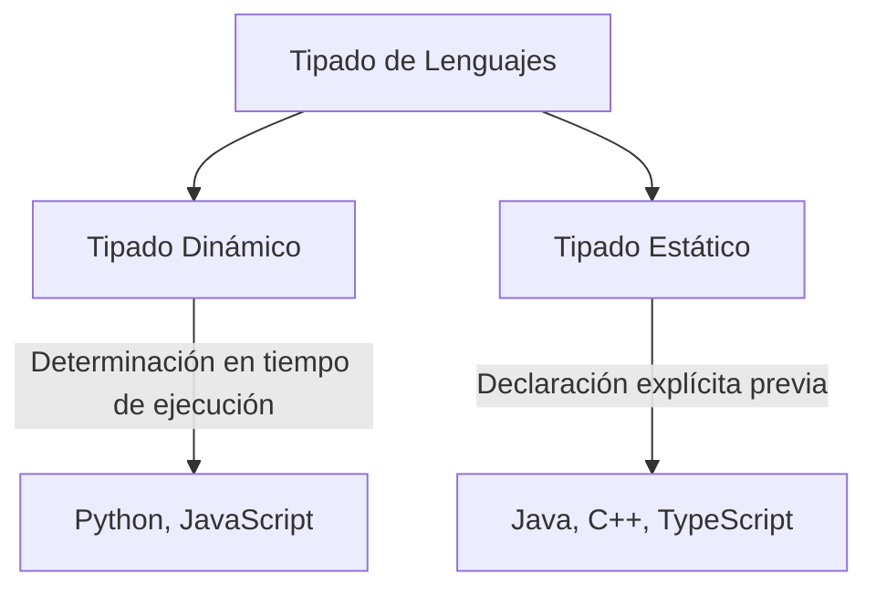
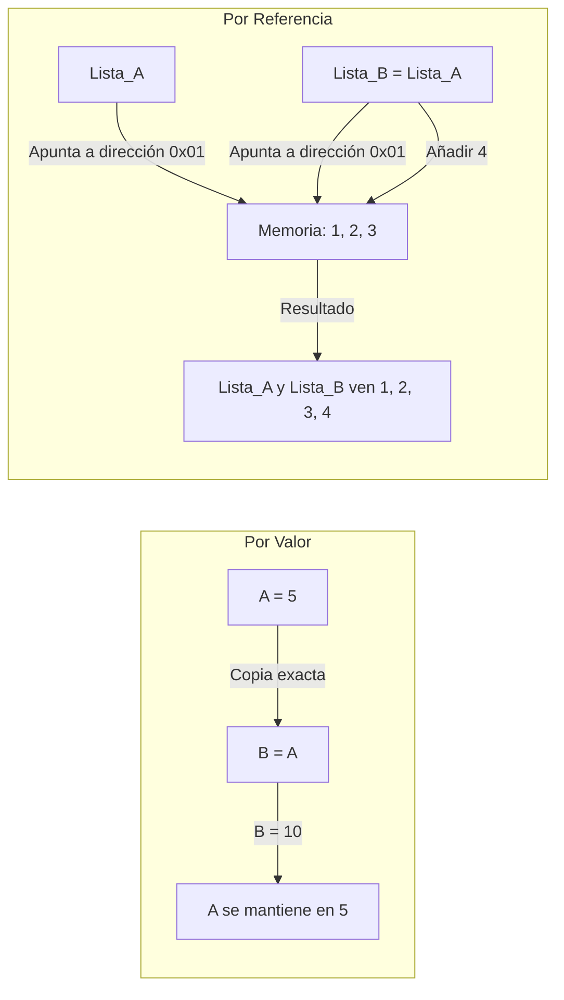

# Variables, Tipos de Datos y Operadores

**Autor(es):** BIG School  
**Fecha:** 2026  
**Tipo:** Paper / Documento Técnico  
**Fuente Original:** PDF / Módulo 0: Fundamentos del Desarrollo de Software  

---

## 1. Visión General y Definición de Variables

La verdadera ventaja competitiva en el desarrollo de software no reside en memorizar los comandos de un lenguaje específico, sino en dominar la estructura atómica de la computación. Comprender el ciclo de vida de una variable —desde su declaración hasta su mutación o persistencia— constituye la base para diseñar sistemas optimizados en memoria y tiempo de ejecución.

### Ciclo de Vida de una Variable

* **Declaración:** Notificación al sistema de la existencia de la variable (`puntos`).
* **Inicialización:** Asignación del valor inicial (`puntos = 0`).
* **Asignación / Mutación:** Modificación del estado almacenado en memoria (`puntos = 100`).

### Convenciones de Nomenclatura

| Convención | Ejemplo | Ámbito de uso habitual |
| :--- | :--- | :--- |
| **camelCase** | `numeroDeClientes` | Variables y funciones en JavaScript, Java, TypeScript. |
| **snake_case** | `numero_de_clientes` | Variables y funciones en Python, Rust, Ruby. |
| **PascalCase** | `NumeroDeClientes` | Nombres de Clases, Tipos e Interfaces en la mayoría de lenguajes. |

---

## 2. Tipos de Datos Primitivos y Tipado

Los tipos de datos primitivos universales comprenden:
* **Números enteros** (*Integers*)
* **Números decimales** (*Floats / Doubles*)
* **Booleanos** (`true` / `false`)
* **Caracteres** (`'a'`) y cadenas de texto (*Strings*)



### Tipado Dinámico (*Dynamic Typing*)

Las variables no poseen un tipo fijo asignado en código; el tipo se evalúa dinámicamente en tiempo de ejecución.

* **Ventaja:** Mayor flexibilidad y velocidad de prototipado.
* **Desventaja:** Los errores de tipo se detectan únicamente durante la ejecución del programa.

```python
# Ejemplo Conceptual Dinámico (Python)
mi_variable = 10      # Evaluado como Integer
mi_variable = "Hola"  # Reasignado como String sin error sintáctico
```

### Tipado Estático (*Static Typing*)

Es obligatorio declarar explícitamente el tipo de la variable al crearla y este no puede alterarse.

* **Ventaja:** Seguridad, rendimiento optimizado en compilación y detección temprana de errores.
* **Desventaja:** Mayor rigidez sintáctica y código más explicito.

```java
// Ejemplo Conceptual Estático (Java)
int miVariable;
miVariable = 10;     // Válido
miVariable = "Hola"; // ERROR DE COMPILACIÓN
```

---

## 3. Coerción y Casting de Tipos

### Coerción de Tipos (*Implicit Coercion*)
Conversión automática e implícita de tipos realizada internamente por el propio lenguaje según las reglas del operador.

```javascript
// Ejemplo en JavaScript
resultado = "5" + 2;  // Resulta en "52" (String por concatenación)
```

### Casting de Tipos (*Explicit Casting*)
Conversión explícita realizada de forma consciente por el desarrollador en el código.

```c
// Ejemplo en C
int entero = (int) 3.99;  // Resultado: 3 (se descarta la parte decimal)
```

---

## 4. Operadores

| Categoría de Operador | Operadores | Descripción |
| --- | --- | --- |
| **Aritméticos** | `+`, `-`, `*`, `/`, `%` | Suma, resta, multiplicación, división y módulo (resto de la división). |
| **Asignación y Compuestos** | `=`, `+=`, `-=`, `*=`, `/=` | Asignación directa y asignaciones compuestas con operación previa. |
| **Comparación** | `==`, `!=`, `>`, `<`, `>=`, `<=` | Igualdad, desigualdad, mayor que, menor que, mayor/igual, menor/igual. |
| **Lógicos** | `&&` (AND), `\|\|` (OR), `!` (NOT) | Conjunción lógica, disyunción lógica y negación. |

---

## 5. Scope (Ámbito) y Lifetime (Tiempo de Vida)

* **Scope Global:** Accesible desde cualquier punto de la aplicación. Se recomienda minimizar su uso para prevenir colisiones de nombres y efectos secundarios.
* **Scope Local / Bloque:** La variable existe únicamente dentro del bloque, función o módulo donde fue declarada.
* **Lifetime (Tiempo de vida):** Intervalo temporal durante el cual la variable permanece asignada en la memoria física. Generalmente, una variable local se libera al finalizar la ejecución de su bloque.

---

## 6. Tipos por Valor vs. Tipos por Referencia



### Por Valor (Primitivos)

Las variables almacenan directamente el dato. Al copiar una variable a otra, se duplica el valor en un espacio de memoria independiente.

```python
a = 5
b = a    # 'b' almacena su propia copia del valor 5
b = 10   # 'a' se mantiene intacto en 5
```

### Por Referencia (Objetos, Listas, Estructuras complejas)

Las variables almacenan un puntero o dirección de memoria que apunta al objeto real. Al asignar la variable a otra, ambas comparten el mismo puntero.

```python
lista_a = [1, 2, 3]
lista_b = lista_a
lista_b.append(4)

# lista_a también refleja [1, 2, 3, 4] porque ambas apuntan a la misma dirección
```

---

## 7. Observaciones Clave

* **Nomenclatura Estandarizada:** La nomenclatura de variables no es un adorno estético, sino una herramienta de mantenimiento para reducir la deuda técnica.
* **Inmutabilidad:** Se debe priorizar el uso de constantes (`const` / `final`) sobre variables siempre que el valor no deba mutar durante la ejecución.
* **Asignación vs. Comparación:** La confusión entre el operador de asignación (`=`) y el operador de comparación (`==`) es uno de los errores lógicos más recurrentes.
* **Efectos Secundarios por Referencia:** En tipos por referencia, modificar una instancia puede generar efectos secundarios no deseados en otros módulos del programa.
* **Lógica de Algoritmos:** Los operadores lógicos constituyen la base fundamental del control de flujo y los algoritmos de decisión.

---

## 8. Conclusión

Entender la anatomía de los datos, su comportamiento en memoria y las leyes lógicas que los gobiernan permite construir sistemas robustos, seguros y escalables en el tiempo, asegurando un control real sobre la infraestructura técnica.