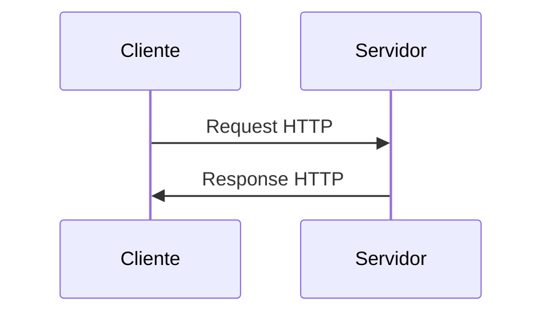

Nombre de archivo sugerido: paper/raw/2026-08-03-apis-comunicacion.md

# APIs y Comunicación

Autor(es): BIG School — Máster Desarrollo con IA
Fecha: 2026-08-03
Tipo: Documento Técnico
Lenguaje: Python
Fuente Original: PDF (0_5_3_-_APIs_y_comunicación.pdf / 0_5_3_-_APIs_y_comunicación_1_.pdf) — Módulo 0

---

La interoperabilidad se ha consolidado como el activo estratégico más crítico en el desarrollo de soluciones tecnológicas contemporáneas, donde ninguna aplicación sobrevive como una isla aislada. En el mercado actual, el valor de un software no reside únicamente en sus funciones internas, sino en su capacidad de **orquestar servicios externos** de manera instantánea y segura. Desde la integración de pasarelas de pago hasta el consumo de modelos avanzados de inteligencia artificial, la eficiencia operativa depende de un **contrato de comunicación** robusto y estandarizado.

## La API como Interfaz Estratégica

**API** significa Interfaz de Programación de Aplicaciones. Una Application Programming Interface debe conceptualizarse no solo como una herramienta técnica, sino como un contrato formal entre dos piezas de software. Para visualizar su funcionamiento en un entorno de negocio, resulta útil la analogía del restaurante: el sistema complejo y restringido es la cocina; los datos procesados son los platos finales; y el cliente es quien desea obtener un resultado. En este esquema, la API actúa como el camarero, el intermediario que presenta un menú (la documentación), gestiona la solicitud (request) y entrega el resultado (response).



Una comunicación API típica tiene dos partes:

1. **La Solicitud (Request)**: Incluye una dirección (URL/Endpoint), un método, cabeceras (metadatos) y, opcionalmente, un cuerpo de datos.
2. **La Respuesta (Response)**: Incluye un código de estado, cabeceras y un cuerpo con los datos solicitados.

Este modelo de comunicación es el estándar que permite a plataformas tan diversas como Uber o Google Maps interactuar en tiempo real bajo un marco de entendimiento común.

## Principios de la Arquitectura REST

**REST** (Representational State Transfer) no es un protocolo ni una herramienta; es un estilo arquitectónico, un conjunto de principios para diseñar APIs que sean ligeras, rápidas y escalables. Su enfoque principal son los **recursos** (cualquier entidad de negocio como clientes, pedidos o productos), identificados mediante URLs que llamamos **Endpoints**.

La manipulación de estos recursos se realiza a través de verbos estandarizados que corresponden a operaciones CRUD:

- **GET**: Lee o recupera un recurso. Ej.: `GET /productos`.
- **POST**: Crea un nuevo recurso. Ej.: `POST /productos`.
- **PUT / PATCH**: Actualiza un recurso existente total o parcialmente. Ej.: `PATCH /productos/5`.
- **DELETE**: Eliminar un recurso. Ej.: `DELETE /productos/5`.

Una característica vital de REST es que es **'stateless'** o sin estado: cada petición debe contener toda la información necesaria para ser procesada de forma independiente, eliminando la necesidad de que el servidor guarde contexto entre solicitudes, lo que optimiza drásticamente la capacidad de escala del sistema.

### Códigos de Estado más comunes

- **2xx (Éxito)**: 200 OK (GET, PATCH); 201 Created (POST).
- **4xx (Error del Cliente)**: 400 Bad Request; 401 Unauthorized; 403 Forbidden; 404 Not Found.
- **5xx (Error del Servidor)**: 500 Internal Server Error (bugs, sobrecarga).

## JSON: El Estándar de Intercambio de Información

Si dos sistemas van a comunicarse, necesitan hablar el mismo idioma. Si bien en el pasado dominaron formatos como XML, la industria ha convergido hacia **JSON (JavaScript Object Notation)** debido a su ligereza y facilidad de interpretación tanto para humanos como para máquinas. A pesar de su nombre, es un formato agnóstico al lenguaje de programación, permitiendo que una infraestructura en Python interactúe con una en Java o JavaScript sin fricciones.

JSON utiliza dos estructuras básicas: **objetos** (colecciones de pares clave/valor, rodeados por `{ }`) y **arrays** (listas ordenadas de valores, rodeados por `[ ]`). Esta simplicidad permite representar datos complejos de forma jerárquica, donde un objeto puede contener listas de otros objetos:

```json
{
  "id": 5,
  "nombre": "Laptop Gamer XZ",
  "precio": 1500.00,
  "en_stock": true,
  "etiquetas": ["electronica", "gaming", "oferta"],
  "detalles": {
    "cpu": "Intel i7",
    "ram_gb": 16,
    "ssd_gb": 512
  }
}
```

## Seguridad y Control de Acceso

Exponer servicios a la red requiere capas de seguridad rigurosas. Hay dos conceptos clave:

- **Autenticación (AuthN)**: ¿Quién eres? Verificar la identidad del cliente.
- **Autorización (AuthZ)**: ¿Qué puedes hacer? Verificar los permisos del cliente identificado.

Esto se gestiona principalmente mediante:

- **API Keys** (claves de acceso fijas).
- **Tokens** (Ej. Bearer Tokens / OAuth), que funcionan como tarjetas de acceso con caducidad tras un proceso de login inicial.

### El Desafío del CORS

Un aspecto técnico pero de alto impacto en el desarrollo web es el **CORS** (Cross-Origin Resource Sharing - Intercambio de Recursos de Origen Cruzado). Por seguridad, los navegadores bloquean por defecto solicitudes entre diferentes dominios (ej. una página cargada desde `mitienda.com` no puede, por defecto, hacer solicitudes API a un dominio diferente). Para permitir que una aplicación legítima consuma datos de otra fuente, el servidor de la API debe incluir cabeceras específicas que autoricen explícitamente el origen de la llamada. Es vital recordar que este bloqueo es una política del navegador y no necesariamente un fallo en la infraestructura de la API.

## Consumo de APIs y Herramientas

¿Cómo interactuamos con las APIs?

- Navegadores Web (Solo GET)
- Línea de Comandos (cURL)
- Clientes Gráficos (Postman, Thunder Client)
- Lenguajes de Programación (Python, JavaScript...)

### Ejemplo Práctico: Consumo de una API REST en Python

El siguiente ejemplo utiliza la librería `requests` para realizar una petición `GET` a una API REST pública, comprobar el código de estado de la respuesta y extraer datos del JSON recibido, convirtiéndolo en un diccionario de Python:

```python
# Archivo: peticiones.py

import requests

url = "https://jsonplaceholder.typicode.com/users/1"

response = requests.get(url)

if response.status_code == 200:
    print("Respuesta correcta")
    usuario = response.json()
    print(usuario["name"])
else:
    print(f"Error: {response.status_code}")
```

## Ejemplos Relacionados

**1. Misma petición con manejo más detallado de errores y extracción de más campos:**

```python
import requests

url = "https://jsonplaceholder.typicode.com/users/1"

response = requests.get(url)

if response.status_code == 200:
    print("¡Respuesta recibida con éxito!")
    datos_usuario = response.json()
    print("Nombre del usuario:", datos_usuario['name'])
    print("Email:", datos_usuario['email'])
else:
    print("Error: No se pudo contactar. Código:", response.status_code)
```

**2. Variación usando el método POST para crear un recurso, ilustrando el mismo patrón de comprobación de estado:**

```python
import requests

url = "https://jsonplaceholder.typicode.com/posts"
datos = {
    "title": "Nuevo post",
    "body": "Contenido del post",
    "userId": 1
}

response = requests.post(url, json=datos)

if response.status_code == 201:
    print("Recurso creado exitosamente")
    print(response.json())
else:
    print(f"Error al crear el recurso: {response.status_code}")
```

## Observaciones Clave

- La gestión de errores mediante **códigos de estado** es fundamental: 200 (éxito), 401 (no autorizado), 404 (no encontrado) y 500 (error del servidor) son los pilares de la comunicación técnica.
- Herramientas como Postman o Thunder Client son indispensables para la fase de pruebas (Testing), permitiendo validar respuestas antes de implementar el código.
- El uso de librerías como 'requests' en Python simplifica la integración programática, convirtiendo respuestas JSON directamente en diccionarios manipulables.
- La escalabilidad en sistemas REST se potencia al no almacenar estado en el servidor, permitiendo procesar millones de peticiones distribuidas.

## Conclusión

Dominar el ecosistema de las APIs es un imperativo estratégico que trasciende el desarrollo de software tradicional. En la era de la inteligencia artificial, la capacidad de una organización para integrar servicios como ChatGPT o modelos de análisis predictivo depende directamente de su dominio sobre estos **conectores universales**. Entender los flujos de petición-respuesta, la seguridad de los tokens y la estructura de los datos JSON permite a los responsables de negocio tomar decisiones informadas sobre cómo construir arquitecturas flexibles, capaces de adaptarse a un mercado que exige una integración continua y una **evolución tecnológica acelerada**.