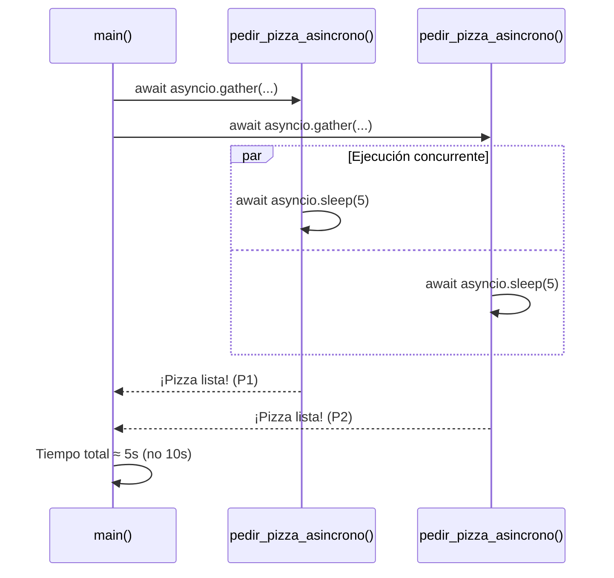

Nombre de archivo sugerido: paper/raw/2026-08-03-asincronia.md

# Asincronía

**Autor(es):** BIG School
**Fecha:** 2026
**Tipo:** Documento Técnico / Material de Curso
**Lenguaje:** Python
**Fuente Original:** PDF (Módulo 0: Fundamentos del Desarrollo de Software) - Máster Desarrollo con IA

---

La eficiencia de un sistema moderno no reside únicamente en su capacidad de procesamiento bruto, sino en su habilidad para gestionar los **tiempos de espera**. En el desarrollo de software convencional, la ejecución síncrona obliga a cada instrucción a aguardar la finalización de la anterior, generando cuellos de botella críticos cuando se interactúa con servicios externos. La programación asíncrona emerge como la solución estratégica para maximizar el **rendimiento operativo**, permitiendo que una aplicación inicie tareas de larga duración —como consultas a bases de datos o peticiones a APIs de Inteligencia Artificial— y continúe con otros procesos sin bloquear el hilo principal. Implementar este enfoque mediante la librería **asyncio** transforma la arquitectura del software, pasando de una estructura lineal ineficiente a un sistema de alta disponibilidad capaz de gestionar múltiples flujos de trabajo en paralelo. Comprender la dualidad entre **async** y **await** es, por tanto, un requisito indispensable para cualquier profesional que busque construir soluciones escalables y preparadas para la integración masiva de servicios en la nube.

## El Cambio de Paradigma: Del Bloqueo a la Concurrencia

Tradicionalmente, el código se ha ejecutado de forma secuencial. Este modelo es sencillo de entender pero profundamente ineficiente en entornos conectados. Gran parte del ciclo de vida de un programa no se consume realizando cálculos complejos en la CPU, sino esperando respuestas de la red, descargas de archivos o resultados de servicios de terceros. En un enfoque síncrono, el programa queda inactivo mientras espera, desperdiciando recursos valiosos.

La asincronía puede compararse con un maestro de ajedrez enfrentándose a múltiples oponentes de forma simultánea. En lugar de sentarse en una mesa y esperar minutos a que un rival mueva ficha, el maestro realiza su movimiento e inmediatamente pasa a la siguiente mesa. No incrementa la velocidad de su pensamiento, sino que elimina el tiempo de inactividad. Al regresar a la primera mesa, el rival probablemente ya habrá jugado. Esta capacidad de orquestar tareas en función de su disponibilidad de respuesta es la base de un software optimizado.

Permite que nuestro programa inicie una tarea de larga espera (como una consulta a la red) y, en lugar de bloquearse, se dedique a otras tareas hasta que la primera haya terminado. Python nos ofrece una librería estándar llamada **"asyncio"** para implementar este comportamiento, que introduce dos nuevas palabras clave que son el corazón de todo: **"async"** y **"await"**.

## Implementación Técnica con Asyncio

### Definición y Ejecución de Corrutinas

Para habilitar estas capacidades en Python, recurrimos al módulo nativo `asyncio`. El primer paso consiste en transformar funciones estándar en **corrutinas** mediante la palabra reservada `async`. Sin embargo, marcar una función como asíncrona es solo la mitad del proceso; el verdadero control se ejerce a través de `await`. Esta instrucción actúa como una pausa inteligente: le indica al programa que la tarea actual tardará en completarse y que el procesador queda libre para atender otras peticiones pendientes de la lista de tareas.

Es fundamental entender que para que este ecosistema funcione, el punto de entrada del programa también debe ser asíncrono. La creación de una función principal (frecuentemente denominada `main`) que orqueste las llamadas y el uso de un ejecutor de bucle de eventos como `asyncio.run()` son requisitos estructurales para habilitar el contexto asíncrono completo.

```python
import asyncio
import time

# Definimos una corrutina
async def pedir_cafe():
    print("Pidiendo un café...")
    # Imaginemos que el café tarda 3 segundos en hacerse.
    # En asincronía, no usamos time.sleep() porque bloquea todo.
    # Usamos asyncio.sleep(), que 'cede' el control.
    await asyncio.sleep(3)
    print("¡Café listo!")
    return "Café"
```

### Comparativa: Ejecución Síncrona vs. Asíncrona

Ejemplo síncrono (bloqueante):

```python
def pedir_pizza_sincrono():
    print("Pidiendo una pizza...")
    time.sleep(5)  # Esto bloquea todo el programa
    print("¡Pizza lista!")

# Ejecución síncrona
start_time = time.time()
pedir_pizza_sincrono()
pedir_pizza_sincrono()
end_time = time.time()
print(f"Tiempo total síncrono: {end_time - start_time:.2f} segundos")
# Salida esperada: Tiempo total síncrono: 10.00 segundos
```

Ejemplo asíncrono (no bloqueante):

```python
async def pedir_pizza_asincrono():
    print("Pidiendo una pizza...")
    await asyncio.sleep(5)  # Esto NO bloquea, cede el control
    print("¡Pizza lista!")

async def main():
    start_time = time.time()
    # Lanzamos ambas tareas para que se ejecuten 'a la vez'
    await asyncio.gather(
        pedir_pizza_asincrono(),
        pedir_pizza_asincrono()
    )
    end_time = time.time()
    print(f"Tiempo total asíncrono: {end_time - start_time:.2f} segundos")

# Ejecutamos el programa asíncrono
asyncio.run(main())
# Salida esperada: Tiempo total asíncrono: 5.00 segundos
```

### Paralelismo Real y Gestión de Tareas

El beneficio tangible de la asincronía se manifiesta cuando lanzamos múltiples operaciones concurrentes. Si tres procesos tardan tres segundos cada uno, una ejecución síncrona requeriría nueve segundos totales. Utilizando herramientas como `asyncio.gather`, podemos iniciar los tres procesos simultáneamente. El resultado es que el tiempo total de ejecución se reduce al tiempo que tarda la tarea más lenta (en este caso, tres segundos), logrando una reducción de la latencia del 66%.



## ¿Cuándo usar Asincronía?

La asincronía no hace que el código se ejecute más rápido. No acelera los cálculos matemáticos de tu procesador. Su superpoder es manejar la espera en operaciones **I/O-Bound** (limitadas por Entrada/Salida):

- Peticiones de red: Llamar a una API, consultar una página web.
- Operaciones de base de datos: Esperar por una consulta compleja.
- Lectura/escritura de archivos: Acceder al disco duro.
- Utilizar servicios de IA (resúmenes, traducciones, etc.)

## Aplicabilidad en Negocios y Servicios de IA

No todas las tareas requieren asincronía. Su valor estratégico brilla en operaciones limitadas por Entrada/Salida (I/O bound). En el contexto actual de negocios, esto se traduce directamente en:

- **Interacción con APIs de IA:** Consultar simultáneamente modelos de lenguaje como GPT y motores de análisis de imagen para generar un informe consolidado.
- **Consultas a Bases de Datos:** Recuperar información de usuarios y catálogos de productos de forma paralela para acelerar el tiempo de carga de una interfaz.
- **Integración de Servicios:** Sincronizar Microservicios que deben comunicarse entre sí sin degradar la experiencia de usuario final.

## Observaciones Clave

- La asincronía no acelera los cálculos matemáticos pesados; su función es optimizar la gestión de las esperas externas.
- Es un error común usar funciones bloqueantes como `time.sleep()` dentro de un contexto asíncrono; se debe sustituir por `asyncio.sleep()` para no detener todo el programa.
- El uso de `await` es obligatorio para obtener el resultado de una corrutina; de lo contrario, solo obtendremos el objeto de la corrutina sin ejecutar.
- La programación asíncrona es la base para ofrecer una experiencia de usuario fluida, evitando que la interfaz se congele durante procesos de red.

## Conclusión

Dominar la asincronía representa un salto cualitativo en la arquitectura de soluciones tecnológicas. En un mercado donde la velocidad de respuesta y la integración de servicios de Inteligencia Artificial son ventajas competitivas, saber gestionar la concurrencia es vital. No se trata de aplicar este modelo indiscriminadamente en todo el código, sino de identificar estratégicamente los puntos donde el sistema está 'esperando' y convertirlos en oportunidades de ejecución proactiva. Al final del día, reducir la latencia no solo mejora la eficiencia de los servidores, sino que garantiza la retención de usuarios que, en el entorno actual, no están dispuestos a tolerar esperas innecesarias.


## Ejemplos Relacionados

Ejercicio práctico real con `asyncio.gather` para 3 tareas concurrentes:

```python
import asyncio
import time

async def pedir_cafe():
    print("Pidiendo un café...")
    await asyncio.sleep(3)
    print("¡Café listo!")
    return "Café"

async def main():
    inicio = time.time()

    await asyncio.gather(
        pedir_cafe(),
        pedir_cafe(),
        pedir_cafe()
    )

    fin = time.time()
    print(f"Tiempo total {fin - inicio:.2f}")

asyncio.run(main())
```

*Nota: al lanzar 3 corrutinas de 3 segundos cada una con `asyncio.gather`, el tiempo total es ≈3 segundos (no 9), confirmando el comportamiento concurrente explicado en el documento principal.*