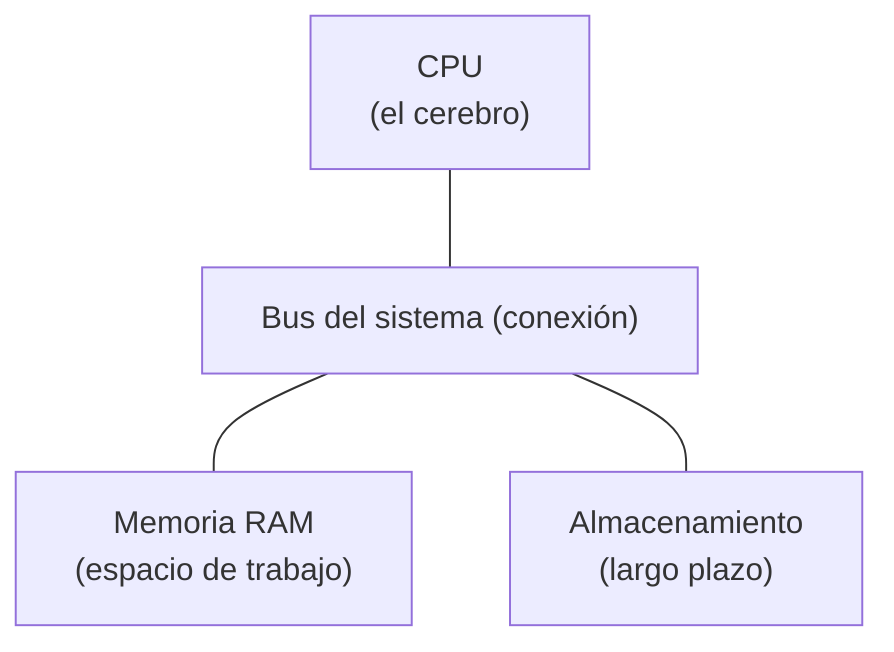
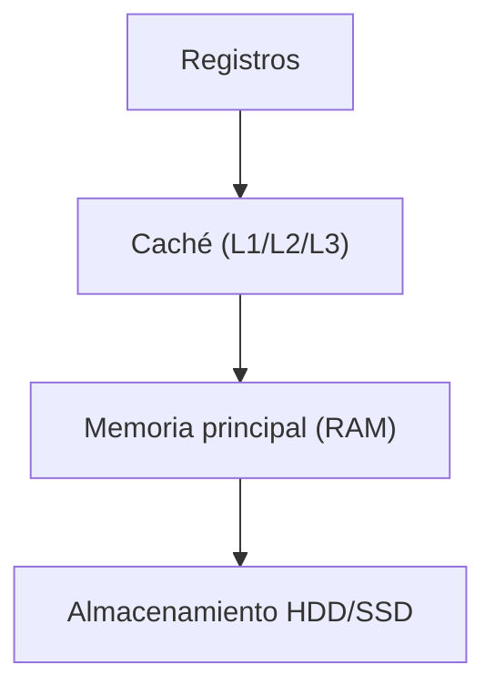

# Fundamentos de la Computación

Autor(es): BIG School — Máster Desarrollo con IA
Fecha: 2026-08-03
Tipo: Documento Técnico
Fuente Original: PDF (0_5_1_-_Fundamentos_de_la_computación.pdf / 0_5_1_-_Fundamentos_de_la_computación_1_.pdf) — Módulo 0

---

La capacidad de la inteligencia artificial para generar código de manera masiva y automatizada ha desplazado el foco del desarrollo tradicional hacia un rol de supervisión estratégica y optimización. Sin embargo, esta delegación técnica es peligrosa si se ignora que toda abstracción de software tiene puntos de fuga: el hardware. La eficiencia operativa de una organización, la escalabilidad de sus servicios en la nube y el control de costes dependen directamente de cómo interactúa el software con la infraestructura subyacente. Comprender los **principios de computación binaria**, la gestión de memoria y la arquitectura de procesamiento no es un ejercicio teórico, sino una necesidad pragmática para transformar el código generado por IA en soluciones de alto rendimiento. En un mercado donde el **paralelismo y la latencia** dictan el ROI de los proyectos tecnológicos, el desarrollador moderno actúa como el puente crítico entre la lógica de negocio abstracta y la realidad física de la máquina, garantizando que el software no solo funcione, sino que sea sostenible y optimizado.

## Del Bit a la Puerta Lógica: La Realidad Binaria

Toda la inteligencia que percibimos en las interfaces modernas se sustenta sobre un cimiento físico extremadamente simple: el transistor. En su núcleo, un ordenador está construido con miles de millones de estos interruptores microscópicos. Un transistor solo tiene dos estados: Encendido (pasa corriente) o Apagado (no pasa corriente), representados mediante el sistema binario: 1 y 0. Esta dualidad es la base del único lenguaje que el hardware comprende de forma nativa. La unidad mínima de información, el **bit** (Binary Digit), se organiza en grupos de ocho para formar un **byte**, el estándar sobre el cual se codifica toda la realidad digital, desde caracteres Unicode hasta complejos modelos de lenguaje.

La verdadera potencia surge de la combinación de miles de millones de estos transistores para formar puertas lógicas (AND, NOT, OR). Estas estructuras permiten realizar operaciones de comparación y aritmética básica que, integradas en circuitos complejos, constituyen la base física de la computación. Ignorar este nivel de detalle impide comprender por qué ciertas operaciones de datos son más costosas que otras a nivel de ciclos de reloj.

## Arquitectura Von Neumann: El Plano Maestro de la Computación

La mayoría de los sistemas actuales siguen el diseño de Von Neumann, una arquitectura que revolucionó la industria al unificar en un mismo espacio (la memoria RAM) tanto los datos como las instrucciones del programa. Esto es lo que permite que un ordenador sea reprogramable y versátil. Esta estructura se divide en tres pilares fundamentales que todo gestor de tecnología debe monitorizar:

- **La Unidad Central de Procesamiento (CPU)**: El motor que ejecuta el ciclo **fetch-decode-execute** (buscar, decodificar, ejecutar) a velocidades de gigahercios:
  - **Fetch (Buscar)**: La CPU obtiene la siguiente instrucción desde la RAM.
  - **Decode (Decodificar)**: La CPU analiza la instrucción binaria para entender qué debe hacer.
  - **Execute (Ejecutar)**: La CPU realiza la operación.
- **Memoria RAM**: El espacio de trabajo volátil y rápido donde residen los procesos activos.
- **Almacenamiento Persistente**: La biblioteca de largo plazo (discos duros) que, aunque masiva, presenta latencias significativamente mayores.

## La Jerarquía de Memoria y el Rendimiento

El cuello de botella de cualquier sistema suele ser la distancia física entre los datos y el procesador. La regla de oro del rendimiento dicta que los datos deben estar lo más cerca posible de la CPU. Para mitigar la lentitud de la RAM respecto a la velocidad de la CPU, existen niveles de **memoria caché (L1, L2, L3)** integrados en el propio procesador:

Acceder a un dato en caché es casi instantáneo, mientras que recuperarlo de un disco duro puede ser órdenes de magnitud más lento (milisegundos frente a nanosegundos). Un software optimizado por un profesional humano sabe gestionar este flujo de datos, mientras que una IA podría generar código que ignore estas jerarquías, disparando los tiempos de ejecución.

## Gestión del Sistema Operativo y Concurrencia

El sistema operativo actúa como el árbitro supremo entre el hardware y las aplicaciones. Sus funciones son críticas:

- **Abstracción del Hardware**: Proporciona una interfaz simplificada y estandarizada.
- **Gestión de Recursos**: Actúa como un árbitro, decidiendo qué programa puede usar la CPU, cuánta memoria puede consumir y cuándo puede acceder al disco, asegurando la equidad y la estabilidad.

Para garantizar la seguridad y estabilidad, el sistema opera en dos dominios:

- **Kernel Space (Espacio del Núcleo)**: El núcleo del SO (el Kernel) se ejecuta aquí, con acceso total pero sensible al hardware.
- **User Space (Espacio de Usuario)**: Aquí corren las aplicaciones, con privilegios restringidos.

## Procesos, Hilos y el Desafío de la Multitarea

Un **Proceso** es una instancia en ejecución de un programa: un contenedor aislado que incluye el código del programa y su memoria asignada. El SO también realiza la Planificación (Scheduling): el Planificador cambia rápidamente la atención de la CPU entre diferentes procesos miles de veces por segundo (Time-Slicing), creando la ilusión de que todo se ejecuta simultáneamente.

Es fundamental distinguir entre dos conceptos que a menudo se confunden en el desarrollo de software:

- **Concurrencia**: la capacidad del sistema para alternar entre múltiples tareas rápidamente, dando la sensación de simultaneidad (scheduling).
- **Paralelismo**: requiere de múltiples núcleos (cores) físicos operando exactamente al mismo tiempo.

Dentro de los procesos existen los **hilos (threads)**, que comparten memoria entre sí. Aunque aumentan la eficiencia, introducen riesgos críticos como las **condiciones de carrera (race conditions)**, donde dos hilos intentan modificar el mismo dato simultáneamente, provocando errores catastróficos. La IA suele ser excelente redactando funciones aisladas, pero frecuentemente falla en prever estos conflictos de concurrencia en entornos complejos.

## Memoria Virtual y el Impacto del Swapping

¿Qué sucede cuando abrimos más programas de los que caben en la RAM física? El sistema operativo emplea la **Memoria Virtual** mediante una técnica conocida como **swapping o paginación**: combina la RAM física con espacio en el disco (Swap) para crear la ilusión de tener mucha más memoria, moviendo temporalmente los datos no utilizados desde la RAM al disco. No obstante, dado que el disco es drásticamente más lento, un sistema que dependa del swap verá su rendimiento degradarse de forma crítica. En entornos de IA, donde el manejo de grandes volúmenes de datos en memoria es constante, escribir software eficiente que evite el swapping es la diferencia entre una aplicación funcional y una inutilizable.

## Observaciones Clave

- Las abstracciones tienen fugas: no permitas que la comodidad de la nube nuble el entendimiento de que el código corre sobre hardware físico con límites reales.
- Jerarquía de datos: Priorizar siempre el uso de caché y RAM frente al almacenamiento persistente para reducir la latencia operativa.
- Cuidado con el paralelismo: La IA puede sugerir el uso de threads para ganar velocidad; supervisa siempre el acceso a la memoria compartida para evitar condiciones de carrera.
- Eficiencia en memoria: Un código que consume RAM en exceso activará el swapping del sistema operativo, penalizando el rendimiento en entornos productivos.

## Conclusión Estratégica

El dominio de los fundamentos de sistemas permite pasar de ser un mero consumidor de tecnología a un arquitecto de soluciones robustas. Al entender cómo la CPU procesa instrucciones y cómo el sistema operativo gestiona el aislamiento de procesos, el profesional adquiere el criterio necesario para auditar el código generado por IA. En última instancia, la inteligencia artificial proporciona la velocidad de implementación, pero es el conocimiento humano del hardware y los sistemas lo que garantiza la eficiencia, la escalabilidad y la viabilidad económica de cualquier desarrollo de software moderno.