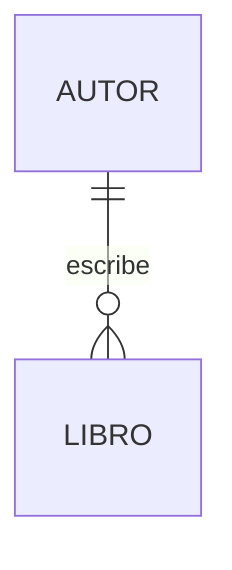

# Gestión de Datos

Autor(es): BIG School — Máster Desarrollo con IA
Fecha: 2026-08-03
Tipo: Documento Técnico
Lenguaje: SQL
Fuente Original: PDF (0_5_4_-_Gestión_de_datos.pdf / 0_5_4_-_Gestión_de_datos_1_.pdf) — Módulo 0

---

La integridad de la información constituye el activo más crítico de cualquier organización moderna, desplazando definitivamente la viabilidad de soluciones rudimentarias como hojas de cálculo hacia ecosistemas de software robustos. Delegar el almacenamiento de transacciones, usuarios y configuraciones en estructuras no profesionales deriva inevitablemente en un **caos operativo** caracterizado por la redundancia y la inconsistencia de datos. Para mitigar estos riesgos, el mercado exige la implementación de Sistemas de Gestión de Bases de Datos (**DBMS**), que actúan como custodios de la **integridad referencial** y el rendimiento.

## Fundamentos del Diseño y Modelado de Datos

A medida que la aplicación crece, nos enfrentamos a problemas de redundancia, inconsistencia, concurrencia y rendimiento. Es por eso que necesitamos un DBMS. Antes de proceder a la implementación técnica, es indispensable establecer un plano arquitectónico mediante el **modelado de datos**, articulado a través del Modelo Entidad-Relación (ER), que se centra en tres componentes clave:

- **Entidades**: Los "sustantivos" principales del sistema (como libros o usuarios).
- **Atributos**: Las características de una entidad (como un ISBN o un nombre).
- **Relaciones**: Cómo interactúan las entidades. Son los "verbos".



### La naturaleza de las relaciones y cardinalidad

La cardinalidad define el comportamiento numérico entre entidades, un factor decisivo para mantener la coherencia del sistema:

- **Uno a Uno (1:1)**: vincula elementos de forma exclusiva.
- **Uno a Muchos (1:N)**: permite que una entidad padre, como un autor, se conecte con múltiples entidades hijas, como sus obras.
- **Muchos a Muchos (N:M)**: requiere la creación de tablas de unión o intermedias para evitar duplicidades innecesarias.

Este rigor en el diseño es lo que permite que el software sea predecible y eficiente ante consultas masivas.

## El Modelo Relacional

Las Entidades se convierten en Tablas, los Atributos en Columnas, y cada instancia de la entidad es una Fila (Registro). El proceso de organizar las tablas para minimizar la redundancia y maximizar la integridad se llama **Normalización**.

- **Clave Primaria (Primary Key - PK)**: garantiza la identificación única de cada registro. Suele ser un ID único.

**Tabla: Autores**

| AutorID (PK) | Nombre | Nacionalidad |
|---|---|---|
| 1 | G. García Márquez | Colombiana |
| 2 | J.R.R. Tolkien | Británica |

- **Clave Foránea (Foreign Key - FK)**: implementa las relaciones y mantiene el vínculo lógico entre tablas. Es una columna en la tabla 'Hija' (Muchos) que referencia la Clave Primaria de la tabla 'Padre' (Uno).

**Tabla: Libros**

| LibroID (PK) | Titulo | AutorID (FK) |
|---|---|---|
| 101 | Cien Años de Soledad | 1 |
| 102 | El Hobbit | 2 |
| 103 | El Amor en Tiempos del Cólera | 1 |

Para relaciones Muchos a Muchos (N:M), se usa una **Tabla de Unión (Join Table)**:

**Tabla: Estudiantes**

| EstudianteID (PK) | Nombre |
|---|---|
| 1 | Juan |
| 2 | María |
| 3 | Pedro |

**Tabla: Cursos**

| CursoID (PK) | Nombre |
|---|---|
| 10 | Master IA |
| 11 | Master Git |
| 12 | Master JS |

**Tabla: Inscripciones**

| EstudianteID (FK) | CursoID (FK) |
|---|---|
| 1 | 10 |
| 1 | 12 |
| 2 | 10 |

## El Paradigma SQL frente a la Flexibilidad NoSQL

El estándar predominante durante décadas ha sido el lenguaje **SQL** (Structured Query Language), fundamentado en esquemas estrictos y relaciones fuertes. Las bases de datos que implementan el modelo relacional se conocen comúnmente como bases de datos SQL. Características clave: utilizan SQL, esquema estricto y relaciones fuertes (Ejemplos: PostgreSQL, MySQL, Oracle). Su valor diferencial reside en garantizar las propiedades **ACID**:

- Atomicidad
- Consistencia
- Aislamiento (Isolation)
- Durabilidad

Estas propiedades aseguran que cualquier transacción, como una transferencia bancaria, se complete íntegramente o no se realice en absoluto, protegiendo al sistema de estados inválidos o fallos críticos.

### Diversificación mediante NoSQL

Sin embargo, la rigidez de SQL motivó el surgimiento del movimiento **NoSQL** (Not Only SQL), diseñado para abordar la escalabilidad horizontal masiva y el manejo de datos no estructurados. Las bases de datos NoSQL sacrifican algo de consistencia a cambio de mayor velocidad y disponibilidad. Características clave: flexibilidad y escalabilidad, manejo de datos no estructurados. Tipos principales:

- Bases de Datos Documentales (Ej. MongoDB)
- Clave-Valor (Ej. Redis)
- Columnares Amplias (Ej. Cassandra)
- Grafos (Ej. Neo4j)

Mientras que SQL destaca en la **consistencia transaccional**, NoSQL prioriza la disponibilidad y la velocidad en entornos de alta demanda.

## Interacción y Manipulación mediante Lenguaje Declarativo

Interactuar con una base de datos relacional implica dominar el acrónimo **CRUD** (Create, Read, Update, Delete). SQL es un lenguaje declarativo: le decimos a la base de datos *qué* queremos, no *cómo* obtenerlo.

- **Create (Crear)**: Añadir nuevos datos. (SQL: `INSERT`)
- **Read (Leer)**: Consultar datos. (SQL: `SELECT`)
- **Update (Actualizar)**: Modificar datos. (SQL: `UPDATE`)
- **Delete (Eliminar)**: Borrar datos. (SQL: `DELETE`)

```sql
-- CREATE: Crear un nuevo autor
INSERT INTO Autores (Nombre, Nacionalidad)
VALUES ('Isabel Allende', 'Chilena');

-- READ: Seleccionar, filtrar y ordenar
SELECT * FROM Autores;
SELECT Nombre FROM Autores;
SELECT Nombre, Nacionalidad FROM Autores
WHERE Nacionalidad = 'Británica';
SELECT * FROM Libros
WHERE LibroID > 101;
SELECT * FROM Autores
ORDER BY Nombre ASC; -- ASC = Ascendente (por defecto)

-- UPDATE: Actualizar la nacionalidad de un autor específico
UPDATE Autores
SET Nacionalidad = 'Colombiana (Actualizado)'
WHERE AutorID = 1;

-- DELETE: Eliminar un libro específico
DELETE FROM Libros
WHERE LibroID = 103;

-- ¡PELIGRO! Sin WHERE, esto borrará TODOS los libros
DELETE FROM Libros;
```

La potencia real se manifiesta en la cláusula **JOIN**, que permite consolidar datos dispersos en múltiples tablas para generar reportes significativos:

```sql
SELECT
    L.Titulo,
    A.Nombre AS NombreAutor  -- con AS definimos un alias para la columna
FROM
    Libros L  -- Empezamos desde Libros (alias 'L')
INNER JOIN
    Autores A ON L.AutorID = A.AutorID; -- Unimos donde las claves coinciden
```

Resultado:

| Titulo | NombreAutor |
|---|---|
| Cien Años de Soledad | G. García Márquez |
| El Hobbit | J.R.R. Tolkien |

Y las funciones de agregación permiten realizar cálculos estadísticos en tiempo real: `COUNT()`, `AVG()`, `SUM()`, `MIN()`, `MAX()`.

```sql
-- ¿Cuántos libros tenemos en total?
SELECT COUNT(*) FROM Libros;

-- ¿Cuántos libros ha escrito el Autor con ID 1?
SELECT COUNT(*) FROM Libros
WHERE AutorID = 1;
```

## Ejemplos Relacionados

**1. Variación de JOIN usando LEFT JOIN para incluir autores sin libros registrados:**

```sql
SELECT
    A.Nombre AS NombreAutor,
    L.Titulo
FROM
    Autores A
LEFT JOIN
    Libros L ON A.AutorID = L.AutorID;
```

**2. Uso de agregación combinada con GROUP BY para contar libros por autor:**

```sql
SELECT
    A.Nombre AS NombreAutor,
    COUNT(L.LibroID) AS TotalLibros
FROM
    Autores A
LEFT JOIN
    Libros L ON A.AutorID = L.AutorID
GROUP BY
    A.Nombre;
```

## Observaciones Clave

- La normalización es el proceso esencial para minimizar la redundancia y maximizar la integridad de los datos en sistemas relacionales.
- Las claves primarias (Primary Keys) garantizan la identificación única de cada registro, mientras que las claves foráneas (Foreign Keys) mantienen el vínculo lógico entre tablas.
- El uso de la cláusula `WHERE` es crítico en operaciones de actualización y borrado; su omisión puede resultar en la pérdida o alteración accidental de toda la base de datos.
- Las propiedades ACID son el pilar que diferencia a las bases de datos relacionales en términos de seguridad transaccional.
- La elección entre SQL y NoSQL no es una preferencia tecnológica, sino una decisión basada en la estructura del dato y los requisitos de escala.

## Conclusión Estratégica

En la era de la inteligencia artificial, el modelado correcto de los datos sigue siendo una responsabilidad humana insustituible. Aunque las herramientas de generación de código pueden asistir en la escritura de consultas, solo una comprensión profunda de la arquitectura de datos permite validar que dichas consultas sean **seguras y eficientes**. Un diseño defectuoso en la base de datos es una deficiencia estructural que ninguna IA puede corregir por sí sola. Por tanto, el dominio de estos fundamentos proporciona la base crítica necesaria para supervisar sistemas automatizados y garantizar que la infraestructura de información de la empresa sea escalable, resiliente y capaz de soportar las demandas del mercado futuro.