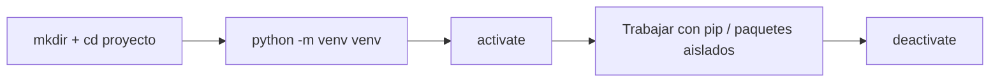

# Gestión de Entornos y Dependencias

**Autor(es):** BIG School
**Fecha:** 2026
**Tipo:** Documento Técnico / Material de Curso
**Lenguaje:** Python
**Fuente Original:** PDF (Módulo 0: Fundamentos del Desarrollo de Software) - Máster Desarrollo con IA

---

## Entorno Virtual

### ¿Qué es un Entorno Virtual?

Un entorno virtual es una copia autocontenida de una instalación de Python. Cuando creamos uno, obtenemos:

- Una copia del intérprete de Python.
- Un espacio propio para instalar librerías (que llamaremos paquetes), que empieza completamente vacío.

La herramienta estándar para crear estos entornos en Python es un módulo llamado **"venv"**.

### Creando y usando un Entorno Virtual

```bash
# Creamos una carpeta para nuestro nuevo proyecto y entramos en ella
mkdir mi_proyecto_genial
cd mi_proyecto_genial

# Le decimos a python que ejecute el módulo venv y cree una carpeta llamada 'venv'
python -m venv venv

# Activamos el entorno virtual, según nuestro sistema operativo
venv\Scripts\activate       # En Windows
source venv/bin/activate    # En macOS y Linux (Bash/ZSH)

# Desactivamos el entorno virtual al terminar de trabajar.
deactivate
```



## Gestión de Paquetes: Archivo de Requisitos

### Gestión de paquetes (PIP)

Un paquete es una colección de código que alguien más ha escrito para resolver un problema específico (hacer peticiones web, análisis de datos, crear gráficos, etc.).

**"pip"** es la herramienta que nos permite instalar, actualizar y eliminar estos paquetes dentro de nuestro entorno virtual activado.

```bash
# Instalación del paquete requests
pip install requests

# Ver todos los paquetes instalados
pip list
```

### Archivo de requisitos (requirements.txt)

Un archivo de requisitos contiene todas las dependencias utilizadas en nuestro proyecto Python.

```bash
# Congela (freeze) la lista de paquetes instalados y la guarda en un archivo
pip freeze > requirements.txt

# Instala todas las dependencias incluidas en el archivo de requisitos
pip install -r requirements.txt
```

## Ejemplos Relacionados

**Ejemplo de un archivo `requirements.txt` real generado con `pip freeze`:**


```text
certifi==2025.8.3
charset-normalizer==3.4.3
idna==3.10
requests==2.32.5
urllib3==2.5.0
```
