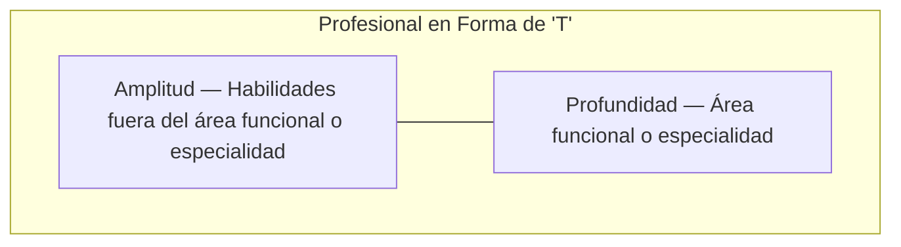

# Introducción a los Lenguajes de Programación

**Autor(es):** BIG School
**Fecha:** 2026
**Tipo:** Documento Técnico / Material de Curso
**Fuente Original:** PDF (Módulo 0: Fundamentos del Desarrollo de Software) - Máster Desarrollo con IA

---

La transición entre conceptualizar una solución y ejecutarla demanda un cambio de paradigma donde la teoría deja de ser un plano estático para convertirse en un sistema operativo dinámico. En este entorno, la capacidad de traducir procesos mentales en instrucciones computacionales no depende únicamente del dominio técnico, sino de la elección estratégica de herramientas que actúen como catalizadores entre la **lógica universal** y la infraestructura de hardware. El desarrollo de software moderno ha desplazado el foco desde la memorización de sintaxis hacia la comprensión profunda de los cimientos, permitiendo que el profesional adopte un **perfil en T**: una base amplia de conocimientos generales complementada con una especialización técnica vertical. Bajo este enfoque, la elección de un primer lenguaje de programación no es un fin en sí mismo, sino el establecimiento de un **puente cognitivo** que garantiza la adaptabilidad ante un mercado que evoluciona a la velocidad de la inteligencia artificial. Quien domina la estructura gramatical del código adquiere la facultad de migrar entre tecnologías sin fricción, asegurando que el verdadero valor resida en la **arquitectura del pensamiento** y no solo en la herramienta empleada.

## La Filosofía del Desarrollador Polivalente

En el contexto empresarial actual, la especialización extrema puede convertirse en un riesgo de obsolescencia. Por ello, es imperativo adoptar la estructura de profesional en forma de T. La barra horizontal de esta figura representa la versatilidad: la capacidad de dialogar con diferentes tecnologías, entender el ecosistema general del software y colaborar en proyectos multidisciplinares. Esta amplitud es la que permite que, ante la aparición de una nueva herramienta de IA o un nuevo framework, el profesional no empiece de cero, sino que traslade sus conocimientos previos a la nueva interfaz.

La barra vertical, por el contrario, simboliza la profundidad. Es necesario elegir un 'instrumento' principal para alcanzar un nivel de maestría que permita ejecutar soluciones complejas con precisión. Al dominar un lenguaje troncal, se adquiere la capacidad de entender la gramática y los patrones de aprendizaje que rigen a todos los demás. Por tanto, el aprendizaje de un lenguaje específico es, en realidad, un entrenamiento para el aprendizaje continuo de cualquier tecnología futura que el mercado demande.



## Python como Estándar Estratégico en la Era de la IA

### Razones de una Elección Ejecutiva

La selección de Python como lenguaje de referencia para profesionales que buscan liderar en el ámbito de la tecnología y los negocios no es fortuita. Se fundamenta en tres pilares que garantizan un retorno de inversión rápido en términos de aprendizaje y capacidad operativa:

- **Legibilidad y Eficiencia:** Python está diseñado bajo una filosofía de sintaxis limpia, muy cercana al lenguaje humano. Esto minimiza la fricción técnica y permite que el desarrollador se concentre en la lógica del negocio y la resolución de problemas, en lugar de enfrentarse a reglas sintácticas crípticas.
- **Versatilidad Multidisciplinar:** Funciona como una 'navaja suiza' capaz de ejecutar desde automatizaciones sencillas de tareas administrativas hasta complejas aplicaciones web y análisis masivos de datos.
- **Predominio en Inteligencia Artificial:** Prácticamente todo el ecosistema moderno de IA y Ciencia de Datos está construido sobre Python. Dominar este lenguaje es obtener un pasaporte directo a las librerías y herramientas que están definiendo el futuro de la automatización inteligente.

En resumen, las razones clave por las que se elige Python son:

- Simplicidad y Legibilidad
- Versatilidad extrema
- Es el lenguaje Rey de la IA y la Ciencia de Datos

## La Comunicación entre el Humano y la Máquina

Para que nuestras instrucciones en Python se transformen en acciones químicas y eléctricas dentro de un procesador, es necesario un proceso de traducción. El hardware solo comprende código máquina (binario), por lo que dependemos de un 'traductor universal'. En este punto, es vital distinguir entre dos métodos de procesamiento.

Por un lado, existen **lenguajes compilados**, donde un software lee la totalidad del código y genera un archivo ejecutable independiente (muy rápido en la ejecución). Por otro lado, Python destaca como un **lenguaje interpretado**: un intérprete lee el código línea por línea, la traduce y la ejecuta en el momento (más flexible y excelente para el desarrollo rápido y la experimentación). Esta característica proporciona una flexibilidad excepcional y un ciclo de retroalimentación inmediato, ideal para la experimentación rápida y el desarrollo ágil en entornos corporativos donde la validación de ideas debe ser constante.

**Python es un lenguaje interpretado.**

## Aplicación Práctica y Estándares de la Industria

El paso a la acción requiere la configuración de un entorno profesional. Utilizando herramientas como Visual Studio Code y sus extensiones específicas, el proceso de escritura de código se vuelve asistido y eficiente. No obstante, más allá de la herramienta, existen convenciones que marcan la diferencia entre un aficionado y un profesional.

Una de ellas es el uso de 'Snake Case' para el nombramiento de variables (palabras en minúscula separadas por guiones bajos) y, fundamentalmente, la adopción del inglés como el idioma estándar de codificación. Aunque la lógica se aprenda en la lengua materna, el código profesional debe ser universal. El uso de variables como `user_name` en lugar de `nombre_usuario` asegura que el software sea mantenible y escalable en equipos globales. La asistencia de la IA en este proceso de traducción de términos es una práctica recomendada que permite acelerar la adopción de estos estándares mundiales.

### Ejemplo introductorio: "¡Hola, Mundo!"

```python
print("¡Hola, Mundo!")

# Esto es un comentario para explicar el código
nombre_usuario = "Alex"
mensaje_bienvenida = "Bienvenido al futuro del software, " + nombre_usuario
print(mensaje_bienvenida)
```

## Observaciones Clave

- La elección de un lenguaje interpretado como Python favorece un entorno de pruebas interactivo, reduciendo el tiempo entre la hipótesis y el resultado.
- Es crítico verificar que la versión de Python instalada sea superior a la 3.10 para garantizar compatibilidad con las librerías modernas de IA.
- El profesional debe supervisar el uso de asistentes de IA (como GitHub Copilot) durante las fases iniciales de aprendizaje para asegurar que comprende la lógica antes de automatizarla.
- El desarrollo en inglés no es opcional en entornos competitivos; es el estándar que garantiza la interoperabilidad del código a nivel global.

## Conclusión

Dominar un instrumento técnico como Python es el primer paso para convertir la visión estratégica en activos digitales tangibles. Al comprender que la tecnología es un medio para ejecutar una melodía lógica universal, el líder de negocios se vuelve capaz de orquestar soluciones que integran IA y software de manera fluida. La verdadera competencia no reside en escribir líneas de código, sino en entender cómo esas líneas interactúan con el hardware para generar valor real, estableciendo una base sólida que no caduca con el surgimiento de nuevas herramientas, sino que se fortalece con ellas.
