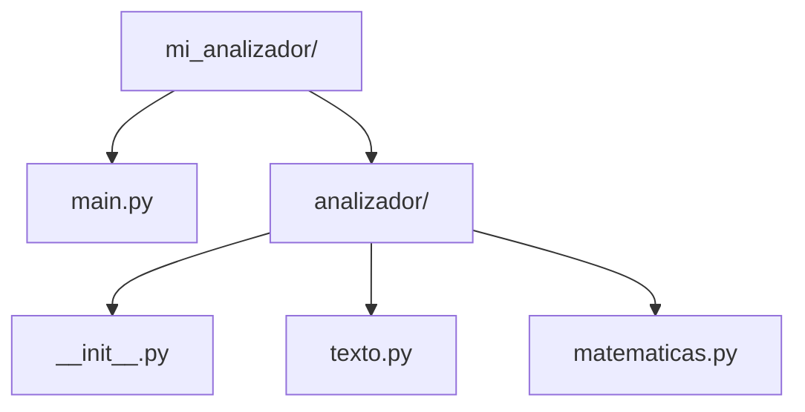

# Modularidad: Introducción a los Lenguajes de Programación

Autor(es): BIG School
Fecha: 2026-08-03
Tipo: Documento Técnico / Presentación
Lenguaje: Python
Fuente Original: PDF (0_4_7_-_Modularidad.pdf) — Módulo 0: Fundamentos del Desarrollo de Software

---

## Módulos

### ¿Qué es un módulo en Python?

Cualquier archivo de Python (`.py`) es un módulo. El nombre del archivo es el nombre del módulo.

A continuación se muestra un módulo de utilidades para procesamiento de texto:

```python
# Creamos el Módulo de Utilidades
# Archivo: text_utils.py

def contar_palabras(texto):
    """Cuenta el número de palabras en un string."""
    return len(texto.split())

def a_mayusculas(texto):
    """Convierte un string a mayúsculas."""
    return texto.upper()
```

Y así se importa y utiliza ese módulo desde un programa principal:

```python
# Creamos el programa principal
# Archivo: main.py

# Importamos nuestro módulo para poder usar sus funciones
import text_utils

mi_frase = "La modularidad es la clave del software profesional."

# Para usar una función del módulo, usamos la sintaxis: nombre_modulo.nombre_funcion
total_palabras = text_utils.contar_palabras(mi_frase)
frase_mayusculas = text_utils.a_mayusculas(mi_frase)

print(f"El texto tiene {total_palabras} palabras.")
print(f"En mayúsculas: {frase_mayusculas}")
```

## Paquetes

### ¿Qué es un paquete en Python?

Un paquete es una carpeta que contiene módulos y un archivo especial (a menudo vacío) llamado `__init__.py`.

Estructura de carpetas del proyecto de ejemplo:



```python
# Archivo: analizador/texto.py
def a_mayusculas(texto):
    return texto.upper()
```

```python
# Archivo: analizador/matematicas.py
def contar_palabras(texto):
    return len(texto.split())
```

Uso del paquete desde el archivo principal:

```python
# Archivo: main.py

# Importamos los módulos desde nuestro paquete
from analizador import texto, matematicas

mi_frase = "Organizar el código en paquetes es una buena práctica."

# Usamos la sintaxis: nombre_modulo.nombre_funcion
palabras = matematicas.contar_palabras(mi_frase)
mayusculas = texto.a_mayusculas(mi_frase)

print(f"Número de palabras: {palabras}")
print(f"Texto transformado: {mayusculas}")
```

### Diferentes formas de importar módulos

1. **`import paquete.modulo`**: La forma más explícita. Requiere usar el nombre completo (`paquete.modulo.funcion()`).
2. **`from paquete import modulo`**: Permite usar `modulo.funcion()`.
3. **`from paquete.modulo import funcion`**: Importa solo una función específica. Permite usar `funcion()` directamente.
4. **`import paquete.modulo as alias`**: Permite renombrar el módulo para que sea más corto de escribir.

### Ejemplo Práctico: Módulo de Utilidades dentro de un Paquete

El siguiente código es una implementación real que aplica el patrón **"from paquete import modulo"** (punto 2 de la lista anterior). El módulo `utilidades.py` vive dentro del paquete `analizador` y agrupa las mismas funciones de conteo de palabras y conversión a mayúsculas:

```python
# Archivo: analizador/utilidades.py

def contar_palabras(texto):
    return len(texto.split())

def a_mayusculas(texto):
    return texto.upper()
```

Y así se consume ese módulo desde otro archivo del proyecto, usando la sintaxis `modulo.funcion()` para dejar explícito el origen de cada función:

```python
# Archivo: textos.py

from analizador import utilidades

mi_frase = "La modularidad es la clave del software profesional"

print(utilidades.contar_palabras(mi_frase))
print(utilidades.a_mayusculas(mi_frase))
```

## Ejemplos Relacionados

**1. Misma funcionalidad usando importación selectiva (`from...import`):**

```python
# Archivo: textos_v2.py
from analizador.utilidades import contar_palabras, a_mayusculas

mi_frase = "La modularidad es la clave del software profesional."

print(contar_palabras(mi_frase))
print(a_mayusculas(mi_frase))
```

**2. Variación del módulo añadiendo una función adicional de conteo de caracteres, útil para extender la misma unidad lógica:**

```python
# Archivo: analizador/utilidades.py (extendido)

def contar_palabras(texto):
    return len(texto.split())

def a_mayusculas(texto):
    return texto.upper()

def contar_caracteres(texto, incluir_espacios=True):
    """Cuenta caracteres de un string, con opción de excluir espacios."""
    if incluir_espacios:
        return len(texto)
    return len(texto.replace(" ", ""))
```

## Beneficios de la Modularidad

1. Organización
2. Reusabilidad
3. Mantenibilidad
4. Colaboración