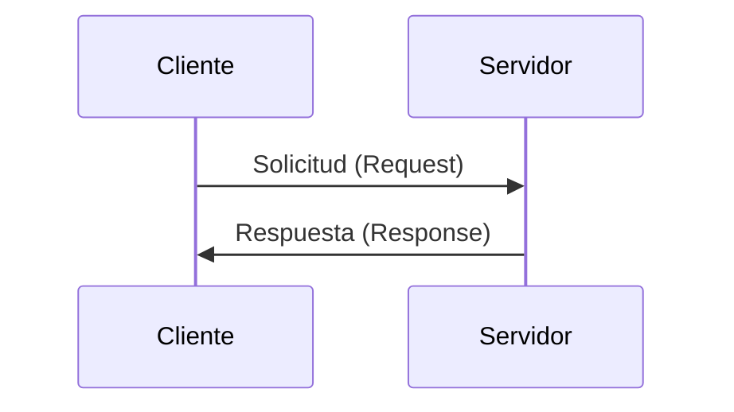
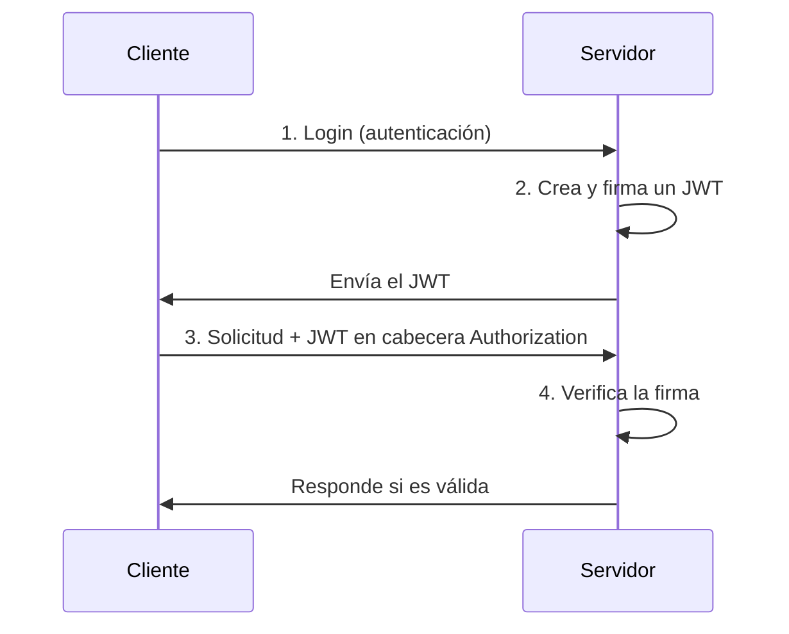

Nombre de archivo sugerido: paper/raw/2026-08-03-redes.md

# Redes

Autor(es): BIG School — Máster Desarrollo con IA
Fecha: 2026-08-03
Tipo: Documento Técnico
Fuente Original: PDF (0_5_2_-_Redes.pdf / 0_5_2_-_Redes_1_.pdf) — Módulo 0

---

La conectividad no es un accesorio del software contemporáneo, sino su infraestructura vital; el software que opera de forma aislada ha dejado de ser competitivo para dar paso a un paradigma de **sistemas distribuidos** interconectados. En el contexto de la inteligencia artificial y los negocios, comprender la mecánica de las redes es el factor diferencial entre desplegar una solución teórica y ejecutar un producto tecnológico escalable. Cada interacción con un modelo de lenguaje de gran tamaño (LLM), cada consulta a una base de datos vectorial y cada transacción en la nube depende de una coreografía precisa de protocolos que garantizan que la información viaje de forma íntegra y segura. El dominio de la **comunicación cliente-servidor** permite a los perfiles de gestión y desarrollo desmitificar la complejidad técnica de las APIs, transformando conceptos abstractos en activos operativos que impulsan el ROI mediante la integración fluida de servicios externos.

## El Modelo Cliente-Servidor



El Cliente (vuestro navegador o app móvil) inicia la conversación enviando una Solicitud (Request). El Servidor es una máquina potente que escucha, procesa la solicitud y envía una Respuesta (Response).

## La Identidad Digital y el Transporte de Datos

Para que un sistema distribuido funcione, es imperativo que cada nodo en la red sea localizable de manera inequívoca. Este proceso se gestiona a través de la **Dirección IP** (Protocolo de Internet), una serie de números (ej. 192.0.2.1) asignada a cada dispositivo. Dada nuestra limitada capacidad para memorizar cadenas de números, el sistema de nombres de dominio (**DNS**) actúa como un traductor estratégico, vinculando nombres de dominio legibles (ej. google.com) con sus correspondientes direcciones IP.

### Fiabilidad frente a Velocidad: TCP y UDP

Una vez establecida la ubicación del servidor, el transporte de la información requiere reglas claras:

- **IP (Protocolo de Internet)**: Se encarga del direccionamiento y de mover los paquetes de datos de un punto a otro. IP no garantiza que el paquete llegue.
- **TCP (Protocolo de Control de Transmisión)**: Se asienta sobre IP y asegura la fiabilidad. Divide los datos en paquetes numerados, los envía, verifica que todos lleguen correctamente y los reensambla en el orden correcto en el destino. Si falta algo, pide que se reenvíe.

Este nivel de rigor es fundamental para aplicaciones donde el error no es una opción, como la ejecución de código o la transferencia de datos financieros. En contraste, protocolos como UDP sacrifican esta verificación en favor de la latencia mínima, siendo la elección predilecta para el streaming o sesiones de videoconferencia donde un pequeño salto de señal es preferible a un retraso acumulado.

### Puertos: Los Apartamentos de la Red

La dirección IP localiza el edificio, pero los **puertos** identifican el servicio específico dentro del servidor. Un puerto es un número que identifica de forma única una aplicación o servicio dentro de un dispositivo conectado a una red. Puertos estandarizados:

- Web (HTTP): Puerto 80
- Web Segura (HTTPS): Puerto 443 (el estándar actual)

La solicitud se dirige a una combinación específica de IP y Puerto (ej. `192.0.2.1:443`). Un servidor puede gestionar simultáneamente una base de datos, un servicio de correo y una API de IA; esta segmentación es técnica pero profundamente estratégica: una configuración incorrecta de puertos puede dejar servicios críticos inaccesibles o, peor aún, exponer vulnerabilidades de seguridad ante actores externos.

## El Lenguaje de la Web: Protocolo HTTP y Métodos

Si el TCP establece la conexión física, el **HTTP** (Protocolo de Transferencia de Hipertexto) define el idioma en el que conversan el cliente y el servidor. Esta comunicación se basa en un ciclo de solicitud y respuesta (HTTPS es la versión segura y cifrada). Toda interacción comienza con una URL (Uniform Resource Locator), que contiene:

| Componente | Ejemplo |
|---|---|
| Protocolo | `https://` |
| Host (dominio) | `www.ejemplo.com` |
| Puerto | `:443` |
| Ruta (recurso) | `/productos/zapatos` |
| Parámetros (query) | `?color=rojo` |
| Fragmento | `#seccion` |

Comprender los métodos HTTP es crucial para diseñar APIs coherentes que la inteligencia artificial pueda interpretar y utilizar correctamente:

- **GET**: Recuperar información. Es como Leer (Read).
- **POST**: Enviar datos para crear algo nuevo. Es como Crear (Create).
- **PUT / PATCH**: Actualizar un recurso existente. PUT reemplaza; PATCH modifica parcialmente. Es como Actualizar (Update).
- **DELETE**: Eliminar un recurso. Es como Eliminar (Delete).

### Anatomía de una Petición de Red

Cada comunicación HTTP se compone de tres elementos críticos: la línea de inicio (método y URL), las cabeceras (headers, con metadatos como el tipo de contenido y credenciales de **autorización**), y el cuerpo (body, con la carga útil o datos reales):


```text
POST /api/libros HTTP/1.1 <-- Línea de Inicio (Método y Ruta)
Host: biblioteca.com
Content-Type: application/json <-- Cabeceras (Metadatos)
User-Agent: MiNavegador/1.0

{
"titulo": "El Quijote" <-- Cuerpo (Datos, opcional)
}
```


En el desarrollo de soluciones de IA, es frecuente que las cabeceras gestionen las claves de API (API Keys), mientras que el cuerpo transporta los 'prompts' o las configuraciones de parámetros del modelo que buscamos ejecutar.

Los códigos de estado de la respuesta indican el éxito o fracaso de la operación:

- **2xx (Éxito)**: Todo fue bien (Ej. 200 OK, 201 Created).
- **3xx (Redirección)**: El recurso se ha movido (Ej. 301 Moved Permanently).
- **4xx (Error del Cliente)**: El cliente hizo algo mal (Ej. 404 Not Found, 403 Forbidden).
- **5xx (Error del Servidor)**: El servidor falló (Ej. 500 Internal Server Error).

Ejemplo de respuesta HTTP:


```text
HTTP/1.1 201 Created <-- Línea de Estado
Content-Type: application/json <-- Cabeceras
Server: Apache/2.4.41

{ <-- Cuerpo
"id": 1,
"mensaje": "Libro creado exitosamente"
}
```

## Gestión del Estado en Entornos Stateless

El protocolo HTTP es, por naturaleza, "amnésico" o **stateless**: no recuerda interacciones pasadas. Para construir experiencias de usuario personalizadas o mantener sesiones activas, la ingeniería de software ha desarrollado soluciones como las Cookies y las Sesiones.

Una **Cookie** es un pequeño fragmento de datos que el servidor pide al navegador del cliente que almacene (usando la cabecera `Set-Cookie`). El navegador la envía automáticamente de vuelta con cada solicitud subsiguiente, permitiendo al servidor "reconocer" al cliente. Sin embargo, almacenar datos sensibles en cookies es inseguro. La solución estándar es usar **Sesiones**:

1. **Login**: El cliente se autentica.
2. **Creación de Sesión**: El servidor crea una sesión única en su memoria o base de datos y genera un ID de sesión.
3. **Envío de Cookie**: El servidor envía este ID al cliente en una Cookie.
4. **Solicitudes Subsecuentes**: El cliente presenta la Cookie; el servidor usa el ID para buscar los datos de la sesión almacenados de forma segura.

Esta distinción es vital desde el punto de vista de la ciberseguridad y el cumplimiento de normativas de protección de datos.

### La Modernidad de los JSON Web Tokens (JWT)

En arquitecturas modernas y microservicios, la escalabilidad de las sesiones tradicionales se ve limitada. La respuesta técnica es el **JSON Web Token (JWT)**, un pase digital firmado criptográficamente que contiene toda la información necesaria del usuario (ej. ID, rol):



Al ser autónomos (self-contained), los tokens permiten que servidores diferentes verifiquen la identidad del cliente sin consultar una base de datos centralizada en cada petición. Esta eficiencia es lo que permite que aplicaciones globales de IA mantengan millones de usuarios simultáneos sin degradación del rendimiento.