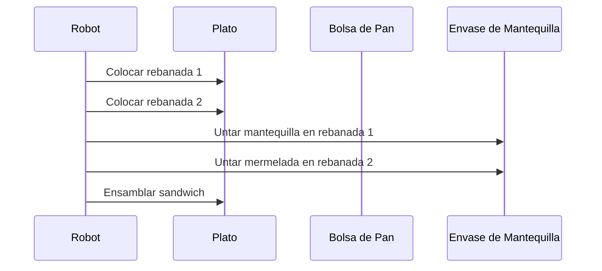
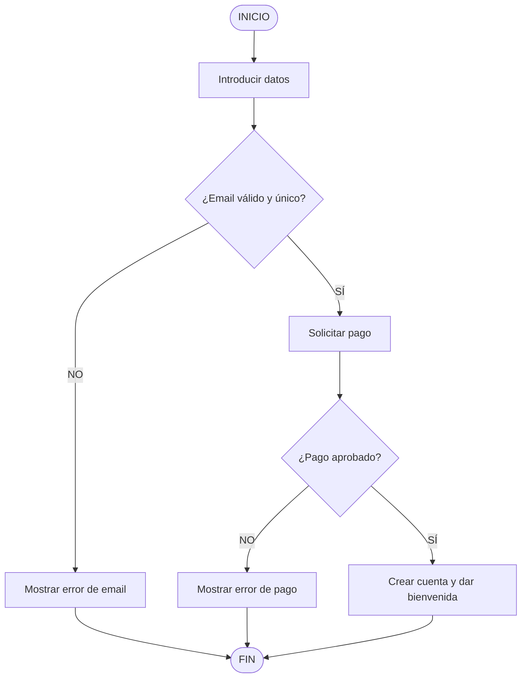

# Ejercicios Prácticos de Pensamiento Computacional — Brais Moure / BIG School

## Metadata
- **Fuente original:** `raw/papers/2026-07-29-ejercicios-practicos-pensamiento-computacional.md`
- **Autor:** [[brais-moure]] / [[big-school]]
- **Fecha:** 2026
- **Tipo de documento:** Documento Técnico / Ejercicios Prácticos

## Summary
Presenta tres ejercicios prácticos diseñados para ejercitar la descomposición atómica, el modelado visual de flujos y la anticipación de casos límite (*edge cases*). 

- **Ejercicio 1 (El Robot y el Sándwich):** Ejercita la descomposición fina y secuencial de instrucciones para un agente carente de contexto implícito.
- **Ejercicio 2 (La Plataforma de Suscripción):** Muestra el desglose de una arquitectura organizativa en mapa mental (Producto, Marketing, Operaciones, Legal) y el flujo de registro con decisiones de validación de correo y pago.
- **Ejercicio 3 (Restablecer Contraseña):** Compara el caminito feliz (*Happy Path*) de restablecimiento de clave frente a múltiples excepciones y casos borde (*Edge Cases*), tales como sintaxis inválida de email, ataques de fuerza bruta (Rate Limiting), enlaces expirados o ya usados, y discrepancias en confirmación de contraseña.

## Key Takeaways
1. **Descomposición Atómica:** Instruir a entidades sin contexto implícito (como bots o interpretes) exige especificar cantidades, ubicaciones y acciones microscópicas.
2. **Estructura de Árbol en Negocio:** Organizar productos digitales requiere descomponer dependencias funcionales en módulos interconectados (Legal, Pagos, QA, Marketing).
3. **Diferenciación entre Happy Path y Edge Cases:** Diseñar soluciones confiables implica construir primero el flujo principal ideal y luego blindar el sistema contra fallos de usuario, seguridad y caducidad de datos.

## Detailed Breakdown

### Ejercicio 1: El Robot y el Sándwich (Descomposición Fina)
- **Objetivo:** Diseñar un algoritmo atómico y secuencial para dar instrucciones a una entidad sin contexto implícito.
- **Lección clave:** Los seres humanos asumen conocimientos implícitos ("abrir el envase antes de untar"); las máquinas y agentes requieren la descomposición explícita de cada micro-acción (localizar, abrir, tomar, medir 5g, deslizar con distribución uniforme).

### Ejercicio 2: La Plataforma de Suscripción (Estructura y Registro)
- **Parte A: Arquitectura Organizativa (Mapa Mental):**
  - *Producto:* Finalizar Desarrollo, Pruebas QA.
  - *Marketing:* Estrategia de Precios, Material promocional, Campaña RRSS, Lanzamiento.
  - *Operaciones:* Gestión de pagos, Despliegue, Soporte al cliente.
  - *Legal:* Política de Privacidad, Términos de Servicio.
- **Parte B: Flujo de Registro:**
  - Validación en dos etapas de bifurcación de decisión: ¿Email válido y único? → ¿Pago aprobado?

### Ejercicio 3: Restablecer Contraseña (Happy Path vs Edge Cases)
- **Parte A: Happy Path (8 Pasos Ideales):**
  1. Clic en "Olvidé contraseña".
  2. Solicitud de email.
  3. Envío de formulario.
  4. Verificación de existencia en base de datos.
  5. Envío de token/enlace único y temporal.
  6. Acceso del usuario al enlace.
  7. Entrada de nueva contraseña con confirmación.
  8. Actualización en base de datos y confirmación final.
- **Parte B: Edge Cases y Excepciones:**
  - *Entrada de Email:* Sintaxis inválida, ataques de fuerza bruta (Rate Limiting / abuso).
  - *El Enlace:* Caducidad (>24h), reutilización de enlace consumido.
  - *Nueva Contraseña:* Requisitos mínimos de complejidad no cumplidos, discrepancia entre campo principal y confirmación.

## Diagrams & Visualizations

### Ejercicio 1: Diagrama de Secuencia Mermaid (El Robot y el Sándwich)


### Ejercicio 2: Diagrama de Flujo Mermaid (Registro en Plataforma)


## Code & Pseudocode Examples

### Ejercicio 1: Pseudocódigo Atómico para Robot
```text
INICIO Preparar_Sandwich
    1. Localizar la bolsa de pan.
    2. Abrir la bolsa de pan.
    3. Extraer UNA rebanada de pan.
    4. Colocar la rebanada en el plato.
    5. Extraer una SEGUNDA rebanada de pan.
    6. Colocar la segunda rebanada en el plato.
    7. Localizar el cuchillo de untar.
    8. Localizar el envase de mantequilla.
    9. Abrir el envase de mantequilla.
    10. Insertar el cuchillo en la mantequilla.
    11. Extraer 5 gramos de mantequilla con el cuchillo.
    12. Deslizar el cuchillo sobre la superficie de la Rebanada 1 hasta distribución uniforme.
    ... [Pasos análogos para mermelada y ensamblado final]
FIN
```

### Ejercicio 2: Estructura Organizativa de Suscripción
```text
Plataforma de Suscripción
├── Producto
│   ├── Finalizar Desarrollo
│   └── Pruebas (QA)
├── Marketing
│   ├── Estrategia de Precios
│   ├── Material promocional
│   ├── Campaña RRSS
│   └── Lanzamiento
├── Operaciones
│   ├── Gestión de pagos
│   ├── Despliegue
│   └── Soporte al cliente
└── Legal
    ├── Política de Privacidad
    └── Términos de Servicio
```

## Entities Mentioned
- [[brais-moure]]
- [[big-school]]

## Concepts Discussed
- [[algoritmo-atomico]]
- [[descomposicion-fina]]
- [[happy-path-vs-edge-cases]]
- [[diagrama-de-flujo]]

## Notable Quotes
> *"El diseño de un algoritmo atómico exige dar instrucciones a una entidad sin contexto implícito."*

## Connections & Reflections
- Demuestra en la práctica cómo aplicar la [[descomposicion]] y la [[abstraccion]] estudiadas en [[wiki/sources/2026-07-29-fundamentos-del-pensamiento-computacional]].

## Open Questions
- ¿Qué estrategias automáticas existen para verificar si la cobertura de casos borde (edge cases) en el diseño es completa antes de programar?
