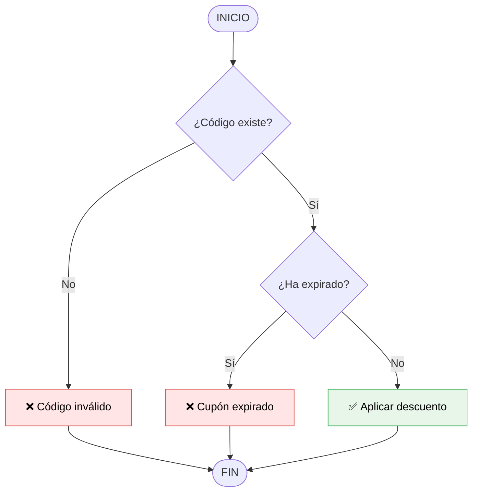

# Fundamentos del Pensamiento Computacional — Brais Moure / BIG School

## Metadata
- **Fuente original:** `raw/papers/2026-07-29-fundamentos-del-pensamiento-computacional.md`
- **Autor:** [[brais-moure]] / [[big-school]]
- **Fecha:** 2026
- **Tipo de documento:** Documento Técnico / Material Académico (Máster Desarrollo con IA)

## Summary
Este documento establece los fundamentos del [[pensamiento-computacional]] en el contexto del desarrollo de software moderno potenciado por inteligencia artificial. Argumenta que con la democratización del código autogenerado por IA, la sintaxis se ha vuelto un *commodity*. Por tanto, el valor diferencial del desarrollador radica en la soberanía técnica, el criterio arquitectónico y la capacidad de resolver problemas de alto nivel.

Se detallan los cuatro pilares clásicos del pensamiento computacional ([[descomposicion]], [[reconocimiento-de-patrones]], [[abstraccion]] y [[diseno-de-algoritmos]]) y las características del diseño algorítmico (secuencia, precisión y finalización). Se ilustra además la representación formal de algoritmos mediante diagramas de flujo (con estándar Mermaid) y pseudocódigo con el ejemplo práctico de un validador de cupones de descuento.

## Key Takeaways
1. **Soberanía Técnica frente a la IA:** La IA es un ejecutor veloz pero sin visión estratégica; el humano debe actuar como director de obra que diseña y valida la arquitectura lógica.
2. **Los 4 Pilares del Pensamiento Computacional:** Descomposición, Reconocimiento de Patrones, Abstracción y Diseño de Algoritmos.
3. **Representación Previa a la Implementación:** Los diagramas de flujo y el pseudocódigo permiten auditar la lógica antes de comprometer recursos en código fuente.
4. **La calidad de los prompts depende de la descomposición:** Instruir a una IA eficazmente exige desglosar previamente la estructura del problema en unidades lógicas atómicas.

## Detailed Breakdown

### 1. Visión General y Contexto del Mercado
- **Comoditización del Código:** La capacidad de escribir sintaxis ha dejado de ser el principal activo del ingeniero; la IA actúa como músculo ejecutor eficiente pero sin comprensión del propósito.
- **Redefinición de Identidad:** El profesional evoluciona de "colocador de ladrillos digitales" a "director de obra" que valida y audita la producción automatizada.
- **Integración Simbiótica:** La soberanía técnica se alcanza cuando la máquina obedece a una estrategia humana predefinida.

### 2. Los Cuatro Pilares del Pensamiento Computacional
1. **[[descomposicion]] (*Divide y Vencerás*):** Fragmentar problemas complejos en subproblemas lógicos independientes.
2. **[[reconocimiento-de-patrones]]:** Identificar similitudes y tendencias para estandarizar y reutilizar soluciones.
3. **[[abstraccion]]:** Filtrar el ruido y detalles irrelevantes para enfocarse en la esencia del modelo.
4. **[[diseno-de-algoritmos]]:** Elaborar secuencias de pasos finitos, precisos y ordenados.

#### Características del Diseño Algorítmico
- **Secuencia:** Flujo lógico ordenado paso a paso.
- **Precisión:** Instrucciones claras y sin ambigüedad.
- **Finalización:** Número finito de pasos e instrucciones de término.

### 3. Representación de Algoritmos

#### Elementos Normalizados de Diagramas de Flujo
| Elemento | Representación Visual | Función |
| :--- | :--- | :--- |
| **Óvalos** | Inicio y Fin | Delimitan el origen y la conclusión del flujo |
| **Rectángulos** | Acciones o Procesos | Indican ejecuciones o cálculos |
| **Rombos** | Decisiones | Evaluaciones de condiciones (Sí / No) |
| **Flechas** | Flujo de Ejecución | Indican la dirección del proceso |

### 4. Observaciones Clave & Conclusión Editorial
- El pensamiento computacional no busca que el humano piense como máquina, sino que reformule problemas para que sean procesables por ellas.
- Las instrucciones (prompts) efectivas para IA nacen de una descomposición previa del problema.
- El éxito técnico moderno se mide por la solidez de los planos lógicos y la arquitectura de sistemas, no por las líneas de código escritas.

## Diagrams & Visualizations

### Diagrama de Flujo: Validación de Cupones de Descuento


## Code & Pseudocode Examples

### Pseudocódigo: Validación de Cupones
```text
INICIO Algoritmo_Validar_Cupon
    LEER codigo_usuario
    LEER fecha_actual
    SI (el codigo_usuario EXISTE en la base de datos) ENTONCES
        OBTENER fecha_expiracion del cupón
        SI (fecha_actual > fecha_expiracion) ENTONCES
            MOSTRAR "Error: Cupón expirado"
        SINO
            APLICAR descuento
            MOSTRAR "Descuento aplicado con éxito"
        FIN SI
    SINO
        MOSTRAR "Error: Código inválido"
    FIN SI
FIN Algoritmo_Validar_Cupon
```

## Entities Mentioned
- [[brais-moure]]
- [[big-school]]

## Concepts Discussed
- [[pensamiento-computacional]]
- [[descomposicion]]
- [[reconocimiento-de-patrones]]
- [[abstraccion]]
- [[diseno-de-algoritmos]]
- [[soberania-humana-en-ia]]

## Notable Quotes
> *"En un entorno saturado por la proliferación de herramientas de generación de código mediante IA, el profesional que sobrevive no es aquel que compite en velocidad con la máquina, sino el que posee la capacidad de orquestar soluciones complejas mediante un pensamiento computacional refinado."*

> *"La inteligencia artificial es un ejecutor, no un estratega; el diseño lógico siempre debe preceder a la generación de código."*

## Connections & Reflections
- Se relaciona directamente con la [[mentalidad-de-arquitecto]] necesaria para guiar agentes de IA como los definidos en [[llm-wiki-pattern]].

## Open Questions
- ¿Cómo medir formalmente el nivel de abstracción óptimo en un prompt complejo para evitar sobre-especificación o vaguedad?
