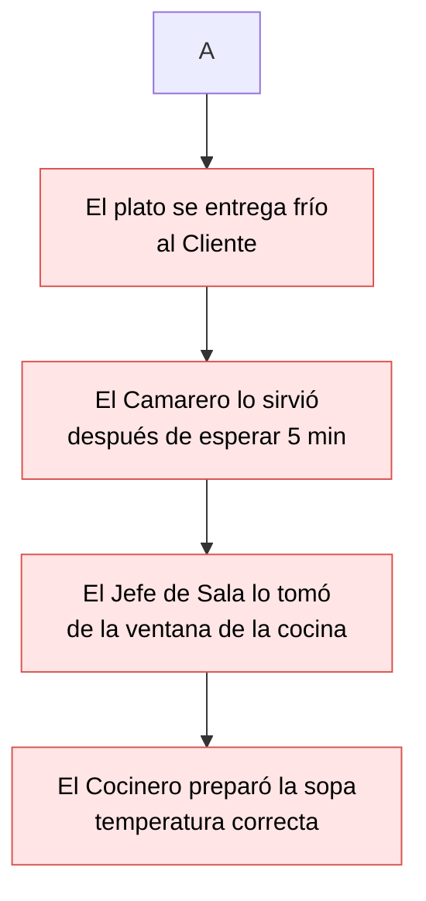

# Metodologías de Resolución de Problemas y Debugging — Brais Moure / BIG School

## Metadata
- **Fuente original:** `raw/papers/2026-07-29-metodologias-de-resolucion-de-problemas.md`
- **Autor:** [[brais-moure]] / [[big-school]]
- **Fecha:** 2026
- **Tipo de documento:** Documento Técnico / Material Académico (Máster Desarrollo con IA)

## Summary
Este trabajo aborda la metodología científica aplicada al diagnóstico de fallos de software ([[metodologia-de-debugging]]) y la resolución estructurada de problemas. Sostiene que en sistemas modernos y distribuidos, donde la generación de código está altamente automatizada, el principal reto técnico es la fragilidad del sistema y la necesidad de diagnosticar comportamientos inesperados de manera rigurosa.

Se rechaza categóricamente el enfoque de "ensayo y error" (que genera [[deuda-tecnica]] oculta) en favor de un proceso de 5 pasos basado en el método científico: Reproducir el error, Observar y entender, Formular hipótesis, Probar aislando una sola variable, y Resolver y verificar con pruebas de regresión. Asimismo, describe las herramientas fundamentales del "detective digital": [[analisis-de-logs]] (arqueología del sistema), [[stack-trace]] (cascada de causalidad), [[breakpoints]] (inspección en tiempo real), [[rubber-duck-debugging]] (técnica del patito de goma) e integración crítica con asistentes de IA.

## Key Takeaways
1. **La Regla de Oro del Debugging:** Reproducir el error en un entorno controlado es el requisito indispensable previo a cualquier intento de reparación.
2. **Método Científico de 5 Pasos:** Reproducir, Observar, Hipotetizar, Probar aislando variable, Resolver y verificar con regresión.
3. **Herramientas de Inspección Profunda:** Logs, Stack Trace, Breakpoints y Rubber Duck Debugging.
4. **Verificación Humana contra Alucinaciones de IA:** La IA acelera el análisis de trazas masivas, pero la validación final del diagnóstico recae exclusivamente en el juicio humano.

## Detailed Breakdown

### 1. Contexto y Filosofía del Debugging
- **Cambio de Paradigma:** La automatización elimina el cuello de botella en la escritura de código pero incrementa la fragilidad en sistemas opacos y distribuidos. La ventaja competitiva se desplaza de la velocidad a la capacidad crítica de diagnóstico.
- **Tendencia Natural al Caos:** Las infraestructuras tienden al caos por definición. El instinto de "ensayo y error" es ineficiente e introduce deuda técnica oculta.
- **El Rol de Arquitecto Forense:** Quien posee el método científico para reproducir, aislar y validar una hipótesis ostenta la verdadera [[soberania-humana-en-ia|soberanía técnica]].

### 2. Metodología Científica Aplicada al Debugging (5 Pasos)
1. **Reproducir el Error (La regla de oro):** Sin manifestación consistente del fallo en entorno controlado, cualquier intento de arreglo es una conjetura.
2. **Observar y Entender:** Definir los parámetros exactos bajo los cuales ocurre la desviación de la expectativa.
3. **Formular una Hipótesis:** Plantear una explicación informada reduciendo ruido ambiental y enfocando variables específicas.
4. **Probar la Hipótesis (Aislar la variable):** Modificar únicamente **una variable a la vez** para comprender con certeza qué corrigió el sistema y evitar "soluciones fantasma".
5. **Resolver y Verificar:** Aplicar la corrección definitiva y realizar pruebas de regresión para garantizar que funcionalidades previas no se rompan.

### 3. El Kit de Herramientas del Detective Digital

#### [[analisis-de-logs]] (Arqueología del Sistema)
- Reconstrucción cronológica de los eventos previos a una falla mediante trazas con niveles de severidad (`INFO`, `WARNING`, `ERROR`).

#### [[stack-trace]] (Rastreo de Pila y Cascada de Causalidad)
- Visión jerárquica que revela la capa interna originaria del fallo.
- **Ejemplo ilustrativo de los 4 Niveles:**
  - *Nivel 1 (El Error Visible):* El plato se entrega frío al cliente.
  - *Nivel 2 (Intermediario):* El camarero lo sirvió después de esperar 5 minutos.
  - *Nivel 3 (Punto de Transferencia):* El jefe de sala lo tomó de la ventana de la cocina.
  - *Nivel 4 (Causa Raíz Subyacente):* El cocinero preparó la sopa a la temperatura correcta, pero el retraso en la ventana provocó la pérdida de temperatura.

#### [[breakpoints]] (Puntos de Interrupción)
- Pausa en tiempo real del flujo de ejecución del software para inspeccionar el estado exacto de las variables en memoria y validar reglas de negocio.

#### Técnicas de Claridad, Simplificación y Sinergia con IA
- **[[rubber-duck-debugging|Patito de Goma (Rubber Duck Debugging)]]:** Explicar el código o problema línea por línea en lenguaje natural a un objeto inanimado o colega para forzar una simplificación cognitiva que revele fallos lógicos invisibles.
- **Simplificación y Aislamiento:** Reducir el sistema a su mínima expresión reproducible descartando módulos no involucrados.
- **Debugging con IA:** La IA actúa como multiplicador de fuerza analizando volúmenes masivos de trazas, pero su producción debe ser auditada rigurosamente por el desarrollador para prevenir alucinaciones.

## Diagrams & Visualizations

### Diagrama Mermaid: Stack Trace de Causalidad (La sopa fría)


## Code & Pseudocode Examples

### Ejemplo 1: Análisis de Logs
```text
02:30:00 INFO: Iniciando ciclo de producción.
02:31:15 INFO: Temperatura del horno alcanzando 200°C.
02:31:16 WARNING: Fluctuación de energía detectada en Sector 3.
02:31:18 ERROR: Sensor de temperatura del horno falló. Ciclo abortado.
```

### Ejemplo 2: Breakpoints (Puntos de Interrupción)
```text
INICIO Algoritmo_Validar_Cupon
    LEER codigo_usuario
    LEER fecha_actual
    [BREAKPOINT Aquí -> Inspección de variables de sesión]
    SI (el codigo_usuario EXISTE en la base de datos) ENTONCES
```

## Entities Mentioned
- [[brais-moure]]
- [[big-school]]

## Concepts Discussed
- [[metodologia-de-debugging]]
- [[metodo-cientifico-en-software]]
- [[analisis-de-logs]]
- [[stack-trace]]
- [[breakpoints]]
- [[rubber-duck-debugging]]
- [[pruebas-de-regresion]]

## Notable Quotes
> *"Las infraestructuras tenderán al caos por definición; dominar el arte del debugging permite transformar una crisis operativa en un proceso previsible y controlado."*

> *"Aislar la variable: modificar únicamente una variable a la vez para asegurar comprender por qué el sistema ha vuelto a su estado óptimo."*

## Connections & Reflections
- Se complementa perfectamente con las directrices de este repositorio (donde antes de diagnosticar se exige inspeccionar logs completos sin parchear síntomas superficiales).

## Open Questions
- ¿Cómo estandarizar la captura de logs en microservicios asíncronos para simplificar la reconstrucción de rastreos de pila distribuidos?
