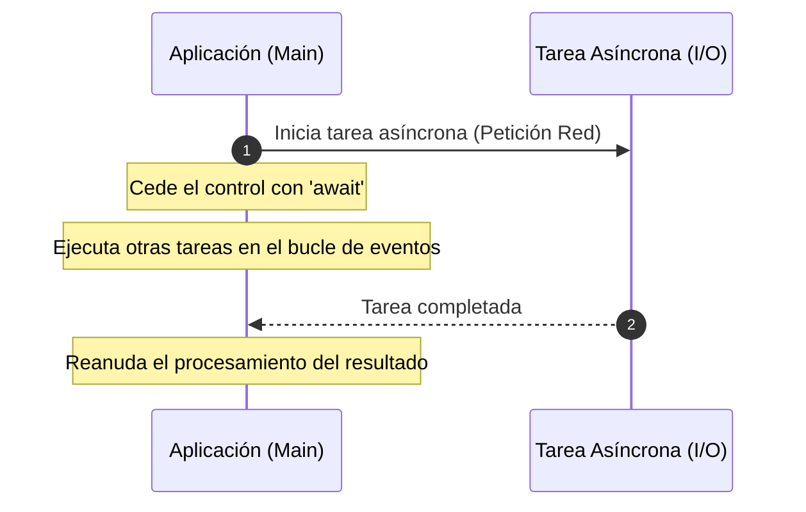
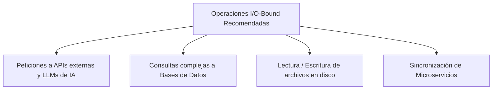

# Programación Asíncrona en Python

## Metadata
- **Fuente original:** `raw/papers/2026-07-30-asincronia-en-python.md`
- **Autor:** [[big-school]]
- **Fecha:** 2026
- **Tipo de documento:** Paper / Documento Técnico (Módulo 0: Fundamentos del Desarrollo de Software)

## Summary
Documento sobre [[programacion-asincrona|programación asíncrona]] en Python: cómo `asyncio` con las palabras clave `async`/`await` permite que una aplicación inicie una tarea de larga duración (red, APIs de IA) y siga ejecutando otras tareas mientras espera, en vez de bloquear el hilo principal. Explica el modelo de corrutinas, la ejecución concurrente con `asyncio.gather`, y cuándo la asincronía aporta valor real: operaciones **I/O-bound**, no cómputo intensivo de CPU.

## Key Takeaways
1. **Asincronía ≠ paralelismo de cómputo:** no acelera cálculos matemáticos pesados (CPU-bound); optimiza la gestión de tiempos de espera (I/O-bound).
2. **`async def`** define una corrutina; **`await`** pausa su ejecución cediendo el control al *event loop* mientras espera una operación de I/O, sin bloquear la aplicación.
3. **`asyncio.gather`** ejecuta múltiples corrutinas de forma concurrente — dos tareas de 5s cada una toman ~5s en total, no 10s.
4. **Casos de uso ideales:** peticiones a APIs externas/LLMs, consultas a bases de datos, lectura/escritura de archivos, sincronización de microservicios.
5. **Nunca mezclar bloqueo síncrono en contexto async:** usar siempre `asyncio.sleep()` en vez de `time.sleep()`; el punto de entrada síncrono debe usar `asyncio.run()`.

## Detailed Breakdown

### 1. Visión General: El Paradigma de la Concurrencia
En desarrollo síncrono convencional, cada instrucción bloquea el hilo principal esperando la respuesta de la anterior. La programación asíncrona permite iniciar una tarea de larga duración y continuar ejecutando otras mientras se espera su finalización — la "analogía del maestro de ajedrez": no piensa más rápido, simplemente elimina los tiempos muertos.

### 2. Implementación Técnica con `asyncio`
- **`async def`:** define una corrutina (función asíncrona).
- **`await`:** pausa la corrutina y cede el control al *event loop* mientras espera el resultado de una operación I/O.

### 3. Comparativa: Ejecución Síncrona vs. Asíncrona
`asyncio.gather()` ejecuta múltiples corrutinas de forma concurrente simultánea — dos operaciones de 5 segundos cada una completan en ~5s totales en vez de 10s en el modelo síncrono secuencial.

### 4. ¿Cuándo Usar Asincronía? (I/O-Bound vs. CPU-Bound)
La asincronía no acelera cálculos intensivos de CPU; su objetivo es optimizar esperas externas: peticiones a APIs de IA (OpenAI, Claude), consultas a bases de datos, lectura/escritura de archivos, sincronización de microservicios.

### 5. Observaciones Clave
- Evitar funciones bloqueantes convencionales (`time.sleep()`) en contexto asíncrono — sustituir por `asyncio.sleep()`.
- `await` es obligatorio para obtener el valor de retorno de una corrutina dentro de otra función asíncrona.
- El punto de entrada síncrono del programa debe usar `asyncio.run()` para ejecutar la corrutina principal.
- Reduce drásticamente la latencia al paralelizar operaciones I/O simultáneas.

### 6. Conclusión
Dominar la asincronía transforma aplicaciones lineales ineficientes en sistemas de alta disponibilidad — identificar dónde el sistema pierde tiempo esperando y convertirlo en ejecución proactiva es clave para escalabilidad y retención de usuarios.

## Diagrams & Visualizations

### Diagrama de Secuencia: Ciclo de una Tarea Asíncrona


### Diagrama Mermaid: Casos de Uso I/O-Bound


## Code & Pseudocode Examples

### Corrutina básica
```python
import asyncio

async def order_coffee():
    print("Pidiendo un café...")
    await asyncio.sleep(3)
    print("¡Café listo!")
    return "Café"
```

### Ejecución concurrente con asyncio.gather
```python
import asyncio
import time

async def order_pizza_async():
    print("Pidiendo una pizza...")
    await asyncio.sleep(5)
    print("¡Pizza lista!")

async def main():
    start_time = time.time()
    await asyncio.gather(
        order_pizza_async(),
        order_pizza_async()
    )
    end_time = time.time()
    print(f"Tiempo total asíncrono: {end_time - start_time:.2f} segundos")

asyncio.run(main())
# Salida esperada: ~5.00 segundos (frente a 10.00s en modelo síncrono)
```

## Entities Mentioned
- [[big-school]]

## Concepts Discussed
- [[programacion-asincrona]]
- [[funciones-de-orden-superior]]
- [[python-como-lenguaje]]

## Notable Quotes
> "Un maestro de ajedrez jugando partidas simultáneas no espera a que cada oponente piense su jugada; realiza su movimiento en una mesa e inmediatamente pasa a la siguiente. No piensa más rápido, simplemente elimina los tiempos muertos e inactivos."

## Connections & Reflections
- Cierra el trío de temas "avanzados" de Python junto con [[wiki/sources/2026-07-30-programacion-funcional]] (funciones de orden superior) y [[wiki/sources/2026-07-30-modularidad-en-python]] (organización) — los tres son prácticas de ingeniería más allá de la sintaxis básica.
- La distinción I/O-bound vs. CPU-bound es un matiz importante que ningún concepto previo del wiki cubría explícitamente — útil como criterio de decisión de arquitectura.
- Sin contradicciones con páginas existentes.

## Open Questions
- ¿Cómo se combina `asyncio` con paralelismo real de CPU (`multiprocessing`) cuando una aplicación tiene simultáneamente cargas I/O-bound y CPU-bound?

## Related Sources
- [[wiki/sources/2026-07-30-programacion-funcional]] — funciones de orden superior, paradigma relacionado en el mismo lenguaje.
- [[wiki/sources/2026-07-30-modularidad-en-python]] — organización de proyectos Python a gran escala.

---

**Estado:** ✅ Completamente procesado e integrado en el wiki
