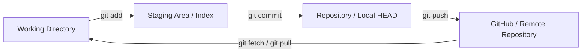
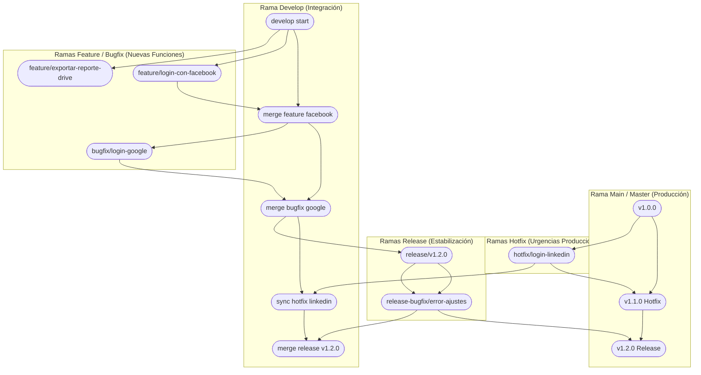

# Guía Maestra de Control de Versiones: Git, GitHub y Gitflow — Fernando Herrera / Brais Moure

## Metadata
- **Fuente original:** `raw/papers/2026-07-30-control-de-versiones-con-git-y-github.md`
- **Autor:** Fernando Herrera (DevTalles) / [[brais-moure]] / [[big-school]]
- **Fecha de Actualización:** 2026
- **Tipo de documento:** Paper / Documento Técnico / Guía de Referencia Avanzada

## Summary
Esta guía maestra detalla el funcionamiento de los sistemas de [[control-de-versiones-git|control de versiones distribuido con Git]], las plataformas de [[github-y-colaboracion|colaboración en GitHub]] y el modelo de flujo de trabajo **Gitflow**. Aborda la arquitectura interna de Git basada en un Grafo Acíclico Dirigido (DAG) y sus tres estados locales (*Working Directory*, *Staging Area* / *Index*, y *Repository* / *HEAD*).

Ofrece una cobertura técnica exhaustiva sobre buenas prácticas con el estándar **Conventional Commits**, la estrategia de ramificación Gitflow (ramas permanentes `main` y `develop`, y efímeras `feature/`, `bugfix/`, `release/`, `hotfix/`), el uso moderno de `git switch` y `git restore`, la automatización con la CLI `git-flow`, el script de limpieza `git cleanup`, etiquetado semántico de versiones (SemVer) por microservicio, y la gestión avanzada de múltiples cuentas SSH con `includeIf` en `.gitconfig`.

## Key Takeaways
1. **Los Tres Estados Locales:** El código transita de *Working Directory* al *Staging Area* (`git add`) y de allí al *Repository* (`git commit`).
2. **Standard Conventional Commits:** Formato `<tipo>(<ámbito>): <descripción>` (`feat`, `fix`, `docs`, `refactor`, `test`, `chore`, `ci`, `perf`) para auditoría limpia y SemVer automático.
3. **Estrategia Gitflow:** `main` (producción inmutable), `develop` (integración continua), `feature/` (nuevas funciones), `release/` (fase de QA), y `hotfix/` (parches urgentes en producción).
4. **Limpieza Automática con `git cleanup`:** Alias global para pruned referencias remotas eliminadas y borrar ramas locales desincronizadas (`: gone`).
5. **Multi-cuenta SSH con `includeIf`:** Automatiza la identidad del autor (`user.email`) según el directorio de trabajo sin intervención manual.

## Detailed Breakdown

### 1. Visión General y Arquitectura del Estado Local
- **Estados Locales:**
  - *Working Directory:* Archivos físicos en el sistema.
  - *Staging Area (Index):* Zona intermedia de preparación de commits.
  - *Repository (Local HEAD):* Base de datos orientada a objetos (DAG).
- **Comandos Modernos (Git 2.23+):** Reemplazar `git checkout` ambiguo por `git switch <rama>` (navegación) y `git restore <archivo>` (descartar cambios).

### 2. Configuración Inicial e Incorporación a Proyectos
- **Desde cero:** Crear repo en GitHub con `.gitignore` -> `git clone` -> desarrollar.
- **En proyecto existente:** `git clone` -> `git remote -v` -> rastrear `develop` con `git switch -c develop origin/develop`.

### 3. Buenas Prácticas: Conventional Commits
- Estándar de mensajes: `<tipo>(<ámbito opcional>): <descripción corta en imperativo>`.
- Tipos principales: `feat` (funcionalidad), `fix` (bugfix), `docs` (documentación), `refactor` (refactorización sin cambio funcional), `test` (pruebas), `chore` (mantenimiento/deps), `ci` (pipelines CI/CD), `perf` (rendimiento).

### 4. Estrategia de Ramificación Gitflow
- **Ramas Permanentes:** `main` (código en producción etiquetado con tags SemVer `v1.0.0`) y `develop` (integración continua de sprint).
- **Ramas Efímeras:**
  - `feature/` (sale de `develop` y regresa a `develop`).
  - `bugfix/` (sale de `develop` y regresa a `develop`).
  - `release/` (sale de `develop`, se congela para QA, se fusiona en `main` y `develop`).
  - `hotfix/` (sale de `main` por urgencia en producción, se fusiona en `main` con tag de versión y en `develop`).

### 5. Matriz de Cambios y Ejercicios Guiados (1 al 6)
- **Cambio #1 (`feature/login-con-facebook`):** `develop` -> PR a `develop` -> `git switch develop && git pull`.
- **Cambio #2 (`feature/exportar-reporte-drive`):** PR a `develop` -> `git remote prune origin` -> `git branch -d feature/...`.
- **Cambio #3 (`bugfix/login-google`):** Uso de `git mv` para renombrar archivos manteniendo la trazabilidad del historial.
- **Cambio #4 (`hotfix/login-linkedin`):** Creada desde `main` -> PR a `main` y a `develop` -> `git tag -a v1.1.0`.
- **Cambio #5 (`release/v1.2.0`):** Congelamiento de versión desde `develop` -> Pruebas QA -> Merge en `main` (Tag `v1.2.0`) y `develop`.
- **Cambio #6 (`release-bugfix/error-ajustes`):** Corrección sobre la release abierta -> Tag parche `v1.2.1`.

### 6. CLI de `git-flow`
- Automatización mediante comandos nativos: `git flow init`, `git flow feature start/finish`, `git flow release start/finish`, `git flow hotfix start/finish`.

### 7. Alias Global de Limpieza (`git cleanup`)
- Alias para eliminar ramas locales huérfanas rastreadas como `: gone` tras el merge en remoto:
  `git config --global alias.cleanup '!git remote prune origin && git branch -vv | grep -E "\[.*: (gone|desaparecido)\]" | awk '\''{print $1}'\'' | xargs -r git branch -D'`

### 8. Gestión de Tags SemVer por Microservicios
- En monorrepositorios o microservicios se usan prefijos en tags: `auth_service_v1.0.0`, `payment_service_v1.2.0`, `frontend_v2.0.0` y se publican con `git push origin --tags`.

### 9. Multi-cuenta SSH y `includeIf` en `.gitconfig`
- Configuración en `~/.ssh/config` definiendo `Host github-trabajo` y `Host github-personal`.
- Automatización de identidades en `~/.gitconfig` mediante `[includeIf "gitdir:~/Proyectos/trabajo/"] path = ~/.gitconfig-trabajo`.

## Diagrams & Visualizations

### Diagrama Mermaid: Arquitectura de Estados Locales


### Diagrama Mermaid: Grafo de Ramificación Gitflow


## Code & Pseudocode Examples

### Ejemplo 1: Alias Global git cleanup
```bash
git config --global alias.cleanup '!git remote prune origin && git branch -vv | grep -E "\[.*: (gone|desaparecido)\]" | awk '\''{print $1}'\'' | xargs -r git branch -D'
```

### Ejemplo 2: Configuración includeIf en ~/.gitconfig
```ini
# Configuración global por defecto (Personal)
[user]
    name = Tu Nombre Personal
    email = tu-personal@correo.com

# Cargar automáticamente configuración de trabajo si el repo está dentro de ~/Proyectos/trabajo/
[includeIf "gitdir:~/Proyectos/trabajo/"]
    path = ~/.gitconfig-trabajo
```

### Ejemplo 3: Etiquetado Semántico de Release
```bash
git switch main
git pull origin main
git tag -a v1.2.0 -m "Release v1.2.0 oficial enviada a producción"
git push origin v1.2.0
```

## Entities Mentioned
- [[brais-moure]]
- [[big-school]]

## Concepts Discussed
- [[control-de-versiones-git]]
- [[github-y-colaboracion]]
- [[terminal-y-cli]]
- [[soberania-humana-en-ia]]

## Notable Quotes
> *"Gitflow organiza la vida del proyecto en dos ramas permanentes (main y develop) y ramas efímeras, garantizando que el código en producción permanezca inmutable e intocable salvo por releases probadas o hotfixes urgentes."*

## Connections & Reflections
- Complementa la arquitectura del [[llm-wiki-pattern]], donde los cambios en la base de conocimiento se versionan e indexan mediante commits atómicos y tags de versión.

## Open Questions
- ¿De qué manera las herramientas de AI Code Review integradas en GitHub Actions (ej. Copilot Pull Request Summaries) alteran las políticas tradicionales de aprobación en PRs?
