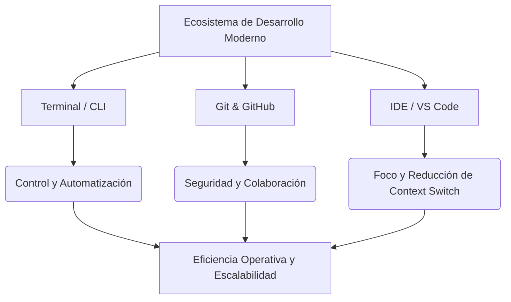

# Ecosistema del Desarrollo de Software Moderno - Conclusiones — Brais Moure / BIG School

## Metadata
- **Fuente original:** `raw/papers/2026-07-30-ecosistema-del-desarrollo-de-software-moderno-conclusiones.md`
- **Autor:** [[brais-moure]] / [[big-school]]
- **Fecha:** 2026
- **Tipo de documento:** Paper / Resumen Ejecutivo

## Summary
Este documento presenta la síntesis ejecutiva del Módulo 1 sobre las herramientas fundamentales del desarrollador moderno. Postula que la competitividad técnica no radica en dominar un lenguaje o framework específico, sino en la capacidad de orquestar la **Tríada Estratégica**: la [[terminal-y-cli|Terminal/CLI]] (motor de automatización y control), [[control-de-versiones-git|Git & GitHub]] (gestión de riesgos y continuidad de negocio) y los [[entornos-de-desarrollo-ide|IDEs]] (centro de mando y auditoría).

Destaca que la irrupción de la IA generativa amplifica la velocidad pero exige un ecosistema profesional bien integrado para mantener el control sobre la producción masiva de código. Dominar herramientas agnósticas (CLI, Git, Markdown) garantiza la longevidad profesional y la soberanía técnica frente a modas tecnológicas pasajeras.

## Key Takeaways
1. **La Tríada Estratégica:** Terminal (automatización CLI), Git & GitHub (colaboración y continuidad), e IDE/VS Code (centro de mando unificado).
2. **Longevidad Profesional:** Las herramientas agnósticas sobrevivirán a la rápida obsolescencia de lenguajes y frameworks.
3. **El Ecosistema como Marco de IA:** La IA acelera la producción pero necesita el marco de Pull Requests, Git e IDEs para ser auditada por el desarrollador.
4. **Tránsito a la Industria:** Pasar de herramientas fragmentadas a una "cocina profesional" marca el salto de artesano a líder industrial de software.

## Detailed Breakdown

### 1. Resumen Ejecutivo y La Tríada Estratégica
- **Motor de Automatización (Terminal/CLI):** Ejecuta tareas repetitivas con precisión quirúrgica eliminando latencia gráfica y conectando con servidores cloud.
- **Gestión de Riesgos (Git & GitHub):** Aísla experimentos en ramas (`feature/`, `bugfix/`) garantizando la continuidad de negocio sin poner en riesgo el código en producción.
- **Centro de Mando (IDE / VS Code):** Unifica herramientas, reduce el *context switch* y sirve como entorno de auditoría para código generado por IA.

### 2. La IA como Acelerador del Ecosistema
- **Ajuste de Flujo:** La IA aumenta el volumen de producción pero requiere que el desarrollador gestione esa masa de código mediante revisiones de PRs y pruebas automatizadas.
- **Subordinación de la IA:** La IA no sustituye las herramientas; las vuelve críticas para mantener el control del producto.

### 3. Observaciones Clave & Conclusión Final
- **Protección del Estado de Flujo:** Reducir la alternancia de ventanas preserva la concentración profunda.
- **Estándar de Incorporación (*Onboarding*):** Entornos de desarrollo estandarizados agilizan la entrada de nuevos ingenieros y aseguran la calidad constante.
- **Construcción de la "Cocina Profesional":** Eleva el oficio de programador a líder de sistemas complejos.

## Diagrams & Visualizations

### Diagrama Mermaid: La Tríada Estratégica del Ecosistema


## Code & Pseudocode Examples

### Resumen Estructural: La Tríada de Herramientas
```text
Ecosistema del Desarrollador Moderno
├── Terminal / CLI (Motor de Automatización & Scripts)
├── Git & GitHub (Gestión de Riesgos & Colaboración)
└── IDE / VS Code (Centro de Mando & Supervisión de IA)
```

## Entities Mentioned
- [[brais-moure]]
- [[big-school]]

## Concepts Discussed
- [[terminal-y-cli]]
- [[control-de-versiones-git]]
- [[github-y-colaboracion]]
- [[entornos-de-desarrollo-ide]]
- [[soberania-humana-en-ia]]

## Notable Quotes
> *"La competitividad en el mercado del desarrollo contemporáneo no se mide por el conocimiento de un lenguaje específico, sino por la capacidad de orquestar la Tríada Estratégica: Terminal, Git e IDE."*

> *"Construir una 'cocina profesional' en el desarrollo de software es lo que permite transitar de la artesanía a la industria."*

## Connections & Reflections
- Cierra el ciclo del Módulo 1 interconectando todas las herramientas con las directrices del [[llm-wiki-pattern]] de [[andrej-karpathy]].

## Open Questions
- ¿Qué métricas de eficiencia operativa cuantifican el impacto económico de reducir el *context switch* en equipos de ingeniería distribuidos?
