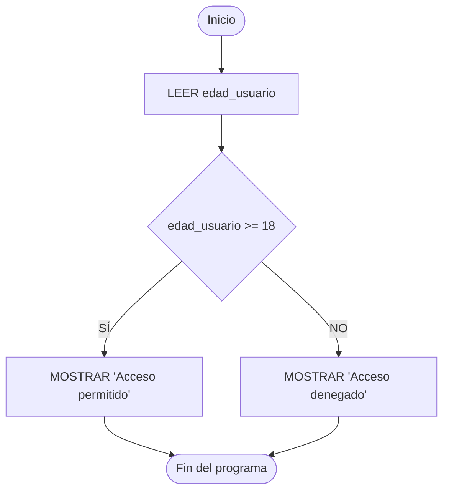
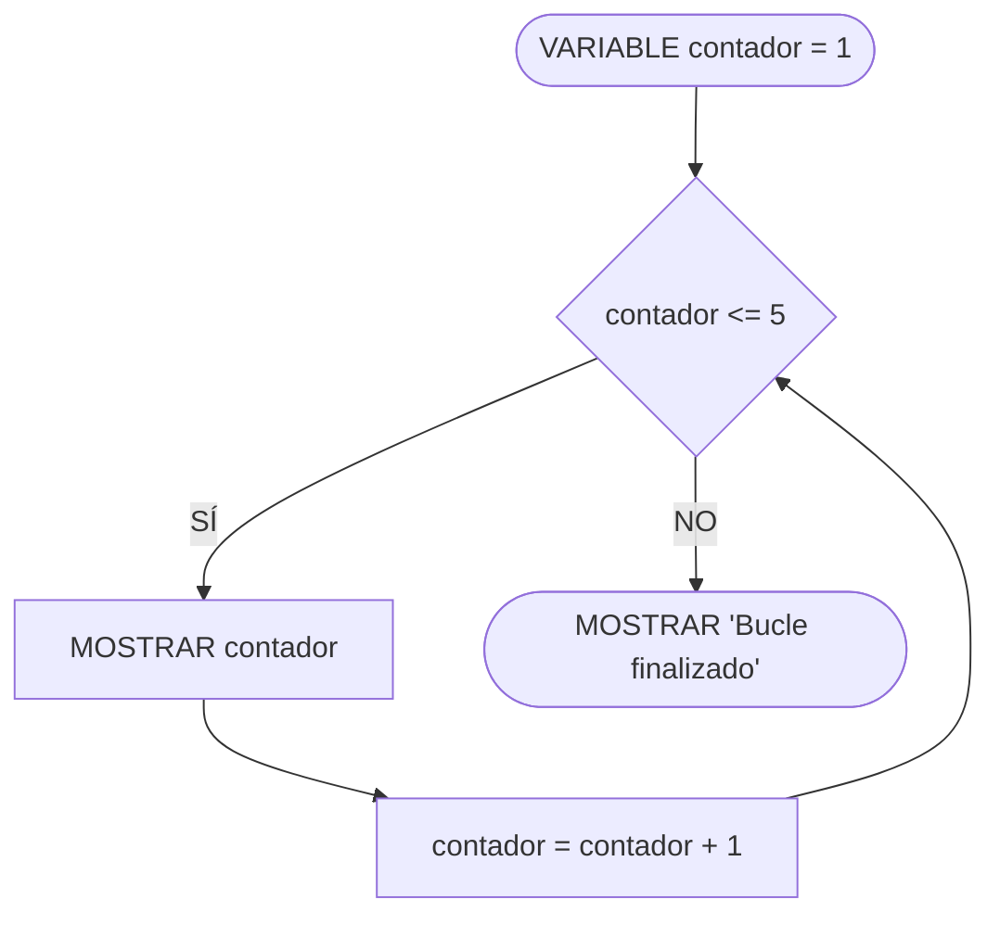

# Estructuras de Control

## Metadata
- **Fuente original:** `raw/papers/2026-07-30-estructuras-de-control.md`
- **Autor:** [[big-school]]
- **Fecha:** 2026
- **Tipo de documento:** Paper / Documento Técnico (Módulo 0: Fundamentos del Desarrollo de Software)

## Summary
Documento que cubre el "sistema nervioso" del software: las estructuras que permiten abandonar el flujo secuencial rígido para tomar decisiones y repetir procesos. Divide el tema en dos grandes familias: los [[condicionales]] (IF/ELSE, ELSE IF, anidamiento, SWITCH) que bifurcan la ejecución según una condición booleana, y los [[bucles]] (WHILE, DO-WHILE, FOR, FOREACH) que repiten bloques de código, junto con el control avanzado de flujo dentro de ellos (BREAK, CONTINUE, RETURN).

## Key Takeaways
1. **IF/ELSE/ELSE IF** bifurcan el flujo según una condición booleana; el anidamiento debe limitarse para no oscurecer la legibilidad.
2. **SWITCH** optimiza legibilidad y rendimiento cuando se evalúa una única variable contra múltiples casos discretos — `BREAK` es crítico para evitar *fall-through* accidental.
3. **WHILE** evalúa la condición antes de iterar (puede ejecutarse 0 veces); **DO-WHILE** evalúa después (garantiza al menos 1 ejecución) — ideal para validación de entradas.
4. **FOR** agrupa inicialización, condición y actualización en una sola línea; **FOREACH** abstrae el contador para recorrer colecciones directamente.
5. **BREAK/CONTINUE/RETURN** son los tres mecanismos de control avanzado: salida inmediata, salto de iteración y retorno de función, respectivamente.

## Detailed Breakdown

### 1. Visión General
Las estructuras de control son el sistema nervioso central del software: permiten pasar de programas que actúan como calculadoras lineales a sistemas que responden a condiciones del entorno en tiempo real.

### 2. Bifurcaciones y Condicionales
- **IF / ELSE:** ejecuta ramas de código según una condición booleana.
- **ELSE IF:** encadena múltiples evaluaciones secuenciales.
- **Anidamiento (*Nesting*):** condicionales dentro de otros bloques condicionales — requiere precaución para no oscurecer la lectura.
- **SWITCH:** selección múltiple; optimiza la evaluación de una variable contra varios casos discretos, con `DEFAULT` como caso de respaldo.

### 3. Estructuras de Repetición (Bucles)
- **WHILE (pre-condición):** evalúa antes de cada iteración; si la condición es falsa desde el inicio, el bloque no se ejecuta nunca.
- **DO-WHILE (post-condición):** garantiza al menos una ejecución antes de evaluar la condición.
- **FOR (iteración determinada):** agrupa inicialización, condición de parada y actualización.
- **FOREACH (iteración sobre colecciones):** abstrae la gestión de contadores para recorrer elementos secuencialmente.

### 4. Control Avanzado de Flujo

| Instrucción | Tipo | Comportamiento |
| :---: | --- | --- |
| `BREAK` | Salida Inmediata | Interrumpe de inmediato el bucle o bloque `SWITCH` actual. |
| `CONTINUE` | Salto de Iteración | Omite el resto de la iteración actual y salta a la siguiente evaluación. |
| `RETURN` | Retorno de Función | Finaliza la función actual y devuelve opcionalmente un valor. |

### 5. Observaciones Clave
- La indentación adecuada y la limitación del anidamiento son requisitos de seguridad para la lógica de decisión.
- `BREAK` es crítico en `SWITCH` para evitar ejecución accidental de casos posteriores en cascada.
- Olvidar actualizar la variable de control en un `WHILE` provoca bucles infinitos que pueden colapsar servicios.
- `DO-WHILE` es ideal para protocolos de validación de entrada que requieren solicitar datos al menos una vez.
- `CONTINUE` optimiza el filtrado ignorando elementos no relevantes sin romper la continuidad del ciclo.

### 6. Conclusión
La maestría en el flujo de control permite orquestar la toma de decisiones del software con rigor, garantizando la estabilidad de la arquitectura ante cualquier escenario operativo.

## Diagrams & Visualizations

### Diagrama Mermaid: Flujo IF/ELSE


### Diagrama Mermaid: Bucle WHILE


## Code & Pseudocode Examples

### IF / ELSE
```text
IF (edad_usuario >= 18) {
    MOSTRAR "Acceso permitido"
} ELSE {
    MOSTRAR "Acceso denegado. Eres menor de edad."
}
```

### ELSE IF encadenado
```text
LEER puntuacion
IF (puntuacion >= 90) {
    MOSTRAR "Calificación: A (Excelente)"
} ELSE IF (puntuacion >= 75) {
    MOSTRAR "Calificación: B (Notable)"
} ELSE IF (puntuacion >= 60) {
    MOSTRAR "Calificación: C (Aprobado)"
} ELSE {
    MOSTRAR "Calificación: D (Suspendido)"
}
```

### Anidamiento
```text
LEER usuario
LEER contraseña
IF (usuario == "Admin") {
    IF (contraseña == "Secreto123") {
        MOSTRAR "Login exitoso como Administrador"
    } ELSE {
        MOSTRAR "Contraseña incorrecta para Admin"
    }
} ELSE {
    MOSTRAR "Usuario no reconocido"
}
```

### SWITCH
```text
SWITCH (opcion_menu) {
    CASE 1:
        AbrirPerfil()
        BREAK
    CASE 2:
        AbrirConfiguracion()
        BREAK
    CASE 3:
        CerrarSesion()
        BREAK
    DEFAULT:
        MOSTRAR "Opción inválida"
}
```

### WHILE
```text
VARIABLE contador = 1
WHILE (contador <= 5) {
    MOSTRAR "Iteración: " + contador
    contador = contador + 1
}
```

### DO-WHILE
```text
VARIABLE contraseña_ingresada
DO {
    MOSTRAR "Por favor, introduce la contraseña:"
    LEER contraseña_ingresada
} WHILE (contraseña_ingresada != "Secreto123")
MOSTRAR "Contraseña correcta."
```

### FOR
```text
FOR (VARIABLE i = 1; i <= 5; i = i + 1) {
    MOSTRAR "Esta es la iteración número: " + i
}
```

### FOREACH
```text
LISTA frutas = ["Manzana", "Banana", "Naranja"]
FOREACH (fruta EN frutas) {
    MOSTRAR "Me gusta comer: " + fruta
}
```

## Entities Mentioned
- [[big-school]]

## Concepts Discussed
- [[condicionales]]
- [[bucles]]
- [[diseno-de-algoritmos]]
- [[pensamiento-computacional]]

## Notable Quotes
> "Estas [estructuras de control] actúan como el sistema nervioso central del software, permitiendo abandonar los flujos secuenciales rígidos para modelar procesos dinámicos."

## Connections & Reflections
- Implementa en código concreto el pilar [[diseno-de-algoritmos]] del [[pensamiento-computacional]] (Módulo 0): un algoritmo es exactamente una secuencia de condicionales y bucles.
- `RETURN` conecta directamente con [[wiki/sources/2026-07-30-funciones-y-parametros]], donde se detalla como mecanismo de retorno de valores.
- Sin contradicciones con páginas existentes.

## Open Questions
- ¿Qué límite práctico de niveles de anidamiento se considera aceptable antes de exigir una refactorización obligatoria (extracción a funciones)?

## Related Sources
- [[wiki/sources/2026-07-30-funciones-y-parametros]] — `RETURN` como mecanismo de salida de función.
- [[wiki/sources/2026-07-29-fundamentos-del-pensamiento-computacional]] — diseño de algoritmos como pilar previo.

---

**Estado:** ✅ Completamente procesado e integrado en el wiki
