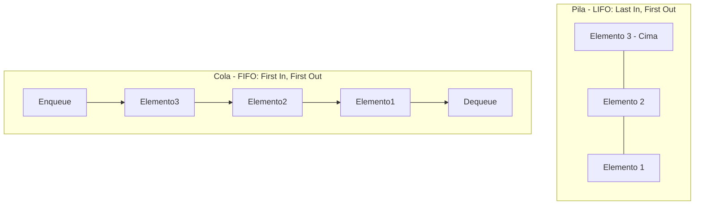

# Estructuras de Datos

## Metadata
- **Fuente original:** `raw/papers/2026-07-30-estructuras-de-datos.md`
- **Autor:** [[big-school]]
- **Fecha:** 2026
- **Tipo de documento:** Paper / Documento Técnico (Módulo 0: Fundamentos del Desarrollo de Software)

## Summary
Si las [[condicionales|estructuras de control]] son el motor lógico de un programa, las [[estructuras-de-datos]] son la arquitectura sobre la que se organiza su información. El documento presenta una taxonomía completa: arrays (tamaño fijo) y listas (tamaño dinámico), pilas (*stack*, LIFO) y colas (*queue*, FIFO) como estructuras de acceso restringido, mapas/diccionarios (*hash tables*, clave-valor con acceso O(1)) y conjuntos (*sets*, sin duplicados). Cierra con un cuadro comparativo de aplicación estratégica que ayuda a elegir la estructura correcta según tamaño, duplicados y patrón de acceso.

## Key Takeaways
1. **Array vs. Lista:** el array tiene tamaño fijo y acceso indexado ultrarrápido; la lista es dinámica y puede crecer/reducirse en ejecución.
2. **Pila (LIFO) vs. Cola (FIFO):** la pila extrae primero lo último insertado (`PUSH`/`POP`, historial de navegación, *call stack*); la cola extrae primero lo primero insertado (`ENQUEUE`/`DEQUEUE`, colas de impresión, tareas asíncronas).
3. **Mapas/Diccionarios:** estructura clave-valor con claves únicas y acceso casi instantáneo (O(1)) vía *hashing*, sin necesidad de recorrer la colección.
4. **Sets:** colección no ordenada que garantiza la ausencia de duplicados de forma automática.
5. **Elegir la estructura correcta** determina directamente la latencia, el consumo de memoria y la escalabilidad de la aplicación.

## Detailed Breakdown

### 1. Visión General
Las estructuras de datos son el esqueleto sobre el que se organiza la información que procesan los algoritmos. La elección correcta determina latencia, consumo de memoria y escalabilidad.

### 2. Taxonomía de Estructuras de Datos

**Arrays y Listas:**
- **Array (Arreglo Estático):** colección contigua de tamaño fijo, acceso indexado de alta velocidad.
- **Lista (Arreglo Dinámico):** estructura lineal cuyo tamaño se expande o contrae en ejecución.

**Pilas y Colas (acceso restringido):**
- **Pila (*Stack*, LIFO):** *Last In, First Out*. Operaciones `PUSH`/`POP`. Casos de uso: historial de navegación, undo, call stack de compiladores.
- **Cola (*Queue*, FIFO):** *First In, First Out*. Operaciones `ENQUEUE`/`DEQUEUE`. Casos de uso: colas de impresión, tareas asíncronas, peticiones de servidor.

**Mapas/Diccionarios (*Hash Tables*):** estructura clave-valor con claves únicas; búsquedas/inserciones casi instantáneas (O(1)) mediante *hashing*.

**Conjuntos (*Sets*):** colección no ordenada sin duplicados — añadir un elemento ya presente no tiene efecto.

### 3. Cuadro Comparativo de Aplicación Estratégica

| Estructura | Tamaño | Duplicados | Acceso / Búsqueda | Caso de Uso Principal |
| --- | --- | --- | --- | --- |
| **Array** | Fijo | Permitidos | Por Índice (O(1)) | Datos de dimensión conocida. |
| **Lista** | Dinámico | Permitidos | Por Índice / Secuencial | Colecciones variables. |
| **Pila** | Dinámico | Permitidos | Solo en la cima (LIFO) | Deshacer acciones, evaluación de expresiones. |
| **Cola** | Dinámico | Permitidos | Solo al frente (FIFO) | Procesamiento de tareas por turno. |
| **Mapa** | Dinámico | Claves Únicas | Por Clave (O(1)) | Búsqueda rápida por identificador. |
| **Set** | Dinámico | Prohibidos | Verificación de pertenencia | Filtrado y garantía de valores únicos. |

### 4. Observaciones Clave
- El acceso indexado en arrays comienza en `0`; acceder al índice igual al tamaño provoca *Index Out of Bounds*.
- Insertar/borrar en posiciones intermedias de estructuras lineales penaliza el rendimiento por desplazamiento de elementos.
- Los mapas sacrifican el orden explícito a favor de velocidad de búsqueda O(1).
- Los sets filtran automáticamente duplicados en la capa de almacenamiento.

### 5. Conclusión
Dominar las estructuras de datos permite diseñar el esqueleto sobre el cual los algoritmos procesan la información, maximizando eficiencia y minimizando consumo de recursos.

## Diagrams & Visualizations

### Diagrama Mermaid: Pila (LIFO) y Cola (FIFO)


## Code & Pseudocode Examples

### Array indexado
```text
Índice 0 | Índice 1 | Índice 2 | Índice 3 | Índice 4
   A     |    B     |    C     |    D     |    E
```

### Mapa / Diccionario
```text
CLAVE (Única)    -->    VALOR
"Nombre"         -->    "Ana"
"Edad"           -->    30
"Ciudad"         -->    "Madrid"
```

### Set
```text
Set Inicial: { "Rojo", "Verde", "Azul" }

Añadir "Verde"    --> El Set permanece: { "Rojo", "Verde", "Azul" } (Omite el duplicado)
Añadir "Amarillo" --> El Set se actualiza: { "Rojo", "Verde", "Azul", "Amarillo" }

¿Existe "Rojo"?  --> Verdadero
```

## Entities Mentioned
- [[big-school]]

## Concepts Discussed
- [[estructuras-de-datos]]
- [[diseno-de-algoritmos]]

## Notable Quotes
> "Si las estructuras de control actúan como el motor lógico de un sistema, las estructuras de datos representan la arquitectura sobre la que se organiza la información."

## Connections & Reflections
- Complementa a [[wiki/sources/2026-07-30-estructuras-de-control]]: control (verbos) + datos (sustantivos) son las dos mitades de todo algoritmo, coherente con el pilar [[diseno-de-algoritmos]].
- El mapa (*hash table*) reaparece implícitamente en [[wiki/sources/2026-07-30-manejo-de-errores-y-excepciones]] como analogía de tabla de excepciones tipadas.
- Sin contradicciones con páginas existentes.

## Open Questions
- ¿En qué punto de escala (número de elementos) deja de ser preferible una lista/array sobre un mapa cuando la búsqueda por clave es el patrón de acceso dominante?

## Related Sources
- [[wiki/sources/2026-07-30-estructuras-de-control]] — el otro pilar complementario del algoritmo (flujo vs. datos).

---

**Estado:** ✅ Completamente procesado e integrado en el wiki
