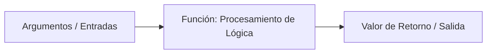

# Funciones y Parámetros

## Metadata
- **Fuente original:** `raw/papers/2026-07-30-funciones-y-parametros.md`
- **Autor:** [[big-school]]
- **Fecha:** 2026
- **Tipo de documento:** Paper / Documento Técnico (Módulo 0: Fundamentos del Desarrollo de Software)

## Summary
Documento sobre [[funciones-y-parametros|funciones y parámetros]] como unidad fundamental de abstracción y modularización: bloques de código reutilizables que aplican el principio DRY (*Don't Repeat Yourself*) y dividen problemas complejos en subproblemas simples. Distingue parámetro (variable de la firma) de argumento (valor real pasado), y retoma el eje [[paso-por-valor-vs-referencia|paso por valor vs. por referencia]] ya visto en variables, ahora aplicado a argumentos de función.

Introduce además [[funciones-puras-y-efectos-secundarios|funciones puras vs. efectos secundarios]], el [[scope-y-lifetime|scope local]] de las variables declaradas dentro de una función y el fenómeno de *shadowing* (sombreado de variables).

## Key Takeaways
1. **DRY y modularización:** las funciones empaquetan lógica reutilizable, reduciendo duplicidad y permitiendo divide y vencerás.
2. **Parámetro ≠ Argumento:** el parámetro es la variable de la firma (`precioBase`); el argumento es el valor real pasado en la invocación (`100`).
3. **Paso por valor vs. por referencia:** tipos primitivos se pasan por valor (copia, no afecta al original); estructuras complejas se pasan por referencia (afecta al original).
4. **Funciones puras vs. efectos secundarios:** una función pura siempre devuelve el mismo resultado para los mismos argumentos y no altera estado externo — es determinista y fácil de testear.
5. **Scope local y shadowing:** las variables de una función no existen fuera de ella; una variable local puede "sombrear" (ocultar temporalmente) una variable global del mismo nombre.

## Detailed Breakdown

### 1. Visión General y Modularización
Mantener bloques extensos de instrucciones es ineficiente, propenso a errores y costoso de mantener. Las funciones (métodos, rutinas, subprogramas) son la unidad fundamental de abstracción: empaquetan una secuencia de instrucciones bajo un nombre descriptivo, aplicando el principio **DRY**.

### 2. Anatomía de una Función
- **Declaración:** definición de la firma, parámetros de entrada y cuerpo de ejecución.
- **Invocación/Llamada:** ejecución del bloque desde otra parte del programa, pasando argumentos.

### 3. Parámetros y Argumentos
- **Parámetro:** variable de la firma que actúa como contenedor (`precioBase`, `impuesto`).
- **Argumento:** valor real pasado en la invocación (`100`, `0.19`).

| Mecanismo | Comportamiento | Impacto en la Variable Original |
| --- | --- | --- |
| **Paso por Valor** | Copia exacta del dato original. | No afecta a la variable externa. |
| **Paso por Referencia** | Dirección de memoria de la variable original. | Modifica directamente la variable externa. |

### 4. Retorno de Valores y Efectos Secundarios
- **`RETURN`:** finaliza la ejecución de la función y devuelve el resultado al punto de invocación.
- **Funciones VOID:** ejecutan acciones (imprimir, escribir en log) sin devolver valor explícito.

| Tipo | Definición | Determinismo |
| --- | --- | --- |
| **Función Pura** | Mismo resultado para los mismos argumentos, sin alterar estado externo. | Totalmente determinista, fácil de testear. |
| **Efecto Secundario** | Modifica variables globales, red o disco. | Puede generar comportamientos imprevistos. |

### 5. Scope (Ámbito) y Sombreado (*Shadowing*)
Las variables declaradas dentro de una función tienen **scope local** — existen solo durante su ejecución. El *shadowing* ocurre cuando una variable local comparte nombre con una global, ocultándola temporalmente dentro del bloque funcional.

### 6. Observaciones Clave
- **Principio de Responsabilidad Única (SRP):** cada función debe realizar una sola tarea bien definida.
- El nombre de una función debe ser un verbo/frase verbal descriptivo (`CalcularDescuento()`, `ValidarUsuario()`).
- Preferir funciones puras para facilitar pruebas unitarias y mantenimiento.
- Muchos lenguajes permiten valores por defecto para parámetros opcionales.

### 7. Conclusión
El uso adecuado de funciones y parámetros es el pilar de la arquitectura limpia: dominar encapsulamiento, aislamiento de ámbitos y transferencia de datos por valor/referencia permite construir sistemas modulares, testeables y escalables.

## Diagrams & Visualizations

### Diagrama Mermaid: Anatomía de una Función


## Code & Pseudocode Examples

### Declaración e invocación
```text
// Firma y Declaración de Función en Pseudocódigo
FUNCION CalcularPrecioTotal(precioBase, impuesto) {
    VARIABLE total = precioBase + (precioBase * impuesto)
    RETORNAR total
FIN FUNCION

// Invocación de la Función
VARIABLE factura = CalcularPrecioTotal(100, 0.19)
```

### Paso por valor vs. por referencia
```python
# Paso por Valor (Tipos Primitivos)
def duplicar_numero(n):
    n = n * 2
    return n

x = 5
duplicar_numero(x)  # x sigue valiendo 5

# Paso por Referencia (Estructuras Complejas / Objetos)
def agregar_item(lista):
    lista.append("Nuevo Elemento")

mis_items = ["Item 1"]
agregar_item(mis_items)  # mis_items ahora contiene ["Item 1", "Nuevo Elemento"]
```

### Scope local y shadowing
```python
variable_global = "Acceso Global"

def mi_funcion():
    variable_local = "Solo dentro de la función"
    print(variable_global) # Válido

mi_funcion()
# print(variable_local) # ERROR: variable_local no existe en el scope global
```

## Entities Mentioned
- [[big-school]]

## Concepts Discussed
- [[funciones-y-parametros]]
- [[funciones-puras-y-efectos-secundarios]]
- [[paso-por-valor-vs-referencia]]
- [[scope-y-lifetime]]
- [[descomposicion]]

## Notable Quotes
> "Una función bien diseñada recibe parámetros, procesa información y devuelve un resultado, minimizando efectos secundarios."

## Connections & Reflections
- Retoma directamente [[paso-por-valor-vs-referencia]] y [[scope-y-lifetime]], ya introducidos en [[wiki/sources/2026-07-30-variables-tipos-de-datos-y-operadores]] — mismo mecanismo, aplicado ahora a argumentos de función en vez de asignación de variables. Coherente, sin contradicción.
- El principio DRY y SRP conectan con [[descomposicion]] (Módulo 0): una función es la materialización de "fragmentar el problema en unidades atómicas".
- `RETURN` conecta con [[wiki/sources/2026-07-30-estructuras-de-control]], donde se introdujo como mecanismo de control de flujo.

## Open Questions
- ¿Cuántos parámetros posicionales son razonables antes de que una función deba refactorizarse para recibir un objeto de configuración?

## Related Sources
- [[wiki/sources/2026-07-30-variables-tipos-de-datos-y-operadores]] — origen del eje por valor/por referencia y scope.
- [[wiki/sources/2026-07-30-estructuras-de-control]] — `RETURN` como instrucción de control de flujo.

---

**Estado:** ✅ Completamente procesado e integrado en el wiki
