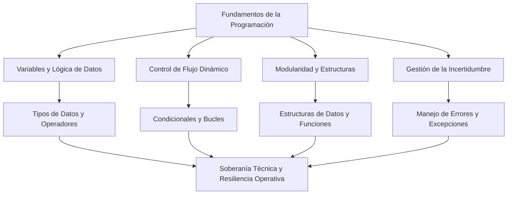

# Fundamentos de la Programación — Conclusiones Generales

## Metadata
- **Fuente original:** `raw/papers/2026-07-30-fundamentos-de-la-programacion-conclusiones.md`
- **Autor:** [[big-school]]
- **Fecha:** 2026
- **Tipo de documento:** Paper / Resumen Ejecutivo (Módulo 0: Fundamentos del Desarrollo de Software)

## Summary
Cierre sintético del "Módulo 2: Fundamentos de la Programación" que integra los cinco bloques del módulo —variables/tipos de datos, control de flujo, estructuras de datos, funciones y manejo de errores— bajo el marco mental del [[pensamiento-computacional]]. Argumenta que resolver problemas con tecnología no depende de dominar una sintaxis específica sino de un kit de herramientas mentales que transforma datos brutos en decisiones estratégicas, y que la Inteligencia Artificial misma es, en esencia, una combinación sofisticada de estas mismas herramientas.

## Key Takeaways
1. **Variables y lógica de datos** son la materia prima: sin una tipificación y manipulación precisa, ninguna estructura superior tiene integridad.
2. **Condicionales y bucles** son lo que separa una lista estática de instrucciones de un sistema que toma decisiones autónomas y escala mediante repetición.
3. **Estructuras de datos y funciones** aportan orden y reutilización a medida que crece la complejidad del proyecto.
4. **El manejo de errores** es la red de seguridad que distingue al desarrollo profesional del amateur: anticipar el fallo, no solo reaccionar a él.
5. **La IA es, en esencia, una combinación de estas mismas herramientas** (variables, funciones, control de flujo, estructuras de datos) — dominarlas es lo que permite supervisar y liderar sistemas que las usan.

## Detailed Breakdown

### 1. El Marco Mental del Pensamiento Computacional
Resolver problemas con tecnología depende de un kit de herramientas mentales para descomponer la realidad en procesos ejecutables, no de dominar una sintaxis específica. Entender los pilares de la programación equivale a entender los engranajes de la economía moderna.

### 2. La Materia Prima: Variables y Lógica de Datos
Las variables son contenedores etiquetados para valores esenciales del negocio; la tipología de datos rige el comportamiento de números, texto y booleanos; los operadores transforman esa materia prima. Sin definición y manipulación precisa de variables, cualquier estructura superior carece de integridad.

### 3. Control de Flujo y Comportamientos Dinámicos
- **Condicionales:** permiten bifurcar la ejecución ("si ocurre esto, haz aquello"), personalizando experiencias de usuario o gestionando riesgo en tiempo real.
- **Bucles:** otorgan la ventaja competitiva de la repetición — procesar miles de registros en milisegundos en vez de días de trabajo manual.

### 4. Organización y Reutilización: Funciones y Estructuras de Datos
- **Estructuras de datos** (arrays, mapas, sets) funcionan como archivadores lógicos que organizan la información de forma escalable.
- **Funciones** representan la transición a la artesanía técnica: empaquetar lógica reutilizable que recibe parámetros, procesa y devuelve un resultado, minimizando efectos secundarios.

### 5. Gestión de la Incertidumbre y Resiliencia Operativa
El desarrollo profesional se distingue del amateur por anticipar el fallo: conexiones que fallan, usuarios que introducen datos erróneos, sistemas externos que caen. El manejo de errores y excepciones es la red de seguridad que garantiza continuidad de servicio y confianza del cliente (*graceful degradation*).

### 6. Observaciones Clave
- Dominar estos fundamentos trasciende lo técnico para ser una ventaja estratégica de mercado.
- La IA es, en su esencia, una combinación sofisticada de estas mismas herramientas mentales.
- Integrarlas capacita para supervisar, diseñar y liderar proyectos que resistan y evolucionen en la complejidad real.

### 7. Conclusión Final
El paso final es trasladar este marco lógico a lenguajes de ejecución concretos para materializar la visión estratégica en soluciones tangibles.

## Diagrams & Visualizations

### Diagrama Mermaid: Mapa del Módulo de Fundamentos de la Programación

## Code & Pseudocode Examples
*(Esta fuente es un resumen ejecutivo sin ejemplos de código propios — remite a los ejemplos de las 6 fuentes previas del módulo.)*

## Entities Mentioned
- [[big-school]]

## Concepts Discussed
- [[pensamiento-computacional]]
- [[variables-y-tipos-de-datos]]
- [[condicionales]]
- [[bucles]]
- [[estructuras-de-datos]]
- [[funciones-y-parametros]]
- [[manejo-de-errores-y-excepciones]]
- [[mentalidad-de-arquitecto]]
- [[soberania-humana-en-ia]]

## Notable Quotes
> "La Inteligencia Artificial, en su esencia, es una combinación sofisticada de estas mismas herramientas mentales (variables, funciones, control de flujo y estructuras de datos)."

## Connections & Reflections
- Cierra el "Módulo 2: Fundamentos de la Programación" de la misma forma en que [[wiki/sources/2026-07-30-ecosistema-del-desarrollo-de-software-moderno-conclusiones]] cerró el Módulo 1 — un resumen ejecutivo que enlaza todas las fuentes del bloque bajo un mapa mental único.
- Confirma y refuerza (no contradice) [[pensamiento-computacional]] y [[mentalidad-de-arquitecto]] del Módulo 0: la programación es la aplicación concreta de esos mismos pilares.
- Sin contradicciones con páginas existentes.

## Open Questions
- ¿Qué fuente futura cubriría la transición de este marco conceptual a un lenguaje real (Python o TypeScript), tal como sugiere la propia conclusión del documento?

## Related Sources
- [[wiki/sources/2026-07-30-fundamentos-de-la-programacion-introduccion-y-sintaxis]]
- [[wiki/sources/2026-07-30-variables-tipos-de-datos-y-operadores]]
- [[wiki/sources/2026-07-30-estructuras-de-control]]
- [[wiki/sources/2026-07-30-estructuras-de-datos]]
- [[wiki/sources/2026-07-30-funciones-y-parametros]]
- [[wiki/sources/2026-07-30-manejo-de-errores-y-excepciones]]

---

**Estado:** ✅ Completamente procesado e integrado en el wiki
