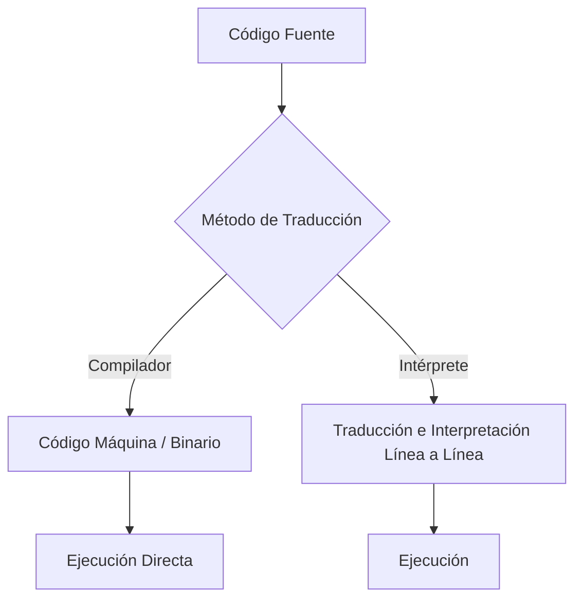

# Fundamentos de la Programación — Introducción y Sintaxis

## Metadata
- **Fuente original:** `raw/papers/2026-07-30-fundamentos-de-la-programacion-introduccion-y-sintaxis.md`
- **Autor:** [[big-school]]
- **Fecha:** 2026
- **Tipo de documento:** Paper / Documento Técnico (Módulo 0: Fundamentos del Desarrollo de Software)

## Summary
Este documento abre el bloque de "Fundamentos de la Programación" replanteando qué significa programar en la era de la IA: no memorizar sintaxis de un lenguaje concreto, sino dominar la infraestructura lógica —[[sintaxis-y-semantica|sintaxis y semántica]]— que traduce una idea de negocio en un activo ejecutable. Distingue el rol de la IA (generar sintaxis rutinaria con precisión quirúrgica) del rol humano intransferible (controlar la semántica y validar la lógica de negocio).

Cubre también la dualidad entre [[compilacion-e-interpretacion|compilación e interpretación]] como los dos mecanismos de traducción de código fuente a código máquina, y cierra con los elementos comunes de sintaxis (keywords, identificadores, delimitadores, case sensitivity) y el propósito correcto de los comentarios de código.

## Key Takeaways
1. **Agnosticismo de lenguaje:** la ventaja competitiva reside en los fundamentos universales, no en la familiaridad con la puntuación de un lenguaje específico.
2. **Sintaxis vs. Semántica:** la sintaxis es el mandato de la máquina (forma); la semántica es el mandato del negocio (fondo) — un programa puede ser gramaticalmente perfecto pero estratégicamente fallido.
3. **Compilación vs. Interpretación:** la compilación traduce todo el código una vez a binario optimizado (rendimiento); la interpretación traduce línea por línea en tiempo de ejecución (flexibilidad).
4. **Impacto asimétrico de errores:** un error sintáctico detiene el programa de forma visible; un error semántico destruye la rentabilidad del proceso sin emitir ningún aviso.
5. **Comentarios como intención, no descripción:** deben explicar el *por qué* de una decisión técnica, nunca el *qué* hace la instrucción.

## Detailed Breakdown

### 1. Visión General y Contexto del Mercado
El mercado ha desplazado el foco del programador-transcriptor hacia el arquitecto de soluciones. Los ordenadores son entidades extremadamente literales sin contexto intrínseco; por eso el trabajo del líder tecnológico no es luchar contra la sintaxis (tarea que la IA asume con precisión quirúrgica) sino controlar la semántica lógica. Entender cuándo un intérprete (inmediatez) es preferible a un compilador (robustez/velocidad) define la viabilidad de una arquitectura escalable.

### 2. La Dualidad del Código: Traducción y Ejecución
El **Código Fuente** (*Source Code*) debe traducirse a **Código Máquina** antes de ejecutarse. Existen dos modalidades de traducción:

| Aspecto | Compilación (*Compiler*) | Interpretación (*Interpreter*) |
| --- | --- | --- |
| **Mecanismo** | Genera un binario ejecutable optimizado de una sola vez. | Lee y traduce línea por línea en tiempo de ejecución. |
| **Analogía** | Traducción editorial previa. | Traducción simultánea en vivo. |
| **Ventaja** | Alta velocidad de ejecución. | Alta flexibilidad y depuración rápida. |
| **Desventaja** | Requiere recompilar antes de probar cambios. | Mayor consumo computacional, menor velocidad. |

### 3. Fundamentos Universales, Sintaxis y Semántica
La sintaxis es la gramática rígida del diálogo hombre-máquina — a diferencia del lenguaje natural, no admite margen de error (`"Vamos a comer, niños."` vs. `"Vamos a comer niños."`). Elementos comunes de sintaxis:

| Elemento Sintáctico | Descripción | Ejemplos |
| --- | --- | --- |
| **Keywords** | Palabras reservadas del lenguaje. | `if`, `while`, `function`, `class`, `return` |
| **Identificadores** | Nombres de variables, funciones, clases. | `userName`, `calcularImpuesto`, `ClienteService` |
| **Puntuaciones y delimitadores** | Símbolos de control gramatical. | `()`, `{}`, `[]`, `;`, `,` |
| **Case sensitive** | Distinción mayúsculas/minúsculas. | `variable` ≠ `Variable` |
| **Espacios e indentación** | Reglas de espaciado para delimitar bloques. | Indentación por bloques (Python) |

Existen dos estilos de delimitación de bloques: por llaves (`{}`, C++/Java/JavaScript) y por indentación (Python).

### 4. Estilo, Convenciones y Comentarios
La semántica rige la intención de negocio detrás de la sintaxis. Los comentarios deben ser descriptivos de la lógica estratégica, no una traducción literal del código.

### 5. Observaciones Clave
- La legibilidad del código es un **activo financiero** que reduce costes de mantenimiento.
- Un error sintáctico detiene el programa; un error semántico destruye la rentabilidad sin avisar.
- La IA es aliada en sintaxis rutinaria; el control de calidad semántico es competencia humana intransferible.

### 6. Conclusión
Separar sintaxis (forma) de semántica (fondo) libera al profesional de la dependencia de un stack tecnológico concreto, garantizando que el software resuelva el problema correcto de la forma más eficiente.

## Diagrams & Visualizations

### Diagrama Mermaid: Métodos de Traducción de Código


## Code & Pseudocode Examples

### Representación binaria de código máquina
```text
01001000 01101111 01101100 01100001
```

### Estilo por llaves (C++, Java, JavaScript)
```javascript
if (condicion) {
    hacer_esto();
}
```

### Estilo por indentación (Python)
```python
if condicion:
    hacer_esto()
```

### Comentario orientado a la intención, no a la descripción
```python
# Comentario descriptivo: Explica la lógica estratégica o la razón de la decisión técnica
calcular_impuesto()
```

## Entities Mentioned
- [[big-school]]

## Concepts Discussed
- [[sintaxis-y-semantica]]
- [[compilacion-e-interpretacion]]
- [[soberania-humana-en-ia]]
- [[pensamiento-computacional]]

## Notable Quotes
> "El profesional de élite es aquel que reconoce que un programa puede ser gramaticalmente perfecto pero estratégicamente fallido."

> "Los comentarios en el código no deben explicar qué hace una instrucción, sino por qué se tomó esa decisión técnica específica."

## Connections & Reflections
- Abre el "Módulo 2: Fundamentos de la Programación", que aterriza en código concreto los 4 pilares de [[pensamiento-computacional]] ya cubiertos en el Módulo 0.
- La distinción sintaxis/semántica es el mismo principio que [[soberania-humana-en-ia]] aplica a la generación de código con IA: la máquina resuelve la forma, el humano valida el fondo.
- No contradice ninguna página existente del wiki.

## Open Questions
- ¿Qué heurísticas objetivas permiten medir si un comentario explica "el qué" en vez de "el por qué" durante una revisión de código automatizada?

## Related Sources
- [[wiki/sources/2026-07-29-fundamentos-del-pensamiento-computacional]] — los mismos 4 pilares aplicados aquí a la sintaxis concreta de un lenguaje.

---

**Estado:** ✅ Completamente procesado e integrado en el wiki
