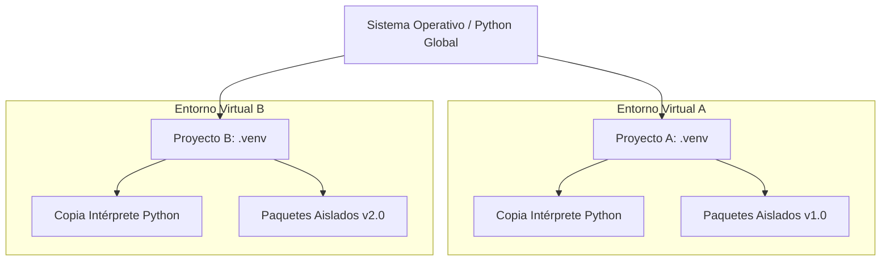

# Gestión de Entornos y Dependencias en Python

## Metadata
- **Fuente original:** `raw/papers/2026-07-30-gestion-de-entornos-y-dependencias.md`
- **Autor:** [[big-school]]
- **Fecha:** 2026
- **Tipo de documento:** Paper / Documento Técnico (Módulo 0: Fundamentos del Desarrollo de Software)

## Summary
Documento sobre [[entornos-virtuales-y-dependencias|entornos virtuales y gestión de dependencias]] como "infraestructura invisible" que garantiza que un proyecto Python se comporte igual en cualquier máquina. Cubre el módulo `venv` (creación/activación/desactivación de entornos aislados), el gestor de paquetes `pip` y el archivo `requirements.txt` como contrato de dependencias con versiones fijadas.

## Key Takeaways
1. **Un entorno virtual es una copia aislada** del intérprete de Python con su propio espacio de paquetes, independiente de la instalación global del sistema.
2. **`venv`** es la herramienta estándar de la librería nativa de Python para crear estos entornos (`python -m venv venv`).
3. **`pip`** instala, actualiza y elimina paquetes dentro del entorno virtual activo.
4. **`requirements.txt`** es el contrato de dependencias — `pip freeze` lo genera, `pip install -r` lo reproduce en otra máquina.
5. **Fijar versiones (*version pinning*)** en producción o proyectos de IA previene fallos por actualizaciones incompatibles de terceros; el propio `venv/`/`.venv/` **nunca** se sube al repositorio (va en `.gitignore`).

## Detailed Breakdown

### 1. Visión General y Contexto
La estabilidad de una solución no reside solo en la lógica del código sino en garantizar que el software se comporte igual en cualquier infraestructura. Confiar en la configuración global de una máquina es un riesgo operativo que colapsa la escalabilidad.

### 2. El Entorno Virtual (`venv`)
Un entorno virtual es una copia autocontenida del intérprete de Python más un espacio vacío para instalar librerías propias del proyecto. `venv` es el módulo estándar para gestionarlos.

**Comandos:**
```bash
python -m venv venv          # Crear
source venv/bin/activate     # Activar (macOS/Linux)
venv\Scripts\activate         # Activar (Windows)
deactivate                    # Desactivar
```

### 3. Gestión de Paquetes con PIP
Un paquete es código de terceros para resolver problemas específicos (peticiones HTTP, análisis de datos, ML). `pip` instala/actualiza/elimina librerías en el entorno activo (`pip install requests`, `pip list`).

### 4. Archivo de Requisitos (`requirements.txt`)
Actúa como contrato de dependencias e inventario de librerías exactas y sus versiones (`pip freeze > requirements.txt`, `pip install -r requirements.txt`).

### 5. Observaciones Clave
- Activar el entorno es obligatorio en cada sesión para evitar instalar paquetes en el ámbito global del sistema.
- Fijar versiones explícitamente previene fallos por actualizaciones incompatibles, crítico en proyectos de IA/producción.
- La carpeta del entorno virtual nunca debe subirse al repositorio — solo se comparte `requirements.txt`.

### 6. Conclusión
Aislar entornos asegura que soluciones de software y modelos de IA sean transferibles, reproducibles y escalables, previniendo incompatibilidades en despliegues a producción y ahorrando costes operativos.

## Diagrams & Visualizations

### Diagrama Mermaid: Aislamiento de Entornos Virtuales


## Code & Pseudocode Examples

### Ciclo de vida del entorno virtual
```bash
mkdir mi_proyecto_genial
cd mi_proyecto_genial
python -m venv venv
source venv/bin/activate   # macOS/Linux
# venv\Scripts\activate    # Windows
deactivate
```

### Gestión de paquetes
```bash
pip install requests
pip list
```

### Archivo de requisitos
```bash
pip freeze > requirements.txt
pip install -r requirements.txt
```

## Entities Mentioned
- [[big-school]]

## Concepts Discussed
- [[entornos-virtuales-y-dependencias]]
- [[modularidad-modulos-y-paquetes]]
- [[deuda-tecnica]]

## Notable Quotes
> "La gestión de entornos virtuales y dependencias emerge como la infraestructura invisible que permite transformar un script local en un producto industrializable."

## Connections & Reflections
- Complementa a [[wiki/sources/2026-07-30-modularidad-en-python]]: módulos/paquetes organizan el código propio; entornos virtuales aíslan las dependencias externas — dos mitades de la misma disciplina de higiene de proyecto.
- Conceptualmente relacionado con [[wiki/sources/2026-07-30-control-de-versiones-con-git-y-github]] (Módulo 1): tanto `.venv/` como el propio `.git/` siguen la misma regla de "no versionar artefactos generados o locales" vía `.gitignore`.
- Sin contradicciones con páginas existentes.

## Open Questions
- ¿Qué ventajas concretas ofrecen gestores más recientes (Poetry, uv, pipenv) sobre el par `venv` + `pip` + `requirements.txt` en proyectos de mediana escala?

## Related Sources
- [[wiki/sources/2026-07-30-modularidad-en-python]] — la otra mitad de la organización de un proyecto Python.
- [[wiki/sources/2026-07-30-control-de-versiones-con-git-y-github]] — convención de `.gitignore` para artefactos que no deben versionarse.

---

**Estado:** ✅ Completamente procesado e integrado en el wiki
