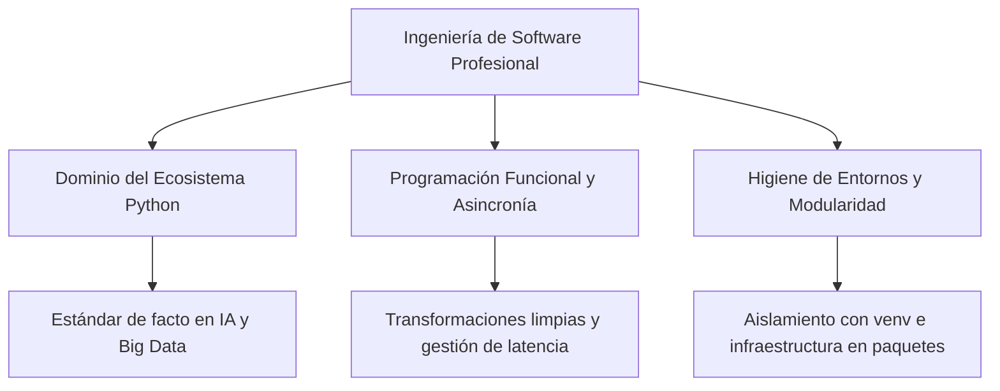

# Introducción a los Lenguajes de Programación — Conclusiones Generales

## Metadata
- **Fuente original:** `raw/papers/2026-07-30-introduccion-a-los-lenguajes-de-programacion-conclusiones-generales.md`
- **Autor:** [[big-school]]
- **Fecha:** 2026
- **Tipo de documento:** Paper / Resumen Ejecutivo (Módulo 0: Fundamentos del Desarrollo de Software)

## Summary
Cierre del "Módulo 3: Lenguajes de Programación" que integra Python como ecosistema, la programación funcional y la asincronía, y la higiene de entornos/modularidad, bajo el argumento de que la robustez técnica (no solo la capacidad de ejecutar una idea) es lo que hace escalable y mantenible una iniciativa tecnológica. Conecta explícitamente cada bloque con su impacto de negocio: previsibilidad operativa, gestión eficiente de I/O y sostenibilidad arquitectónica frente a la deuda técnica.

## Key Takeaways
1. **Python es el estándar de facto en IA y ciencia de datos** — dominar sus fundamentos y evolucionar hacia programación funcional produce transformaciones de datos limpias y auditable.
2. **La asincronía es la técnica clave** para interactuar con APIs externas, bases de datos y microservicios sin bloquear el flujo del programa, optimizando costes de infraestructura.
3. **Entornos virtuales y modularidad son disciplina, no opcional:** garantizan reproducibilidad entre máquinas y facilitan el mantenimiento a escala.
4. **La programación funcional minimiza errores en producción** frente a la imperativa, al evitar estados mutables globales.
5. **La arquitectura modular frena el crecimiento exponencial de la deuda técnica** a medida que la empresa escala.

## Detailed Breakdown

### 1. Resumen Ejecutivo
La viabilidad de una iniciativa tecnológica no reside solo en ejecutar una idea, sino en la robustez que la hace escalable y mantenible a largo plazo — la diferencia entre un prototipo frágil y una solución de negocio sólida.

### 2. Los Pilares del Desarrollo de Software de Alto Nivel
- **Dominio del Ecosistema y Gramática Funcional:** Python como estándar de facto en IA/Data Science; evolucionar hacia programación funcional enfoca al desarrollador en transformaciones limpias, predecibles y auditables.
- **Agilidad y Rendimiento mediante Asincronía:** gestionar eficientemente el tiempo de espera es vital para interactuar con APIs, bases de datos y microservicios sin bloquear el flujo, optimizando costes y ofreciendo respuestas fluidas.
- **Disciplina e Higiene en la Organización de Proyectos:** entornos virtuales garantizan reproducibilidad entre máquinas; la modularidad permite infraestructuras de gran escala fáciles de mantener, auditar y escalar.

### 3. Observaciones Clave
- La elección de lenguajes/herramientas debe basarse en madurez del ecosistema e integración nativa con arquitecturas de IA.
- La programación funcional minimiza errores en producción frente a la imperativa al evitar estados mutables globales.
- Prescindir de entornos virtuales compromete la estabilidad y reproducibilidad del despliegue.
- La asincronía es indispensable al consumir servicios externos y APIs de forma masiva.
- La arquitectura modular frena el crecimiento exponencial de la deuda técnica.

### 4. Conclusión Final
Combinar Python, pensamiento funcional, asincronía y modularidad establece una plataforma estable para innovación continua y crecimiento sostenible en el mercado digital.

## Diagrams & Visualizations

### Diagrama Mermaid: Mapa del Módulo de Lenguajes de Programación

## Code & Pseudocode Examples
*(Resumen ejecutivo sin ejemplos de código propios — remite a los ejemplos de las 7 fuentes previas del módulo.)*

## Entities Mentioned
- [[big-school]]

## Concepts Discussed
- [[python-como-lenguaje]]
- [[funciones-de-orden-superior]]
- [[programacion-asincrona]]
- [[entornos-virtuales-y-dependencias]]
- [[modularidad-modulos-y-paquetes]]
- [[deuda-tecnica]]
- [[mentalidad-de-arquitecto]]

## Notable Quotes
> "La transición de seguir instrucciones secuenciales a diseñar arquitecturas modulares, asíncronas y aisladas capacita al profesional para abordar problemas de negocio complejos con rigor técnico."

## Connections & Reflections
- Cierra el "Módulo 3: Lenguajes de Programación" con la misma estructura de síntesis que las conclusiones del Módulo 1 ([[wiki/sources/2026-07-30-ecosistema-del-desarrollo-de-software-moderno-conclusiones]]) y el Módulo 2 ([[wiki/sources/2026-07-30-fundamentos-de-la-programacion-conclusiones]]).
- Refuerza (no contradice) [[mentalidad-de-arquitecto]] y [[deuda-tecnica]] del Módulo 0: la modularidad y los entornos aislados son la aplicación práctica de esa mentalidad a un lenguaje concreto.
- Sin contradicciones con páginas existentes.

## Open Questions
- ¿Qué fuente futura cubriría testing automatizado (unit tests, TDD) y CI/CD en Python — el gap que ya señalaba el lint del Módulo 2?

## Related Sources
- [[wiki/sources/2026-07-30-introduccion-a-los-lenguajes-de-programacion]]
- [[wiki/sources/2026-07-30-bases-de-los-lenguajes-de-programacion]]
- [[wiki/sources/2026-07-30-programacion-orientada-a-objetos]]
- [[wiki/sources/2026-07-30-programacion-funcional]]
- [[wiki/sources/2026-07-30-modularidad-en-python]]
- [[wiki/sources/2026-07-30-gestion-de-entornos-y-dependencias]]
- [[wiki/sources/2026-07-30-asincronia-en-python]]

---

**Estado:** ✅ Completamente procesado e integrado en el wiki
