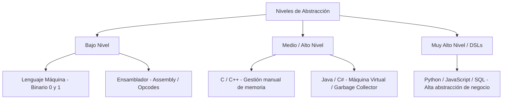
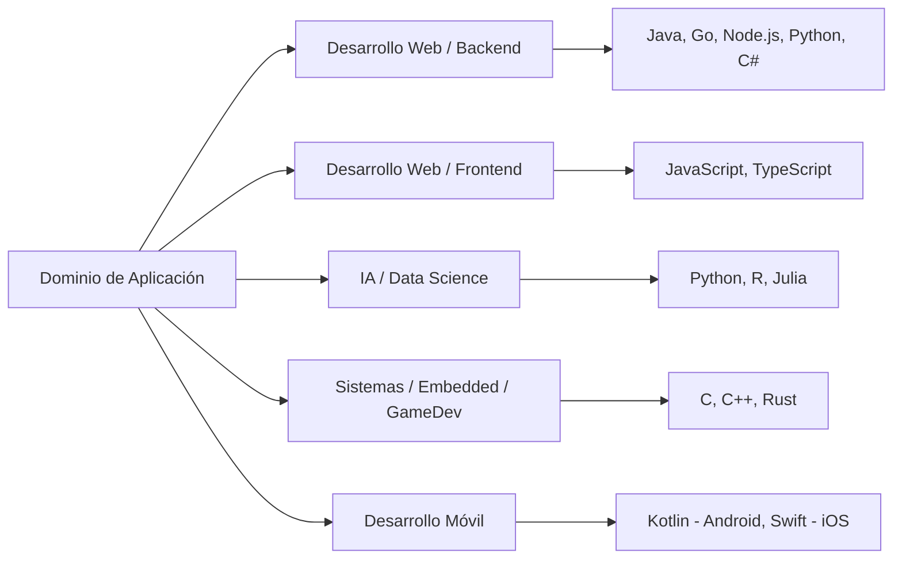

# Introducción a los Lenguajes de Programación

## Metadata
- **Fuente original:** `raw/papers/2026-07-30-introduccion-a-los-lenguajes-de-programacion.md`
- **Autor:** [[big-school]]
- **Fecha:** 2026
- **Tipo de documento:** Paper / Documento Técnico (Módulo 0: Fundamentos del Desarrollo de Software)

## Summary
Abre el "Módulo 3" definiendo qué es un lenguaje de programación y por qué su elección es una decisión estratégica de arquitectura, no estética. Presenta los [[niveles-de-abstraccion|niveles de abstracción]] (bajo nivel, medio/alto nivel, muy alto nivel/DSL) y los principales [[paradigmas-de-programacion|paradigmas de programación]] (imperativo, orientado a objetos, funcional, declarativo). Extiende además la clasificación de [[compilacion-e-interpretacion|compilación vs. interpretación]] con un tercer modelo híbrido (JIT/bytecode), y cierra con criterios de selección de lenguaje según dominio de industria.

## Key Takeaways
1. **La elección de lenguaje es arquitectónica**, no dogmática: impacta rendimiento, mantenibilidad, costes operativos y time-to-market.
2. **Niveles de abstracción:** de binario/ensamblador (bajo nivel, control total) a Python/SQL (muy alto nivel, expresividad extrema) — a mayor abstracción, menor control directo del hardware.
3. **Paradigmas multiparadigma:** la mayoría de lenguajes modernos combinan imperativo, POO, funcional y declarativo según el problema.
4. **Tercer modelo de ejecución — Híbrido/JIT:** Java/C# compilan a bytecode intermedio que una máquina virtual traduce en tiempo de ejecución (ni puramente compilado ni puramente interpretado).
5. **Agnosticismo tecnológico:** dominar fundamentos universales permite aprender la sintaxis de un lenguaje nuevo en días; el valor real de un lenguaje está en su ecosistema, no solo su sintaxis.

## Detailed Breakdown

### 1. Visión General y Evolución Tecnológica
Un lenguaje de programación es un sistema formal de reglas sintácticas y semánticas para instruir a un sistema de cómputo. Su evolución histórica ha buscado elevar el nivel de abstracción para expresar conceptos de negocio sin gestionar manualmente hardware.

### 2. Niveles de Abstracción de los Lenguajes

| Nivel | Ejemplos | Ventajas | Desventajas |
| --- | --- | --- | --- |
| **Bajo Nivel** | Binario, Assembly | Control absoluto del hardware, máxima velocidad. | Dificultad extrema, nula portabilidad. |
| **Nivel Medio/Alto** | C, C++, Rust | Alto rendimiento con sintaxis estructurada. | Gestión compleja de memoria, curva de aprendizaje alta. |
| **Alto Nivel** | Java, C#, Go | Seguridad de memoria, GC, independencia de plataforma. | Menor control directo, consumo adicional de recursos. |
| **Muy Alto Nivel / DSL** | Python, SQL, HTML/CSS | Expresividad extrema, prototipado ultra rápido. | Menor velocidad bruta, mayor abstracción de memoria. |

### 3. Principales Paradigmas de Programación

| Paradigma | Enfoque Principal | Conceptos Clave | Lenguajes Representativos |
| --- | --- | --- | --- |
| **Imperativo/Procedural** | Describe *cómo* calcular paso a paso. | Algoritmos secuenciales, variables mutables. | C, Pascal, Bash |
| **Orientado a Objetos** | Modela datos y comportamientos en Objetos. | Clases, Encapsulamiento, Herencia, Polimorfismo. | Java, C++, C#, Python |
| **Funcional** | Evalúa funciones matemáticas puras. | Funciones puras, inmutabilidad, higher-order. | Haskell, Elixir, Scala, Clojure |
| **Declarativo** | Describe *qué* resultado se desea. | Consultas, reglas lógicas. | SQL, Prolog, HTML |

### 4. Clasificación según el Modelo de Ejecución
1. **Compilados** (C, C++, Go, Rust): traducción completa a código máquina antes de ejecutar.
2. **Interpretados** (Python, Ruby, PHP): traducción y ejecución línea por línea.
3. **Híbridos/JIT** (Java, C#/.NET): compilan a bytecode/CIL intermedio agnóstico; una máquina virtual (JVM/CLR) lo traduce en tiempo de ejecución mediante un compilador Just-In-Time.

### 5. Criterios de Selección de Lenguaje por Dominio de Industria
Backend (Java, Go, Node.js, Python, C#), Frontend (JavaScript, TypeScript), IA/Data Science (Python, R, Julia), Sistemas/Embedded/GameDev (C, C++, Rust), Móvil (Kotlin, Swift). Ningún lenguaje es superior en todos los contextos.

### 6. Observaciones Clave
- El agnosticismo tecnológico permite aprender sintaxis nueva en días si se dominan los fundamentos.
- Lenguajes modernos como Rust logran seguridad de memoria en compilación sin Garbage Collector.
- El valor real de un lenguaje reside en la madurez de su ecosistema (librerías, frameworks, comunidad), no solo su sintaxis.

### 7. Conclusión
Comprender taxonomía, niveles de abstracción, modelos de ejecución y paradigmas permite tomar decisiones informadas de arquitectura que garantizan escalabilidad, mantenibilidad y rendimiento a largo plazo.

## Diagrams & Visualizations

### Diagrama Mermaid: Niveles de Abstracción

### Diagrama Mermaid: Selección de Lenguaje por Dominio

## Code & Pseudocode Examples
*(Esta fuente es conceptual/taxonómica; no incluye ejemplos de código propios — los ejemplos de código llegan en las fuentes siguientes del módulo, centradas en Python.)*

## Entities Mentioned
- [[big-school]]

## Concepts Discussed
- [[niveles-de-abstraccion]]
- [[paradigmas-de-programacion]]
- [[compilacion-e-interpretacion]]

## Notable Quotes
> "La elección de un lenguaje de programación no es una decisión dogmática o estética, sino una decisión estratégica de arquitectura de software."

## Connections & Reflections
- Extiende [[compilacion-e-interpretacion]] (ya existente desde el Módulo 2) con un tercer modelo — híbrido/JIT — que no contradice la dicotomía original, la completa.
- Abre el "Módulo 3: Lenguajes de Programación", que aterriza los fundamentos abstractos de los Módulos 0 y 2 en un lenguaje concreto (Python) en las fuentes siguientes.
- Sin contradicciones con páginas existentes.

## Open Questions
- ¿Qué framework de decisión objetivo (más allá de "depende del dominio") ayuda a elegir entre dos lenguajes igualmente maduros para un mismo caso de uso?

## Related Sources
- [[wiki/sources/2026-07-30-fundamentos-de-la-programacion-introduccion-y-sintaxis]] — la dicotomía original compilación/interpretación que aquí se extiende.
- [[wiki/sources/2026-07-30-bases-de-los-lenguajes-de-programacion]] — Python como caso concreto de lenguaje muy alto nivel/interpretado.

---

**Estado:** ✅ Completamente procesado e integrado en el wiki
