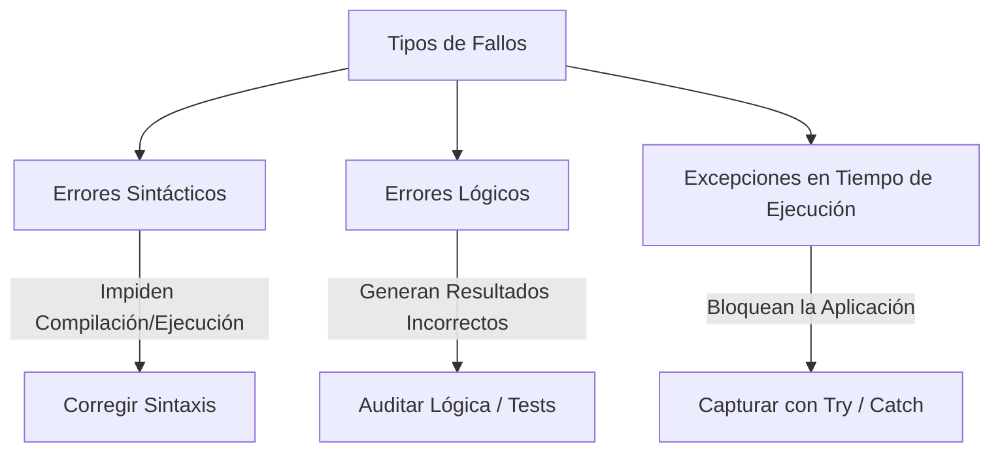
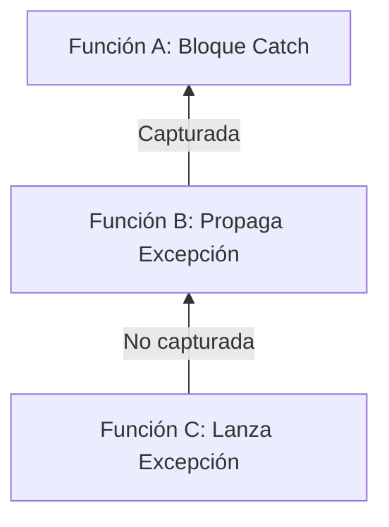

# Manejo de Errores y Excepciones

## Metadata
- **Fuente original:** `raw/papers/2026-07-30-manejo-de-errores-y-excepciones.md`
- **Autor:** [[big-school]]
- **Fecha:** 2026
- **Tipo de documento:** Paper / Documento Técnico (Módulo 0: Fundamentos del Desarrollo de Software)

## Summary
Este documento cubre el [[manejo-de-errores-y-excepciones|manejo de errores y excepciones]] como la disciplina que permite diseñar software resiliente capaz de degradarse con elegancia (*graceful degradation*) en vez de colapsar. Presenta una taxonomía de tres tipos de fallo (sintáctico, lógico, excepción en tiempo de ejecución), el mecanismo estándar `TRY/CATCH/FINALLY`, el lanzamiento explícito de excepciones (`THROW`/`RAISE`), su propagación por la pila de llamadas (*call stack bubbling*) y la creación de excepciones personalizadas heredando de las clases base del lenguaje.

## Key Takeaways
1. **Tres tipos de error:** sintáctico (compilación), lógico (silencioso, resultado incorrecto) y excepción en tiempo de ejecución (evento anómalo imprevisto).
2. **`TRY/CATCH/FINALLY`:** `TRY` envuelve código sospechoso, `CATCH` intercepta la excepción (encadenable por tipo), `FINALLY` se ejecuta siempre para liberar recursos.
3. **`THROW`/`RAISE`:** una función puede lanzar intencionadamente una excepción cuando detecta que sus precondiciones no se cumplen.
4. **Propagación (*call stack bubbling*):** una excepción no capturada localmente sube por la pila de llamadas hasta encontrar un `CATCH`, o termina el programa abruptamente si llega a la raíz.
5. **No silenciar excepciones:** un `catch {}` vacío oculta errores críticos y dificulta el diagnóstico — regla dura de resiliencia.

## Detailed Breakdown

### 1. Visión General y Resiliencia del Software
En producción, lo imprevisto (fallos de red, archivos no encontrados, datos inválidos, agotamiento de recursos) es una certeza, no una posibilidad remota. El manejo de errores permite responder de forma controlada sin colapsar. Ignorarlo conduce a inestabilidad, corrupción de datos y mala experiencia de usuario.

### 2. Taxonomía de Errores en Software

| Tipo de Error | Momento de Detección | Causa Principal | Ejemplo |
| --- | --- | --- | --- |
| **Error Sintáctico** | Compilación/Interpretación | Violación de reglas gramaticales. | Paréntesis olvidado, palabra clave mal escrita. |
| **Error Lógico** | Ejecución (silencioso) | Defecto en el diseño del algoritmo. | Sumar el impuesto en vez de multiplicarlo. |
| **Excepción en Tiempo de Ejecución** | Ejecución | Evento anómalo imprevisto. | División por cero, archivo no encontrado, timeout de red. |

### 3. El Mecanismo Estándar: Bloque TRY/CATCH/FINALLY
- **`TRY`:** envuelve el código sospechoso; si ocurre una excepción, la ejecución se interrumpe de inmediato.
- **`CATCH`/`EXCEPT`:** intercepta la excepción; se pueden encadenar múltiples `CATCH` para distintos tipos.
- **`FINALLY`:** se ejecuta siempre, haya o no error — se usa para liberar recursos (cerrar archivos, desconectar BD, liberar sockets).

### 4. Lanzamiento y Propagación de Excepciones
- **`THROW`/`RAISE`:** una función lanza intencionadamente una excepción cuando sus condiciones de ejecución no se cumplen.
- **Propagación (*Call Stack Bubbling*):** si una excepción no se captura localmente, sube por la pila de llamadas buscando un `CATCH` en funciones superiores; si llega a la raíz sin capturarse, el programa termina abruptamente.

### 5. Excepciones Personalizadas (*Custom Exceptions*)
Los desarrolladores pueden definir sus propios tipos de excepción heredando de las clases base del lenguaje, mejorando la claridad y trazabilidad de negocio.

### 6. Observaciones Clave
- No silenciar excepciones: un `catch {}` vacío oculta errores críticos.
- Usar siempre `FINALLY` o administradores de contexto (`with` en Python, `using` en C#) para liberar recursos.
- Los mensajes de error al usuario deben ser claros pero no exponer detalles sensibles de infraestructura.
- Registrar *stack traces* completos en logging centralizado para auditoría.

### 7. Conclusión
El manejo riguroso de errores diferencia el código experimental del software de grado de producción: anticipar fallos, limpiar recursos y propagar de forma controlada garantiza estabilidad y confiabilidad.

## Diagrams & Visualizations

### Diagrama Mermaid: Taxonomía de Fallos


### Diagrama Mermaid: Propagación de Excepciones (Call Stack Bubbling)


## Code & Pseudocode Examples

### Bloque TRY/CATCH/FINALLY
```text
TRY {
    // Código propenso a generar excepciones
    AbrirArchivo("datos.csv")
    LeerContenido()
} CATCH (ExcepcionArchivoNoEncontrado e) {
    // Manejo específico del error de archivo
    MOSTRAR "El archivo solicitado no existe en el sistema."
} CATCH (ExcepcionGeneral e) {
    // Captura de cualquier otra excepción no prevista
    MOSTRAR "Ocurrió un error inesperado: " + e.mensaje
} FINALLY {
    // Bloque de limpieza obligatoria (se ejecuta SIEMPRE)
    CerrarArchivo()
}
```

### Lanzamiento explícito (RAISE)
```python
def calcular_descuento(precio, porcentaje):
    if porcentaje < 0 or porcentaje > 100:
        raise ValueError("El porcentaje de descuento debe estar entre 0 y 100.")
    return precio - (precio * (porcentaje / 100))
```

### Excepción personalizada
```python
class SaldoInsuficienteException(Exception):
    """Excepción lanzada cuando una cuenta no tiene fondos suficientes."""
    pass

def realizar_retiro(cuenta, monto):
    if monto > cuenta.saldo:
        raise SaldoInsuficienteException("No posee saldo suficiente para retirar este monto.")
    cuenta.saldo -= monto
```

## Entities Mentioned
- [[big-school]]

## Concepts Discussed
- [[manejo-de-errores-y-excepciones]]
- [[metodologia-de-debugging]]
- [[stack-trace]]

## Notable Quotes
> "La resiliencia no consiste en impedir que los errores ocurran, sino en preverlos, aislarlos y recuperarse adecuadamente."

## Connections & Reflections
- Complementa directamente a [[metodologia-de-debugging]] y [[stack-trace]] (Módulo 0): el manejo de excepciones es la prevención estructural, el debugging es la investigación posterior cuando la prevención falla.
- La propagación de excepciones (*call stack bubbling*) es literalmente el mismo mecanismo que describe la página [[stack-trace]] al rastrear la causa raíz de un fallo.
- Sin contradicciones con páginas existentes.

## Open Questions
- ¿Cómo se equilibra la granularidad de excepciones personalizadas (muchas clases específicas) contra la simplicidad de mantenimiento del árbol de excepciones?

## Related Sources
- [[wiki/sources/2026-07-29-metodologias-de-resolucion-de-problemas]] — metodología de debugging y herramientas de diagnóstico (logs, breakpoints, stack trace).

---

**Estado:** ✅ Completamente procesado e integrado en el wiki
