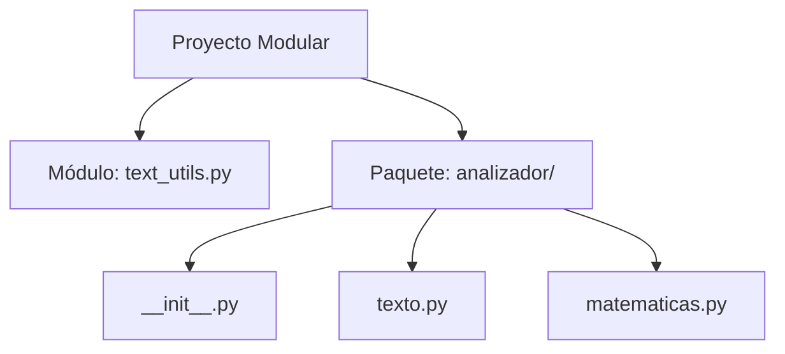

# Modularidad en Python: Módulos y Paquetes

## Metadata
- **Fuente original:** `raw/papers/2026-07-30-modularidad-en-python.md`
- **Autor:** [[big-school]]
- **Fecha:** 2026
- **Tipo de documento:** Paper / Documento Técnico (Módulo 0: Fundamentos del Desarrollo de Software)

## Summary
Documento sobre [[modularidad-modulos-y-paquetes|modularidad]] como estrategia de ingeniería para fragmentar la complejidad de una aplicación: cualquier archivo `.py` es un **módulo**; un **paquete** es una carpeta con módulos y un `__init__.py`. Cubre las cuatro sintaxis de importación (`import`, `from...import`, `from...import función`, `import...as`) y los beneficios de organización, reusabilidad, mantenibilidad y colaboración en equipo.

## Key Takeaways
1. **Módulo = cualquier archivo `.py`**; su nombre de archivo se convierte en el identificador para importarlo.
2. **Paquete = carpeta con módulos + `__init__.py`**, que notifica al intérprete que debe tratarse como paquete ejecutable.
3. **Cuatro sintaxis de importación**, de más explícita (`import paquete.modulo`) a más abreviada (`import paquete.modulo as alias`).
4. **Beneficios de la modularidad:** organización por responsabilidad, reusabilidad sin duplicar lógica, mantenibilidad (un fix se propaga a todo el sistema) y colaboración sin conflictos de Git.
5. **La modularidad reduce la deuda técnica** y mejora el time-to-market al permitir trabajo paralelo de varios desarrolladores sobre módulos independientes.

## Detailed Breakdown

### 1. Visión General y Beneficios
La modularidad fragmenta la complejidad en componentes independientes; código monolítico en un único archivo se vuelve inasimilable y propenso a fallos sistémicos.

### 2. Módulos en Python
Cualquier archivo `.py` es técnicamente un módulo; se consume vía `import nombre_modulo` y se invoca como `nombre_modulo.nombre_funcion()`.

### 3. Paquetes en Python
Un paquete es una carpeta con módulos y un `__init__.py` especial. Estructura típica:
```text
mi_analizador/
│
├── main.py
└── analizador/
    ├── __init__.py
    ├── texto.py
    └── matematicas.py
```

### 4. Sintaxis de Importación

| Sintaxis | Descripción | Ejemplo de Uso |
| --- | --- | --- |
| `import paquete.modulo` | Importación explícita, espacio de nombres completo. | `paquete.modulo.funcion()` |
| `from paquete import modulo` | Acorta el prefijo de llamada. | `modulo.funcion()` |
| `from paquete.modulo import funcion` | Importa función/clase específica al namespace local. | `funcion()` |
| `import paquete.modulo as alias` | Asigna un alias. | `alias.funcion()` |

### 5. Observaciones Clave
- `__init__.py` notifica al intérprete que la carpeta es un paquete ejecutable.
- Evitar nombres de módulos locales que colisionen con librerías estándar (`math.py`, `json.py`).
- Separar responsabilidades en módulos reduce la deuda técnica y optimiza el time-to-market.

### 6. Conclusión
La modularidad transforma scripts aislados en arquitecturas industrializables — el estándar para software escalable, mantenible y listo para entornos corporativos complejos.

## Diagrams & Visualizations

### Diagrama Mermaid: Estructura Modular


## Code & Pseudocode Examples

### Módulo simple
```python
# Archivo: text_utils.py
def contar_palabras(texto):
    """Cuenta el número de palabras en un string."""
    return len(texto.split())

def a_mayusculas(texto):
    return texto.upper()
```
```python
# Archivo: main.py
import text_utils

mi_frase = "La modularidad es la clave del software profesional."
total_palabras = text_utils.contar_palabras(mi_frase)
frase_mayusculas = text_utils.a_mayusculas(mi_frase)
```

### Paquete con múltiples módulos
```python
# Archivo: analizador/texto.py
def a_mayusculas(texto):
    return texto.upper()
```
```python
# Archivo: analizador/matematicas.py
def contar_palabras(texto):
    return len(texto.split())
```
```python
# Archivo: main.py
from analizador import texto, matematicas

mi_frase = "Organizar el código en paquetes es una buena práctica."
palabras = matematicas.contar_palabras(mi_frase)
mayusculas = texto.a_mayusculas(mi_frase)
```

## Entities Mentioned
- [[big-school]]

## Concepts Discussed
- [[modularidad-modulos-y-paquetes]]
- [[descomposicion]]
- [[deuda-tecnica]]
- [[python-como-lenguaje]]

## Notable Quotes
> "La modularidad transforma scripts aislados en arquitecturas de ingeniería industrializables."

## Connections & Reflections
- Es la materialización a nivel de archivos/carpetas del pilar [[descomposicion]] (Módulo 0): mismo principio de "divide y vencerás", ahora aplicado a la organización física del código, no solo a la lógica.
- Conecta directamente con [[deuda-tecnica]]: la falta de modularidad (código monolítico) es una fuente explícita de deuda técnica según esta fuente.
- Complementa a [[wiki/sources/2026-07-30-gestion-de-entornos-y-dependencias]]: módulos/paquetes organizan el código propio; entornos virtuales aíslan las dependencias externas.

## Open Questions
- ¿En qué punto de crecimiento de un paquete conviene subdividirlo en subpaquetes anidados en vez de añadir más módulos planos?

## Related Sources
- [[wiki/sources/2026-07-29-fundamentos-del-pensamiento-computacional]] — descomposición como pilar original del pensamiento computacional.
- [[wiki/sources/2026-07-30-gestion-de-entornos-y-dependencias]] — la otra mitad de la organización de un proyecto Python (dependencias vs. código propio).

---

**Estado:** ✅ Completamente procesado e integrado en el wiki
