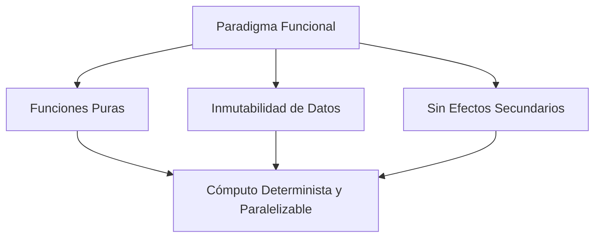

# Programación Funcional en Python

## Metadata
- **Fuente original:** `raw/papers/2026-07-30-programacion-funcional.md`
- **Autor:** [[big-school]]
- **Fecha:** 2026
- **Tipo de documento:** Paper / Documento Técnico (Módulo 0: Fundamentos del Desarrollo de Software)

## Summary
Profundiza en el paradigma funcional en Python: [[funciones-puras-y-efectos-secundarios|funciones puras]] (determinismo + sin efectos secundarios), inmutabilidad de datos (tuplas, strings, enteros, frozensets) y [[funciones-de-orden-superior|funciones de primera clase y de orden superior]] (funciones como valores, `map`, `filter`, `lambda` y list comprehensions como alternativa más "pythónica").

## Key Takeaways
1. **Función pura = determinismo + sin efectos secundarios:** mismo resultado para los mismos argumentos, sin tocar estado externo ni hacer I/O.
2. **Inmutabilidad:** los datos no se modifican, se transforman generando una copia nueva — tuplas/strings/enteros/frozensets son inmutables en Python, previniendo condiciones de carrera en entornos multihilo.
3. **Funciones de primera clase:** en Python las funciones son objetos — se asignan a variables, se pasan como argumentos y se devuelven desde otras funciones.
4. **Funciones de orden superior** (`map`, `filter`) reciben o devuelven funciones; Python favorece las **list comprehensions** sobre encadenar `map`/`filter` por legibilidad.
5. **`lambda`** define funciones anónimas de una sola línea sin `def`, útiles como argumento rápido de funciones de orden superior.

## Detailed Breakdown

### 1. Visión General: Paradigma Funcional vs. Imperativo
La Programación Funcional (PF) es declarativa: trata el cómputo como evaluación de funciones matemáticas puras, evitando estado mutable. El imperativo describe *cómo* ejecutar cambiando estado paso a paso; PF describe *qué* transformación aplicar. Python es multiparadigma: incorpora herramientas funcionales sin imponer pureza funcional total.

### 2. Conceptos Fundamentales: Funciones Puras e Inmutabilidad
Una función pura cumple dos condiciones: determinismo (mismos argumentos → mismo resultado siempre) y ausencia de efectos secundarios (no altera globales, no muta argumentos, sin I/O).

| Tipo | Determinista | Efectos Secundarios | Facilidad de Testing |
| --- | :---: | :---: | --- |
| **Función Pura** | Sí | No | Alta |
| **Función Impura** | No | Sí | Compleja (requiere mocks) |

La inmutabilidad complementa la pureza: tipos inmutables en Python son tupla, str, int y frozenset — si se requiere un cambio, se genera una nueva copia. Beneficio: elimina errores de concurrencia y condiciones de carrera en entornos multihilo.

### 3. Funciones de Primera Clase y de Orden Superior
En Python las funciones son objetos de primera clase: se asignan a variables, se pasan como argumentos, se devuelven desde otras funciones. Una función de orden superior recibe y/o devuelve funciones como resultado.

### 4. Funciones Anónimas: `lambda`
Sintaxis compacta (`lambda parametros: expresion`) para funciones de una sola línea sin `def`, típicamente usadas como argumento de `map`/`filter`/`sorted`.

### 5. Herramientas de Transformación: `map`, `filter` y Comprensiones
`map(función, iterable)` transforma cada elemento; `filter(función_booleana, iterable)` conserva solo los que cumplen la condición. Python favorece las **List Comprehensions** sobre encadenar `map`+`filter` por legibilidad superior.

### 6. Observaciones Clave
- La transparencia referencial de las funciones puras facilita memoización y optimización de rendimiento.
- Se recomienda usar List Comprehensions en vez de encadenar `map()`/`filter()`.
- La inmutabilidad previene deadlocks y simplifica sistemas paralelos/distribuidos.

### 7. Conclusión
El paradigma funcional aporta rigor y mantenibilidad: funciones puras, inmutabilidad y transformaciones declarativas permiten construir pipelines de datos robustos, testeables y escalables para IA y Big Data.

## Diagrams & Visualizations

### Diagrama Mermaid: Pilares del Paradigma Funcional


## Code & Pseudocode Examples

### Función pura vs. impura
```python
# Pura
def calcular_impuesto(precio, tasa):
    return precio * tasa

# Impura: modifica estado global
total_impuestos = 0
def acumular_impuesto(precio, tasa):
    global total_impuestos
    total_impuestos += precio * tasa
```

### Funciones de orden superior
```python
def aplicar_operacion(func, x, y):
    return func(x, y)

def sumar(a, b):
    return a + b

resultado = aplicar_operacion(sumar, 10, 20)  # 30
```

### Lambda
```python
def cuadrado(n):
    return n ** 2

cuadrado_lambda = lambda n: n ** 2
print(cuadrado_lambda(5))  # 25
```

### map, filter y list comprehensions
```python
numeros = [1, 2, 3, 4]
duplicados = list(map(lambda x: x * 2, numeros))  # [2, 4, 6, 8]

numeros2 = [1, 2, 3, 4, 5, 6]
pares = list(filter(lambda x: x % 2 == 0, numeros2))  # [2, 4, 6]

cuadrados_de_pares = [x ** 2 for x in numeros2 if x % 2 == 0]  # [4, 16, 36]
```

## Entities Mentioned
- [[big-school]]

## Concepts Discussed
- [[funciones-de-orden-superior]]
- [[funciones-puras-y-efectos-secundarios]]
- [[paradigmas-de-programacion]]
- [[python-como-lenguaje]]

## Notable Quotes
> "Mientras que el enfoque imperativo describe cómo ejecutar tareas cambiando estados paso a paso, la programación funcional se centra en qué transformaciones aplicar a los datos."

## Connections & Reflections
- Retoma y profundiza [[funciones-puras-y-efectos-secundarios]] (ya creado en el Módulo 2) con ejemplos concretos en Python — coherente, sin contradicción, solo añade la dimensión de inmutabilidad que el Módulo 2 no cubría explícitamente.
- La tupla inmutable de [[wiki/sources/2026-07-30-bases-de-los-lenguajes-de-programacion]] es el ejemplo perfecto de inmutabilidad aplicada.
- Complementa (no compite con) [[programacion-orientada-a-objetos]]: Python permite mezclar ambos paradigmas en el mismo proyecto.

## Open Questions
- ¿En qué punto de complejidad de una pipeline de transformaciones deja de ser legible una cadena de list comprehensions y conviene volver a funciones nombradas explícitas?

## Related Sources
- [[wiki/sources/2026-07-30-funciones-y-parametros]] — funciones puras vs. efectos secundarios en términos agnósticos de lenguaje.
- [[wiki/sources/2026-07-30-programacion-orientada-a-objetos]] — paradigma complementario en el mismo lenguaje multiparadigma.

---

**Estado:** ✅ Completamente procesado e integrado en el wiki
