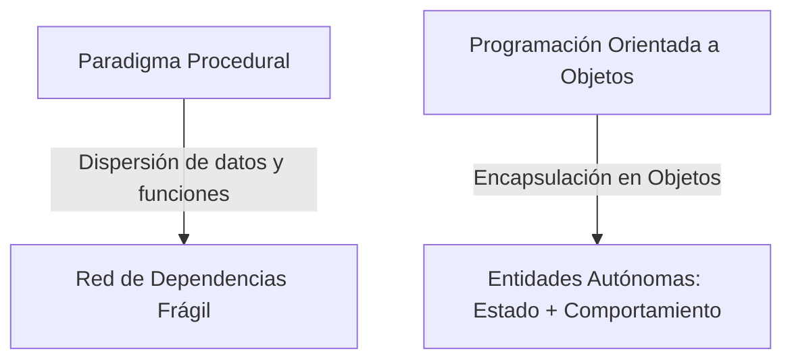
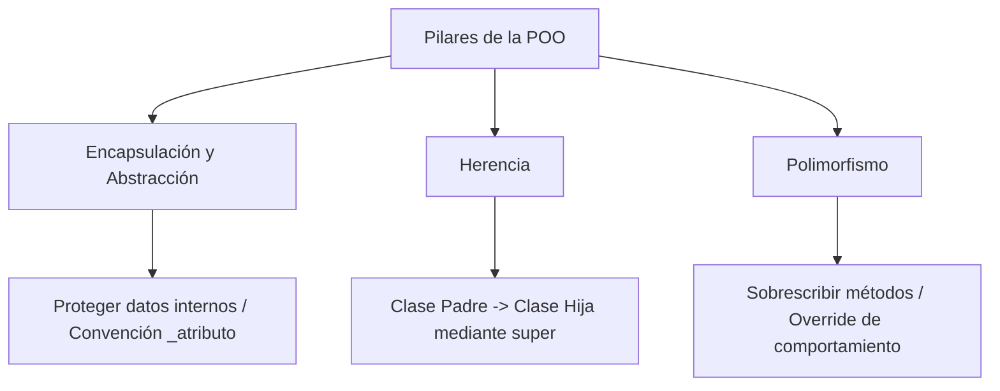

# Programación Orientada a Objetos (POO) en Python

## Metadata
- **Fuente original:** `raw/papers/2026-07-30-programacion-orientada-a-objetos.md`
- **Autor:** [[big-school]]
- **Fecha:** 2026
- **Tipo de documento:** Paper / Documento Técnico (Módulo 0: Fundamentos del Desarrollo de Software)

## Summary
Documento sobre [[programacion-orientada-a-objetos|Programación Orientada a Objetos]] (POO) en Python: la transición del paradigma procedural (datos y funciones dispersos) a POO (datos y comportamiento encapsulados en Objetos). Cubre la anatomía del objeto (Clase, Instancia, Constructor `__init__`, `self`) y los tres pilares operativos — Encapsulación/Abstracción, Herencia y Polimorfismo — con ejemplos progresivos de una jerarquía `LibraryItem` → `Book`/`DVD`.

## Key Takeaways
1. **POO combina Estado (atributos) y Comportamiento (métodos)** en unidades autónomas llamadas Objetos, a diferencia del paradigma procedural que los mantiene separados.
2. **Clase vs. Objeto:** la clase es el plano abstracto (`PascalCase`); el objeto es su instancia concreta en memoria.
3. **Encapsulación:** proteger datos internos con la convención de guion bajo (`_balance`) — en Python es una convención, no una restricción forzada por el lenguaje.
4. **Herencia:** una clase hija reutiliza atributos/métodos de una clase padre vía `super()`.
5. **Polimorfismo:** distintas clases hijas responden al mismo método (`borrow()`) con comportamiento propio mediante sobrescritura (*override*).

## Detailed Breakdown

### 1. Visión General: Del Paradigma Procedural a POO
El paradigma procedural dispersa datos y funciones, generando una red de dependencias frágil. POO encapsula ambos en Objetos: **Estado** (atributos, lo que el objeto conoce) y **Comportamiento** (métodos, lo que el objeto hace).

### 2. Anatomía del Objeto: Clases, Constructor y `self`

| Término | Definición |
| --- | --- |
| **Clase** | Modelo/plano abstracto que define la estructura de los objetos (`PascalCase`). |
| **Objeto/Instancia** | Materialización real de una clase con datos específicos en memoria. |
| **Constructor (`__init__`)** | Método especial que inicializa el estado del objeto al instanciarlo. |
| **`self`** | Referencia autorreferencial para acceder a los propios atributos/métodos del objeto. |

### 3. Los Cuatro Pilares de la POO (Encapsulación, Herencia, Polimorfismo)

**Encapsulación y Abstracción:** protege la integridad de los datos impidiendo alteración arbitraria externa. Python usa la convención `_atributo` para señalar atributos protegidos; la abstracción expone solo una interfaz pública simplificada.

**Herencia:** permite crear clases hijas que heredan de una clase padre usando `super()` para invocar su constructor — evita duplicar lógica común (`LibraryItem` → `Book`).

**Polimorfismo y Sobrescritura (*Overriding*):** distintas clases hijas responden al mismo método con su propia implementación — recorrer una lista mixta de `Book` y `DVD` e invocar `.borrow()` en cada uno ejecuta versiones distintas del método.

### 4. Observaciones Clave
- `PascalCase` es el estándar esencial para nombrar clases en Python.
- `self` es gestionado internamente por Python — no se pasa manualmente al invocar un método.
- La encapsulación con `_` es una convención de diseño que exige disciplina, no una restricción forzada por el lenguaje.
- El polimorfismo facilita extender sistemas con nuevos tipos sin alterar la lógica de procesamiento existente.

### 5. Conclusión
En la era de la IA, el valor diferencial no es saber escribir un bucle, sino diseñar la arquitectura orientada a objetos que conecta las piezas del negocio — entender clases, herencia y encapsulación permite dirigir modelos de IA para construir sistemas fiables y mantenibles.

## Diagrams & Visualizations

### Diagrama Mermaid: De Procedural a POO


### Diagrama Mermaid: Los Pilares de la POO


## Code & Pseudocode Examples

### Anatomía básica: constructor y self
```python
class Book:
    def __init__(self, title, author):
        self.title = title
        self.author = author
        self.is_borrowed = False

    def borrow(self):
        if self.is_borrowed:
            print(f"Error: '{self.title}' ya está prestado.")
        else:
            self.is_borrowed = True
            print(f"'{self.title}' ha sido prestado.")

book_1 = Book("Cien Años de Soledad", "Gabriel García Márquez")
book_1.borrow()
```

### Encapsulación
```python
class BankAccount:
    def __init__(self, owner):
        self.owner = owner
        self._balance = 0.0  # Atributo protegido por convención

    def deposit(self, amount):
        if amount > 0:
            self._balance += amount

    def get_balance(self):
        return self._balance
```

### Herencia y polimorfismo
```python
class LibraryItem:
    def __init__(self, title):
        self.title = title
        self.is_borrowed = False

    def borrow(self):
        self.is_borrowed = True

class Book(LibraryItem):
    def __init__(self, title, author):
        super().__init__(title)
        self.author = author

class DVD(LibraryItem):
    def __init__(self, title, director):
        super().__init__(title)
        self.director = director

    def borrow(self):  # Sobrescritura (Override)
        print(f"Verificando si el DVD '{self.title}' tiene rayones...")
        super().borrow()

items = [Book("Dune", "Frank Herbert"), DVD("Inception", "Nolan")]
for item in items:
    item.borrow()  # Cada objeto ejecuta su propia versión de borrow()
```

## Entities Mentioned
- [[big-school]]

## Concepts Discussed
- [[programacion-orientada-a-objetos]]
- [[paradigmas-de-programacion]]
- [[python-como-lenguaje]]

## Notable Quotes
> "En la era de la IA, el valor diferencial del profesional no reside en saber escribir un bucle, sino en diseñar la arquitectura orientada a objetos que conecta las piezas del negocio."

## Connections & Reflections
- Es la implementación concreta del paradigma "Orientado a Objetos" ya listado en [[paradigmas-de-programacion]] (fuente anterior de este mismo módulo).
- El `self` como referencia autorreferencial es conceptualmente análogo al [[scope-y-lifetime|scope local]] de una función (Módulo 2): ambos delimitan a qué puede acceder un bloque de código.
- Sin contradicciones con páginas existentes.

## Open Questions
- ¿Cuándo la composición de objetos es preferible a la herencia para evitar jerarquías de clases frágiles (*fragile base class problem*)?

## Related Sources
- [[wiki/sources/2026-07-30-introduccion-a-los-lenguajes-de-programacion]] — POO como uno de los paradigmas principales.
- [[wiki/sources/2026-07-30-programacion-funcional]] — paradigma alternativo/complementario en el mismo lenguaje (Python multiparadigma).

---

**Estado:** ✅ Completamente procesado e integrado en el wiki
