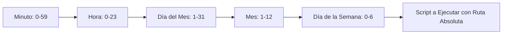

# Guía Rápida de Bash/Shell: Terminal y Línea de Comandos — Brais Moure

## Metadata
- **Fuente original:** `raw/papers/2026-07-30-terminal-y-linea-de-comandos.md`
- **Autor:** [[brais-moure]] / MoureDev Pro
- **Fecha:** 2026
- **Tipo de documento:** Paper / Documento Técnico / Guía Rápida

## Summary
Esta guía técnica profundiza en la relevancia, configuración y dominio práctico de la línea de comandos ([[terminal-y-cli]]) y la [[shell-bash-zsh|shell de Bash]] en el contexto del desarrollo de software moderno e infraestructura asistida por IA. Sostiene que aunque la IA sobresale en la generación de código, la terminal sigue siendo el rey indiscutible de la ejecución, orquestación, despliegue y control de los sistemas en entornos reales.

Cubre desde la distinción conceptual entre Terminal, Shell y Bash hasta operaciones avanzadas de manipulación de archivos Unix, permisos octales (`chmod`, `chown`, `umask`), redirecciones de entrada/salida y tuberías (`|`), editores de texto en consola (Nano, Vim), gestión de procesos, desarrollo de scripts automatizados en Bash (`.sh`) y programación de tareas mediante el demonio `cron`.

## Key Takeaways
1. **La IA crea, Bash ejecuta:** La IA define la lógica del software ("qué"), pero la infraestructura exige a la shell controlar el entorno de ejecución ("dónde" y "cómo").
2. **Jerarquía Unix y Comandos Universales:** El árbol de archivos parte de la raíz `/`; comandos esenciales incluyen `pwd`, `ls -lh`, `cd`, `mkdir -p`, `cp -a`, `mv`, `rm -rf`.
3. **Pipes y Redirecciones:** Permiten encadenar la salida de un comando con la entrada de otro (`|`), guardar resultados (`>`), o concatenar logs (`>>`).
4. **Esquema de Permisos Octal:** Basado en `r=4`, `w=2`, `x=1` divididos en Propietario (`u`), Grupo (`g`) y Otros (`o`).
5. **Automatización con Cron:** La sintaxis de 5 campos (`* * * * *`) permite programar ejecuciones periódicas de scripts usando rutas absolutas.

## Detailed Breakdown

### 1. Introducción: La Shell en la Era de la IA
- **El Rol de la Shell:** La IA actúa como copiloto generando código, pero la terminal es el panel de control. El código no tiene valor en producción hasta que se despliega de forma fiable a través de la interfaz CLI.
- **Soberanía del Entorno:** Orquestar contenedores Docker, pipelines CI/CD y servidores cloud requiere el dominio directo de Bash.

### 2. Configuración y Conceptos Fundamentales
- **Diferencia de Términos:**
  - *Shell:* Intérprete de órdenes escritas (`bash`, `zsh`, `sh`, `powershell`).
  - *Terminal:* Interfaz gráfica/pantalla que transmite el texto a la shell (Warp, Xterm, Terminal del sistema).
  - *Bash (Bourne-Again Shell):* Shell estándar en la mayoría de entornos Unix/Linux.
- **Entornos en Windows:** Git for Windows (emulación parcial) y WSL (*Windows Subsystem for Linux*, kernel Linux nativo en `/mnt/c`).

### 3. Primeros Pasos y Anatomía de Comandos
- **Comandos de Orientación y Navegación:** `pwd` (ruta actual), `ls -la` (listado con ocultos), `cd ..` (subir nivel), `cd ~` (directorio personal).
- **Anatomía:** `comando [opciones] [argumentos]` (ej. `ls -lh /var/log`).
- **Comandos de Sistema:** `whoami`, `date`, `uptime`, `hostname`, `uname -a`, `clear`.
- **Ruta Absoluta vs Relativa:** Absoluta inicia siempre en la raíz `/`; relativa se calcula desde la posición actual (`pwd`).

### 4. Sistema de Archivos Unix y Manipulación
- **Jerarquía Unix:** `/` (root), `/home` (usuarios), `/etc` (configuraciones), `/bin` (binarios ejecutables), `/var` (logs y datos variables), `/tmp` (archivos temporales).
- **Manipulación de Archivos:** `touch` (crear), `mkdir -p` (directorios anidados), `cp -a` (copia exacta con atributos), `mv` (mover/renombrar), `rm -rf` (eliminación recursiva forzada sin papelera).
- **Wildcards (Comodines):** `*` (cero o más caracteres) y `?` (exactamente un carácter). Búsqueda avanzada con `find . -name "*.log"`.

### 5. Comandos Avanzados, Redirecciones y Pipes
- **Visualización:** `cat` (completo), `less` (paginado interactivo), `head -n 20` (primeras líneas), `tail -f` (monitorear trazas en tiempo real).
- **Filtrado y Conteo:** `grep -r` (búsqueda recursiva de patrones) y `wc -l` (conteo de líneas).
- **Operadores de Redirección y Tuberías:**
  - `>` : Redirección de salida (sobrescribe).
  - `>>` : Redirección de salida en modo append (concatena).
  - `<` : Redirección de entrada.
  - `|` : *Pipe* (conecta la salida de un comando con la entrada del siguiente, ej. `cat log.txt | grep "ERROR" | wc -l`).
- **Variables de Entorno:** Locales (`var="valor"`) vs Globales (`export API_KEY="secret"`). Persistencia en `~/.bashrc` o `~/.zshrc`.

### 6. Editores de Texto en Consola
- **Nano:** Editor simple con accesos `Ctrl+O` (guardar) y `Ctrl+X` (salir).
- **Vim:** Editor modal (Modo Normal para comandos/navegación con `h,j,k,l`, Modo Inserción con `i`, Modo Comando con `:` como `:wq` para guardar y salir o `:q!` para descartar).

### 7. Permisos y Administración del Sistema
- **Esquema Notación Octal:** `r=4`, `w=2`, `x=1`. Suma por clases: Propietario (`u`), Grupo (`g`), Otros (`o`).
  - *`755` (`rwxr-xr-x`):* Control total del propietario; lectura y ejecución para grupo/otros.
  - *`644` (`rw-r--r--`):* Lectura y escritura para propietario; solo lectura para grupo/otros.
- **Comandos de Control:** `chmod` (cambiar permisos), `chown` (cambiar propietario), `umask` (máscara predeterminada), `sudo` (ejecutar como root).

### 8. Gestión de Procesos, Aliases e Historial
- **Monitorización:** `ps aux` (listado completo con PID), `top`/`htop` (monitores en tiempo real), `df -h` (disco), `free -h` (memoria RAM).
- **Segundo Plano y Control:** Ejecución en background con `&`, listar trabajos con `jobs`, traer a primer plano con `fg`. Eliminación con `kill -9 <PID>`.
- **Aliases e Historial:** `alias gs='git status'`, `history`, `!!` (re-ejecutar último comando).

### 9. Scripting en Bash
- **Encabezado Shebang:** `#!/bin/bash` al inicio del archivo `.sh`.
- **Regla de Asignación:** Sin espacios alrededor del `=` (ej. `nombre="Brais"`).
- **Operaciones Aritméticas:** `resultado=$((a + b))`.
- **Entrada de Datos:** `read -p "Prompt: " variable` y `read -s` para contraseñas ocultas.
- **Argumentos Posicionales:** `$0` (nombre script), `$1`, `$2` (parámetros), `$#` (conteo total), `$@` (todos los argumentos).

### 10. Lógica y Control de Flujo
- **Comparaciones:** Numéricas (`-eq`, `-ne`, `-gt`, `-ge`, `-lt`, `-le`), Texto (`=`, `!=`, `-z`), Archivos (`-e`, `-f`, `-d`, `-s`).
- **Estructuras:** `if [ condición ]; then ... elif ... else ... fi`, `case $var in ... esac`, bucles `for`, `while` y `until`.
- **Códigos de Salida:** `$?` almacena el retorno del último comando (`0` es éxito). Encadenamiento corto con `&&` (éxito) y `||` (fallo).

### 11. Automatización con Cron
- **Sintaxis Crontab (5 campos):** `Minuto (0-59) Hora (0-23) DíaMes (1-31) Mes (1-12) DíaSemana (0-6) /ruta/absoluta/al/script.sh`.
- **Operaciones:** `crontab -e` (editar), `crontab -l` (listar). Redirección de logs en cron: `>> /var/log/cron.log 2>&1`.

### 12. Recursos y Ecosistema
- Adopción de **Zsh** y framework **Oh My Zsh** para personalización y autocompletado avanzado.

## Diagrams & Visualizations

### Diagrama Mermaid: Sintaxis de Campos en Crontab


## Code & Pseudocode Examples

### Ejemplo 1: Encadenamiento de Comandos con Pipes y Redirección
```bash
# Filtrar peticiones 404 en el log de accesos y contar total de ocurrencias
cat accesos.log | grep "404" | wc -l > reporte_errores.txt
```

### Ejemplo 2: Script Bash Interactivo con Control de Flujo y Argumentos
```bash
#!/bin/bash
# Script de validación de directorio y conteo de archivos

DIR_TARGET="${1:-.}"

if [ -d "$DIR_TARGET" ]; then
    echo "Analizando directorio: $DIR_TARGET"
    TOTAL=$(ls -1 "$DIR_TARGET" | wc -l)
    echo "Total de elementos encontrados: $TOTAL"
else
    echo "Error: El directorio '$DIR_TARGET' no existe." || exit 1
fi
```

### Ejemplo 3: Expresión Crontab para Respaldos Diarios
```text
# Ejecutar script de respaldo a las 2:00 AM todos los días laborables (Lunes a Viernes)
0 2 * * 1-5 /home/usuario/scripts/backup.sh >> /var/log/backup.log 2>&1
```

## Entities Mentioned
- [[brais-moure]]
- [[big-school]]

## Concepts Discussed
- [[terminal-y-cli]]
- [[shell-bash-zsh]]
- [[redirecciones-y-pipes]]
- [[soberania-humana-en-ia]]
- [[descomposicion]]

## Notable Quotes
> *"La IA es muy buena definiendo el 'qué' (la lógica de la aplicación), pero la infraestructura exige un control absoluto sobre el 'dónde' y el 'cómo' (el entorno de ejecución)."*

> *"Dominar la shell no es mirar al pasado, es asegurar tu control sobre la infraestructura que potencia el futuro."*

## Connections & Reflections
- Refuerza la directriz de este repositorio sobre la soberanía del desarrollador frente a agentes de IA, donde la CLI es el medio primario de interacción para ejecutar builds, linting y comandos del sistema.

## Open Questions
- ¿Qué estrategias avanzadas de seguridad previenen la inyección involuntaria de comandos en scripts de Bash expuestos a APIs REST?
