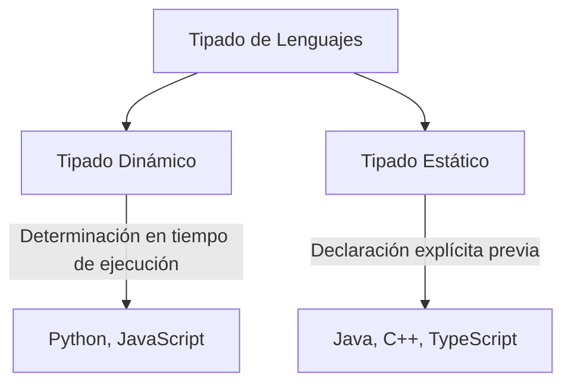
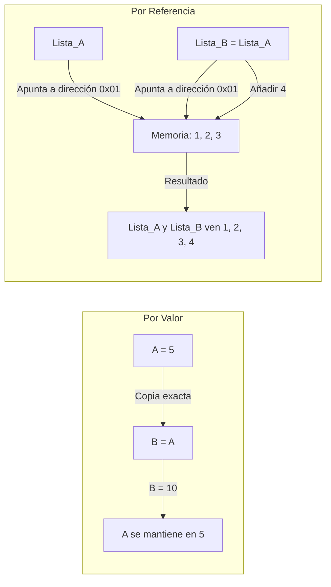

# Variables, Tipos de Datos y Operadores

## Metadata
- **Fuente original:** `raw/papers/2026-07-30-variables-tipos-de-datos-y-operadores.md`
- **Autor:** [[big-school]]
- **Fecha:** 2026
- **Tipo de documento:** Paper / Documento Técnico (Módulo 0: Fundamentos del Desarrollo de Software)

## Summary
Este documento cubre la "materia prima" de todo programa: [[variables-y-tipos-de-datos|variables y tipos de datos]], su ciclo de vida (declaración, inicialización, asignación) y las convenciones de nomenclatura (camelCase, snake_case, PascalCase). Profundiza en la distinción entre [[tipado-estatico-vs-dinamico|tipado dinámico y estático]], la coerción implícita vs. el casting explícito de tipos, y en los operadores aritméticos, de asignación, comparación y lógicos.

Cierra con dos ejes que reaparecen en el resto del módulo: [[scope-y-lifetime|scope y lifetime]] (ámbito y tiempo de vida de una variable) y [[paso-por-valor-vs-referencia|el comportamiento por valor vs. por referencia]] al copiar variables.

## Key Takeaways
1. **Ciclo de vida de una variable:** declaración → inicialización → asignación/mutación.
2. **Tipado dinámico vs. estático:** dinámico evalúa el tipo en tiempo de ejecución (flexible, errores tardíos); estático exige declaración explícita (seguro, errores tempranos).
3. **Coerción vs. casting:** la coerción es automática e implícita (`"5" + 2 = "52"`); el casting es explícito y consciente (`(int) 3.99 = 3`).
4. **Por valor vs. por referencia:** los primitivos se copian por valor (independientes); los objetos/listas se copian por referencia (comparten memoria — mutar uno muta el otro).
5. **Nomenclatura como mantenimiento:** una nomenclatura pobre no es un problema estético, es una fuente directa de [[deuda-tecnica]].

## Detailed Breakdown

### 1. Visión General y Definición de Variables
Comprender el ciclo de vida de una variable —declaración, inicialización, mutación/persistencia— es la base para diseñar sistemas optimizados en memoria y tiempo de ejecución.

**Convenciones de nomenclatura:**

| Convención | Ejemplo | Ámbito de uso habitual |
| :--- | :--- | :--- |
| **camelCase** | `numeroDeClientes` | JavaScript, Java, TypeScript |
| **snake_case** | `numero_de_clientes` | Python, Rust, Ruby |
| **PascalCase** | `NumeroDeClientes` | Clases, Tipos e Interfaces |

### 2. Tipos de Datos Primitivos y Tipado
Tipos primitivos universales: enteros, decimales (floats/doubles), booleanos, caracteres y strings.

- **Tipado Dinámico:** el tipo se evalúa en tiempo de ejecución (Python, JavaScript). Ventaja: flexibilidad y prototipado rápido. Desventaja: errores de tipo solo detectables en ejecución.
- **Tipado Estático:** el tipo se declara explícitamente y no puede alterarse (Java, C++, TypeScript). Ventaja: seguridad y detección temprana de errores. Desventaja: mayor rigidez sintáctica.

### 3. Coerción y Casting de Tipos
- **Coerción (implícita):** conversión automática realizada por el lenguaje según las reglas del operador (`"5" + 2` → `"52"` en JavaScript).
- **Casting (explícito):** conversión consciente realizada por el desarrollador (`(int) 3.99` → `3` en C, se descarta la parte decimal).

### 4. Operadores

| Categoría | Operadores | Descripción |
| --- | --- | --- |
| **Aritméticos** | `+`, `-`, `*`, `/`, `%` | Suma, resta, multiplicación, división, módulo. |
| **Asignación y Compuestos** | `=`, `+=`, `-=`, `*=`, `/=` | Asignación directa y compuesta. |
| **Comparación** | `==`, `!=`, `>`, `<`, `>=`, `<=` | Igualdad, desigualdad, orden. |
| **Lógicos** | `&&`, `\|\|`, `!` | Conjunción, disyunción, negación. |

### 5. Scope (Ámbito) y Lifetime (Tiempo de Vida)
- **Scope Global:** accesible desde cualquier punto — se recomienda minimizar por colisiones de nombres.
- **Scope Local/Bloque:** existe solo dentro del bloque, función o módulo donde fue declarada.
- **Lifetime:** intervalo temporal en que la variable permanece en memoria; una variable local se libera al finalizar su bloque.

### 6. Tipos por Valor vs. Tipos por Referencia
- **Por Valor (Primitivos):** al copiar una variable a otra se duplica el valor en memoria independiente — mutar la copia no afecta al original.
- **Por Referencia (Objetos, Listas):** las variables almacenan un puntero a la misma dirección de memoria — mutar una copia muta también el original.

### 7. Observaciones Clave
- La nomenclatura estandarizada reduce la [[deuda-tecnica]], no es un adorno estético.
- Priorizar constantes (`const`/`final`) sobre variables mutables cuando el valor no deba cambiar.
- Confundir `=` (asignación) con `==` (comparación) es uno de los errores lógicos más recurrentes.
- Los tipos por referencia pueden generar efectos secundarios no deseados entre módulos.

### 8. Conclusión
Entender la anatomía de los datos, su comportamiento en memoria y las leyes lógicas que los gobiernan permite construir sistemas robustos, seguros y escalables.

## Diagrams & Visualizations

### Diagrama Mermaid: Tipado de Lenguajes


### Diagrama Mermaid: Por Valor vs. Por Referencia


## Code & Pseudocode Examples

### Tipado dinámico (Python)
```python
mi_variable = 10      # Evaluado como Integer
mi_variable = "Hola"  # Reasignado como String sin error sintáctico
```

### Tipado estático (Java)
```java
int miVariable;
miVariable = 10;     // Válido
miVariable = "Hola"; // ERROR DE COMPILACIÓN
```

### Coerción implícita (JavaScript)
```javascript
resultado = "5" + 2;  // Resulta en "52" (String por concatenación)
```

### Casting explícito (C)
```c
int entero = (int) 3.99;  // Resultado: 3 (se descarta la parte decimal)
```

### Por valor
```python
a = 5
b = a    # 'b' almacena su propia copia del valor 5
b = 10   # 'a' se mantiene intacto en 5
```

### Por referencia
```python
lista_a = [1, 2, 3]
lista_b = lista_a
lista_b.append(4)

# lista_a también refleja [1, 2, 3, 4] porque ambas apuntan a la misma dirección
```

## Entities Mentioned
- [[big-school]]

## Concepts Discussed
- [[variables-y-tipos-de-datos]]
- [[tipado-estatico-vs-dinamico]]
- [[paso-por-valor-vs-referencia]]
- [[scope-y-lifetime]]
- [[deuda-tecnica]]

## Notable Quotes
> "La nomenclatura de variables no es un adorno estético, sino una herramienta de mantenimiento para reducir la deuda técnica."

## Connections & Reflections
- El eje por-valor/por-referencia introducido aquí reaparece de forma idéntica en [[wiki/sources/2026-07-30-funciones-y-parametros]] al explicar cómo se pasan argumentos a una función — mismo concepto, dos puntos de aplicación.
- Esta es la tercera fuente del wiki que menciona [[deuda-tecnica]] (antes en Módulo 0), cruzando el umbral de 3+ menciones sin página propia — se crea `wiki/concepts/deuda-tecnica.md` en esta misma ingesta.
- Sin contradicciones con páginas existentes.

## Open Questions
- ¿Qué convenciones de linting automatizado detectan de forma más fiable la confusión entre `=` y `==` antes de llegar a producción?

## Related Sources
- [[wiki/sources/2026-07-30-funciones-y-parametros]] — retoma scope y paso por valor/referencia en el contexto de funciones.

---

**Estado:** ✅ Completamente procesado e integrado en el wiki
