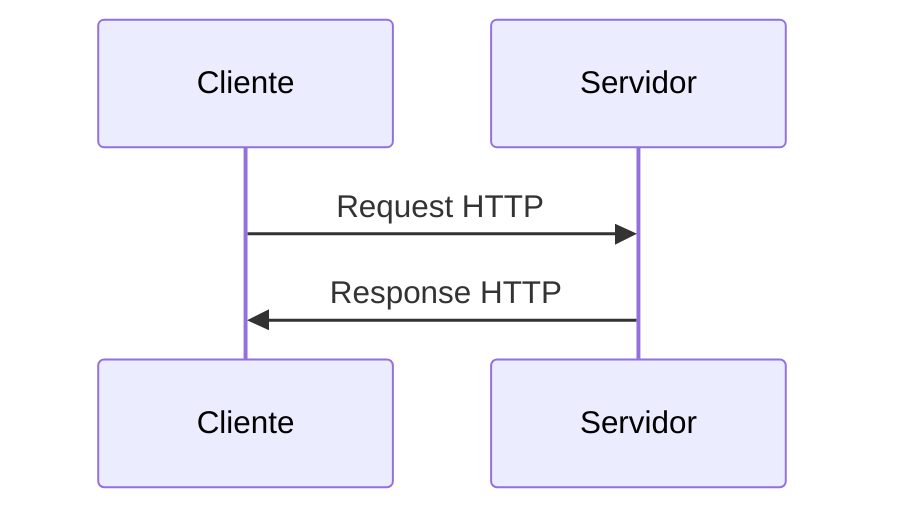

# APIs y Comunicación

## Metadata
- **Fuente original:** `raw/papers/2026-08-03-apis-comunicacion.md`
- **Autor:** [[big-school]]
- **Fecha:** 2026-08-03
- **Tipo de documento:** Documento Técnico (PDF `0_5_3_-_APIs_y_comunicación.pdf`, Módulo 0)

## Summary
Tercera fuente del Módulo 4: define la API como "contrato formal entre dos piezas de software" (analogía del restaurante: cocina/plato/camarero/cliente), desarrolla los principios de la arquitectura **REST** (recursos, endpoints, verbos CRUD, statelessness), presenta **JSON** como el estándar de intercambio agnóstico al lenguaje, cubre seguridad (AuthN vs. AuthZ, API Keys, Tokens, CORS) y cierra con ejemplos ejecutables en Python usando la librería `requests` para consumir una API REST real.

## Key Takeaways
1. **API = contrato formal entre dos piezas de software**, no solo una herramienta técnica — analogía del restaurante: la API es el camarero entre el cliente y la cocina (el sistema complejo).
2. **REST es un estilo arquitectónico, no un protocolo:** organiza el diseño alrededor de **recursos** (identificados por **Endpoints**/URLs) manipulados con verbos CRUD (`GET`/`POST`/`PUT`/`PATCH`/`DELETE`).
3. **REST es stateless:** cada petición debe contener toda la información necesaria — el servidor no guarda contexto entre solicitudes, lo que optimiza la escalabilidad.
4. **JSON es el estándar de intercambio** por su ligereza y agnosticismo de lenguaje — dos estructuras básicas: objetos (`{}`) y arrays (`[]`), anidables jerárquicamente.
5. **AuthN (autenticación) ≠ AuthZ (autorización):** AuthN responde "¿quién eres?"; AuthZ responde "¿qué puedes hacer?" — se gestionan con API Keys o Tokens (Bearer/OAuth).
6. **CORS** es una política de seguridad del **navegador** (no un fallo de la API) que bloquea por defecto solicitudes entre dominios distintos, salvo que el servidor autorice explícitamente el origen.
7. **`requests` en Python** simplifica el consumo de APIs: `requests.get(url)` / `requests.post(url, json=datos)`, comprobando `response.status_code` y extrayendo `response.json()` como diccionario.

## Detailed Breakdown

### 1. La API como Interfaz Estratégica
Una API (Application Programming Interface) es un contrato formal entre dos piezas de software. La analogía del restaurante: la cocina es el sistema complejo y restringido; los platos son los datos procesados; el cliente busca un resultado; la API es el camarero — presenta el menú (documentación), gestiona la solicitud y entrega la respuesta. Toda comunicación tiene dos partes: la **Solicitud** (URL/Endpoint, método, cabeceras, cuerpo opcional) y la **Respuesta** (código de estado, cabeceras, cuerpo con los datos).

### 2. Principios de la Arquitectura REST
REST (Representational State Transfer) es un estilo arquitectónico, no un protocolo ni una herramienta — un conjunto de principios para APIs ligeras, rápidas y escalables. Su enfoque son los **recursos** (cualquier entidad de negocio: clientes, pedidos, productos), identificados por URLs llamadas **Endpoints**. Los verbos HTTP mapean a CRUD: `GET` (lee), `POST` (crea), `PUT`/`PATCH` (actualiza total/parcialmente), `DELETE` (elimina). Una característica vital: **statelessness** — cada petición debe ser autosuficiente, sin que el servidor guarde contexto entre solicitudes, lo que optimiza drásticamente la escalabilidad.

### 3. JSON: El Estándar de Intercambio de Información
Tras el declive de XML, la industria convergió en **JSON** por su ligereza e interpretabilidad tanto para humanos como para máquinas — y por ser agnóstico al lenguaje de programación (una infraestructura Python puede interactuar con una en Java sin fricción). Usa dos estructuras: **objetos** (pares clave/valor, `{}`) y **arrays** (listas ordenadas, `[]`), anidables para representar datos jerárquicos complejos.

### 4. Seguridad y Control de Acceso
**Autenticación (AuthN):** ¿quién eres? — verifica identidad. **Autorización (AuthZ):** ¿qué puedes hacer? — verifica permisos del cliente ya identificado. Se gestionan con **API Keys** (claves fijas) o **Tokens** (Bearer/OAuth, con caducidad tras login). El **CORS** (Cross-Origin Resource Sharing) es una política de seguridad del navegador — no un fallo de la API — que bloquea por defecto peticiones entre dominios distintos, salvo que el servidor incluya cabeceras que autoricen explícitamente el origen.

### 5. Consumo de APIs y Herramientas
Las APIs se consumen desde navegadores (solo GET), línea de comandos (`cURL`), clientes gráficos (Postman, Thunder Client) o lenguajes de programación. En Python, la librería `requests` simplifica el flujo: petición → verificación de `status_code` → extracción de `response.json()` como diccionario manipulable.

### 6. Observaciones Clave
- Los códigos de estado (200, 401, 404, 500) son los pilares de la comunicación técnica y del manejo de errores en la integración.
- Postman/Thunder Client son indispensables para probar antes de implementar código.
- `requests` convierte respuestas JSON directamente en diccionarios manipulables.
- La escalabilidad REST se potencia precisamente por no almacenar estado en el servidor.

### 7. Conclusión
Dominar el ecosistema de APIs es un imperativo estratégico: la capacidad de una organización para integrar servicios de IA (ChatGPT, modelos predictivos) depende directamente de su dominio sobre estos "conectores universales" — flujos de petición-respuesta, seguridad de tokens y estructura JSON.

## Diagrams & Visualizations



## Code & Pseudocode Examples

### Estructura JSON anidada
```json
{
  "id": 5,
  "nombre": "Laptop Gamer XZ",
  "precio": 1500.00,
  "en_stock": true,
  "etiquetas": ["electronica", "gaming", "oferta"],
  "detalles": {
    "cpu": "Intel i7",
    "ram_gb": 16,
    "ssd_gb": 512
  }
}
```

### Consumo de una API REST en Python (GET)
```python
import requests

url = "https://jsonplaceholder.typicode.com/users/1"
response = requests.get(url)

if response.status_code == 200:
    print("Respuesta correcta")
    usuario = response.json()
    print(usuario["name"])
else:
    print(f"Error: {response.status_code}")
```

### Creación de un recurso (POST)
```python
import requests

url = "https://jsonplaceholder.typicode.com/posts"
datos = {"title": "Nuevo post", "body": "Contenido del post", "userId": 1}

response = requests.post(url, json=datos)

if response.status_code == 201:
    print("Recurso creado exitosamente")
    print(response.json())
else:
    print(f"Error al crear el recurso: {response.status_code}")
```

## Entities Mentioned
- [[big-school]]

## Concepts Discussed
- [[apis-rest]]
- [[protocolo-http]]

## Notable Quotes
> "La API actúa como el camarero, el intermediario que presenta un menú (la documentación), gestiona la solicitud (request) y entrega el resultado (response)."

## Connections & Reflections
- Construye directamente sobre [[protocolo-http]] y [[redes-y-protocolos-tcp-ip]] (ambos de [[wiki/sources/2026-08-03-redes]]): REST es, en esencia, un conjunto de convenciones sobre cómo usar HTTP de forma coherente. Se crea el concepto nuevo [[apis-rest]] separado de `protocolo-http` porque REST añade una capa de diseño (recursos, statelessness como principio arquitectónico, AuthN/AuthZ, CORS) que trasciende el protocolo de transporte en sí.
- El ejemplo de `requests` en Python conecta con [[python-como-lenguaje]] (Módulo 3) como caso de uso práctico de bibliotecas de terceros.

## Open Questions
- ¿Qué convenciones adicionales (HATEOAS, versionado de API, paginación) separan una API "RESTful" madura de una que solo usa verbos HTTP sobre JSON sin más disciplina?

## Related Sources
- [[wiki/sources/2026-08-03-redes]] — la capa de transporte y protocolo HTTP sobre la que se construye REST.
- [[wiki/sources/2026-08-03-gestion-datos]] — los datos que las APIs REST típicamente exponen provienen de una base de datos modelada.

---

**Estado:** ✅ Completamente procesado e integrado en el wiki
