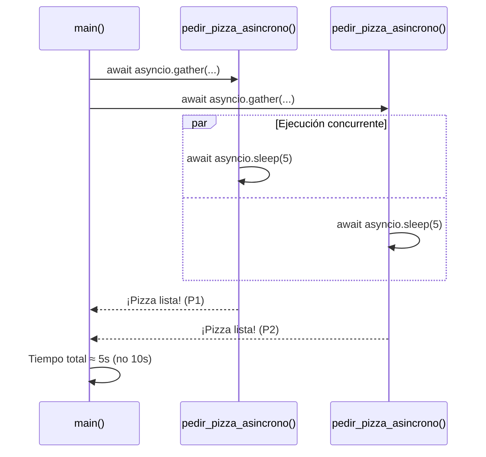

# Asincronía en Python (Segunda Pasada)

## Metadata
- **Fuente original:** `raw/papers/2026-08-03-asincronia.md`
- **Autor:** [[big-school]]
- **Fecha:** 2026
- **Tipo de documento:** Documento Técnico / Material de Curso (Módulo 0: Fundamentos del Desarrollo de Software — Máster Desarrollo con IA)

## Summary
Segunda pasada sobre `asyncio`/`async`/`await`, con una analogía nueva (el maestro de ajedrez que juega múltiples partidas simultáneas) y un diagrama de secuencia Mermaid que visualiza la ejecución concurrente de dos corrutinas frente a `asyncio.gather`. Añade una sección explícita de **aplicabilidad en negocios y servicios de IA** (consultar simultáneamente varios modelos de lenguaje, recuperar datos de usuarios/catálogos en paralelo, sincronizar microservicios).

## Key Takeaways
1. **Analogía del maestro de ajedrez:** no piensa más rápido, simplemente elimina el tiempo de inactividad moviendo entre mesas mientras los rivales piensan — la esencia de la concurrencia I/O-bound.
2. **`async def` + `await`** son requisitos estructurales: el punto de entrada del programa también debe ser asíncrono (`async def main()` + `asyncio.run(main())`).
3. **`asyncio.gather()`** ejecuta múltiples corrutinas concurrentemente: 3 tareas de 3 segundos cada una completan en ~3s totales (no 9s) — reducción de latencia del 66% en el ejemplo dado.
4. **Nunca mezclar `time.sleep()` bloqueante dentro de una corrutina** — siempre `asyncio.sleep()`, que cede el control en vez de bloquear todo el programa.
5. **Aplicabilidad de negocio:** consultar simultáneamente modelos de IA distintos (GPT + análisis de imagen) para un informe consolidado, recuperar datos de usuarios/catálogos en paralelo, sincronizar microservicios sin degradar la experiencia de usuario.
6. La asincronía **no acelera el cómputo** (CPU-bound); su superpoder es gestionar la espera en operaciones **I/O-bound** (red, base de datos, disco, servicios de IA).

## Detailed Breakdown

### 1. El Cambio de Paradigma: Del Bloqueo a la Concurrencia
El código tradicional se ejecuta secuencialmente — sencillo pero ineficiente en entornos conectados, donde gran parte del ciclo de vida de un programa se consume esperando respuestas de red, descargas o servicios de terceros, no realizando cálculos. La analogía del maestro de ajedrez: no incrementa su velocidad de pensamiento, elimina el tiempo de inactividad al moverse entre mesas mientras los rivales piensan.

### 2. Implementación Técnica con Asyncio
`async` transforma funciones estándar en **corrutinas**; `await` es una pausa inteligente que libera el procesador para atender otras tareas pendientes mientras la actual espera. El punto de entrada del programa (`main`) también debe ser asíncrono, orquestado con `asyncio.run()`.

### 3. Comparativa: Ejecución Síncrona vs. Asíncrona
Un ejemplo directo contrasta `time.sleep()` (bloqueante, 10s totales para dos llamadas de 5s cada una) contra `asyncio.sleep()` + `asyncio.gather()` (no bloqueante, ~5s totales para las mismas dos llamadas ejecutadas "a la vez").

### 4. Paralelismo Real y Gestión de Tareas
Con tres procesos de tres segundos cada uno, una ejecución síncrona requeriría nueve segundos; `asyncio.gather()` los inicia simultáneamente y el tiempo total se reduce al de la tarea más lenta (~3s) — una reducción de latencia del 66% en este caso concreto. El diagrama de secuencia Mermaid visualiza esta concurrencia entre `main()` y dos llamadas paralelas.

### 5. ¿Cuándo usar Asincronía?
La asincronía no acelera cálculos matemáticos del procesador; su valor es exclusivamente en operaciones **I/O-Bound**: peticiones de red, operaciones de base de datos, lectura/escritura de archivos, uso de servicios de IA (resúmenes, traducciones).

### 6. Aplicabilidad en Negocios y Servicios de IA
- **Interacción con APIs de IA:** consultar simultáneamente modelos de lenguaje (GPT) y motores de análisis de imagen para generar un informe consolidado.
- **Consultas a Bases de Datos:** recuperar datos de usuarios y catálogos de productos en paralelo para acelerar la carga de una interfaz.
- **Integración de Servicios:** sincronizar microservicios que deben comunicarse sin degradar la experiencia de usuario.

### 7. Observaciones Clave
- La asincronía no acelera cálculos matemáticos pesados; optimiza la gestión de esperas externas.
- Usar `time.sleep()` dentro de un contexto asíncrono es un error común que bloquea todo el programa; siempre `asyncio.sleep()`.
- `await` es obligatorio para obtener el resultado de una corrutina — sin él, solo se obtiene el objeto corrutina sin ejecutar.
- Es la base de una experiencia de usuario fluida, evitando que la interfaz se congele durante procesos de red.

### 8. Conclusión
Dominar la asincronía es un salto cualitativo en arquitectura de soluciones: no se trata de aplicar el modelo indiscriminadamente, sino de identificar estratégicamente los puntos donde el sistema "espera" y convertirlos en oportunidades de ejecución proactiva, mejorando eficiencia de servidores y retención de usuarios.

## Diagrams & Visualizations



## Code & Pseudocode Examples

### Corrutina básica
```python
import asyncio

async def pedir_cafe():
    print("Pidiendo un café...")
    await asyncio.sleep(3)
    print("¡Café listo!")
    return "Café"
```

### Síncrono vs. asíncrono (comparativa completa)
```python
def pedir_pizza_sincrono():
    print("Pidiendo una pizza...")
    time.sleep(5)  # Bloquea todo el programa
    print("¡Pizza lista!")

async def pedir_pizza_asincrono():
    print("Pidiendo una pizza...")
    await asyncio.sleep(5)  # NO bloquea, cede el control
    print("¡Pizza lista!")

async def main():
    await asyncio.gather(
        pedir_pizza_asincrono(),
        pedir_pizza_asincrono()
    )

asyncio.run(main())
# Tiempo total asíncrono: ≈5.00 segundos (no 10)
```

### Ejercicio práctico: tres corrutinas concurrentes
```python
import asyncio
import time

async def pedir_cafe():
    print("Pidiendo un café...")
    await asyncio.sleep(3)
    print("¡Café listo!")
    return "Café"

async def main():
    inicio = time.time()
    await asyncio.gather(
        pedir_cafe(),
        pedir_cafe(),
        pedir_cafe()
    )
    fin = time.time()
    print(f"Tiempo total {fin - inicio:.2f}")

asyncio.run(main())
# ≈3 segundos (no 9), confirma el comportamiento concurrente
```

## Entities Mentioned
- [[big-school]]

## Concepts Discussed
- [[programacion-asincrona]]

## Notable Quotes
> "La asincronía puede compararse con un maestro de ajedrez enfrentándose a múltiples oponentes de forma simultánea. [...] No incrementa la velocidad de su pensamiento, sino que elimina el tiempo de inactividad."

## Connections & Reflections
- Reafirma [[wiki/sources/2026-07-30-asincronia-en-python]], ya integrado en [[programacion-asincrona]] — sin contradicción. Añade la analogía del ajedrez (complementaria a la del maestro de ajedrez ya usada en otras fuentes de pensamiento computacional) y la sección explícita de aplicabilidad en negocios/IA.
- El diagrama de secuencia Mermaid es una visualización nueva que no estaba en la primera pasada — útil para entender la superposición temporal de corrutinas.

## Open Questions
- (Reafirma la pregunta abierta ya registrada en [[programacion-asincrona]] sobre la combinación de `asyncio` con `multiprocessing` para cargas mixtas I/O-bound y CPU-bound.)

## Related Sources
- [[wiki/sources/2026-07-30-asincronia-en-python]] — primera pasada, mismo marco conceptual sobre asyncio/async/await.
- [[wiki/sources/2026-08-03-conclusiones-lenguajes-programacion]] — la asincronía como pilar de "agilidad y rendimiento" en la síntesis final del módulo.

---

**Estado:** ✅ Completamente procesado e integrado en el wiki
